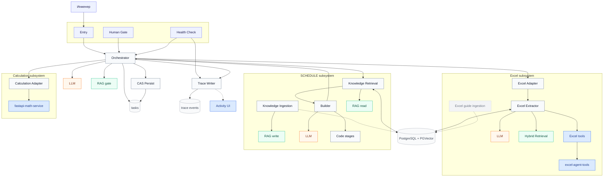

# Petroleum Engineering MAS — n8n 2.30.8

Единый документ: архитектура, компонентная схема и **пошаговое развёртывание с нуля**.

Практичный MVP для создания и проверки `SCHEDULE` в режимах `CREATE` и preserve-by-default `REVISE`. Входные `.data/.inc`, Excel, `.dev` и CPS3 обрабатываются внутри n8n и локальных FastAPI-сервисов. Результат — текст `schedule.inc`.

**Целевая версия:** строго n8n `2.30.8`.  
**Машинный контракт имён/bindings:** [`n8n/import-manifest.json`](n8n/import-manifest.json).  
**CSV шаблоны Data Tables:** [`n8n/data-tables/`](n8n/data-tables/).  
**Проверка связности:** `Form — MAS Deployment Health Check` (на работе — UI; в лаборатории ещё `scripts/mas_stack_health.py`).  
**Снимок readiness:** [`docs/architecture/production-readiness-review-2026-08-16.md`](docs/architecture/production-readiness-review-2026-08-16.md).

### Жёсткие правила полевого контура (работа)

| Что | Как только так |
|---|---|
| **n8n** | Только **UI**: Import from File, Data Tables, credentials, bindings, Activate/Publish. Никакого REST-импорта workflow, никакого `docker compose` для n8n на работе. |
| **Сервисы** Excel Tools / Math / MAS Activity | Только **локально на Windows** (`setup-windows.bat` → `.env` → `start-windows.bat`). Не из Docker на полевом ПК. |
| **Postgres + PGVector** | Тот, что уже привязан к корпоративному n8n; credential настраивается в UI (SSL = Disable, если без TLS). |
| **Секреты / `$env` / Global Variables** | В workflow **не используются**. URL и ключи — в нодах / credentials / `*.env` на Windows. |

Лабораторный Compose (postgres + n8n + runners + excel-tools) — **приложение** в конце документа, не основной путь.

---

## 1. Компонентная схема

Источник истины для имён — `n8n/import-manifest.json` и поле `name` в `n8n/workflows/core/` и `n8n/workflows/support/`.

**Как читать:** короткие названия — роли/сервисы. Цвет: **оранжевый = LLM**, **зелёный = RAG/memory**, **синий = FastAPI / tools**. Имена workflow в UI — в `n8n/import-manifest.json`.



**MVP runtime:** Orchestrator, `CAS — Persist Task State`, Trace, Excel Adapter+Agent, `MAS — Knowledge Retrieval`, `SCHEDULE — Builder`, Calculation Adapter, Activity hydrate (`List Tasks` / `Load Feed`), Health Check. Презентация handoff’ов — локальный `mas-activity-service` на Windows (`:8200`): live sync из Trace Writer (`ACTIVITY_BASE_URL` = IP этой Windows-машины); список задач — F5 / клик по бренду **MAS Activity** (hydrate из Data Tables). Commissioning REVISE дат ввода: deterministic timeline (`parse → shift / keep|remove / new-well HITL → emit`). Деструктивный `remove` скважин вне Excel — **только** typed enum `unlisted_wells_policy`, не prose.

**Активация:** после импорта всё `active: false`. Сначала биндинги + credentials + RAG → Health Check → при 0 FAIL активируйте runtime (Orchestrator, CAS, Trace, specialists, Activity hydrate) и **только потом** Entry / Human Gate.  
**Не активировать / не Publish как пользовательский вход:** `Adapter — Excel Form`, `Template — Engineering Specialist`, `Reference — AI Components`.  
**Knowledge Ingestion:** не Publish; первый пакет — Manual **Test workflow**, дальше — вставка простыни `excel-agent-operating-guide.documents.json`.

### Runtime shape

```text
Form / webhook
→ Universal Engineering Orchestrator (HITL + Verifier)
→ CAS — Persist Task State (единственная запись task state)
→ Calculation Adapter | Excel Adapter | MAS — Knowledge Retrieval
→ SCHEDULE Builder (intake→baseline→plan→render→merge→validate→verify)
→ accountable release gate in Orchestrator
→ bounded schedule.inc
```

SCHEDULE delivery — три workflow + shared Trace Writer. Отдельных diagnostic mirrors (`intake`, `baseline-*`, `planner`, `renderer`, …) нет: стадии живут Code-нодами внутри Builder; release — в Orchestrator (`Apply action and version guard`).

---

## 2. Зачем такая архитектура

Паттерн: **Stateful Orchestrator–Workers** с явными validation/verification и HITL.

1. **Нельзя «просто промптнуть Excel → SCHEDULE».** LLM галлюцинирует координаты, скважины и синтаксис. Оркестратор не считает геометрию и не пишет финальный SCHEDULE сам: делегирует FastAPI (Excel/Math) и проверяет результат независимым Verifier.
2. **Нельзя скормить весь Excel как Markdown.** Тысячи строк убивают контекст и бюджет. Excel Agent работает tool-ами: introspect → detect/describe → query; в модель попадает только выжимка.
3. **Нужен аудит.** Решения, tool-вызовы и gates пишутся в `Writer — MAS Trace` / `mas_trace_events_v1` без секретов и raw prompts.

### Краткий разбор компонентов

| Подсистема | Что делает |
|---|---|
| **Orchestrator** | Planner + Verifier LLM, HITL, routing на allowlisted Call-ноды; Load task by ID |
| **CAS persist** | Единственная запись `engineering_orchestrator_tasks_v1`: insert + optimistic update |
| **Excel** | Adapter → Agent (LLM + governed `excel_protocol` RAG + 7 tool-нод) → `excel-agent-tools` |
| **MAS Knowledge** | `MAS — Knowledge Ingestion` / `MAS — Knowledge Retrieval` — общий RAG всех агентов (`target_base`) |
| **SCHEDULE** | `SCHEDULE — Builder` (Code stages + 2 LLM); знания берёт из MAS Knowledge, namespace `schedule_mvp`; commissioning timeline keep/remove/new-well HITL |
| **Calculation** | Adapter → `fastapi-math-service` (DEV × CPS3/ZMAP) |
| **Activity UI** | Windows `mas-activity-service` (`:8200`) — chat handoffs + HITL; sync из Trace Writer; hydrate списка из Data Tables |
| **Infra (поле)** | Корпоративный n8n 2.30.8 + Postgres/PGVector; на Windows — Excel Tools, Math, Activity |
| **Infra (лаборатория)** | Опционально Compose: postgres, n8n, runners, excel-tools (см. §5) |

---

## 3. Развёртывание с нуля (канон: Windows + UI n8n)

Порядок на работе: **сначала три Windows-сервиса**, потом **чистый UI-импорт в n8n**, потом биндинги / credentials / RAG / Health Check / activate.

### Step 0 — Preconditions

| Need | Notes |
|---|---|
| n8n **2.30.8** (корпоративный) | UI доступ; JSON из репозитория не новее/не старше |
| PostgreSQL + PGVector | Уже за корпоративным n8n; credential SSL = Disable, если без TLS |
| OpenAI-compatible chat + embeddings | Planner, Verifier, SCHEDULE, Excel Agent; **Dimensions в embeddings не задавать** |
| Windows 64-bit, Python 3.11–3.13 | Для трёх FastAPI |
| Сеть | n8n должен достучаться до Windows IP:`8000` / `8100` / `8200`; Windows — до URL n8n (hydrate) |

### Step 0b — Локальные сервисы (Windows CMD) — обязательно

Три отдельных окна CMD. Шаблон у всех: `setup-windows.bat` → скопировать `*.env.example` → `*.env` → править ключи/хост → `start-windows.bat` → во втором CMD `check-windows.bat`.

**1) Excel Tools** (`:8000`)

```bat
cd excel-agent-tools
setup-windows.bat
copy excel-tools.env.example excel-tools.env
notepad excel-tools.env
start-windows.bat
```

- `API_KEY` — уникальный; тот же ключ потом в Agent Runtime configuration в n8n.  
- Корпоративный n8n на другом хосте: `EXCEL_TOOLS_HOST=0.0.0.0`, URL в n8n = `http://<IP-Windows>:8000/api/v1`.  
- n8n на том же ПК: можно `127.0.0.1`.

**2) Math Service** (`:8100`)

```bat
cd fastapi-math-service
setup-windows.bat
copy math-service.env.example math-service.env
start-windows.bat
```

Проверка: `check-windows.bat` → `http://127.0.0.1:8100/health`. В Adapter — Calculation: `math_service_url` = `http://<IP-Windows>:8100/api/v1/math` (не `$env`).

**3) MAS Activity** (`:8200`) — морда

```bat
cd mas-activity-service
setup-windows.bat
copy mas-activity.env.example mas-activity.env
notepad mas-activity.env
start-windows.bat
```

Минимум в `mas-activity.env`:

| Переменная | Значение на работе |
|---|---|
| `MAS_ACTIVITY_KEY` | Свой ключ (не `change-me-…`) |
| `MAS_ACTIVITY_HOST` | `0.0.0.0` если n8n на другой машине; иначе `127.0.0.1` |
| `HITL_MODE` | Сначала `local` для проверки морды; live — `webhook` / `n8n_rest` / `auto` |
| `ACTIVITY_LIST_URL` | `http://<URL-n8n>/webhook/mas-activity-list-tasks` (после Step 3) |
| `ACTIVITY_FEED_URL` | `http://<URL-n8n>/webhook/mas-activity-load-feed` |

UI: `http://127.0.0.1:8200/` — **Новая задача**, бренд **MAS Activity** / F5 тянет список из Data Tables, deep-link `/t/<task_id>`.  
Тексты в ленте — лаконичный русский presentation layer (шаблоны по `status`); сырые EN summary не должны быть главным текстом пузыря.

После импорта Trace Writer (Step 5): в Code **Prepare MAS activity sync** задайте:

- `ACTIVITY_BASE_URL=http://<IP-Windows>:8200`
- `ACTIVITY_KEY` = тот же, что `MAS_ACTIVITY_KEY`

`POST /v1/sync` **не** сбрасывает открытый HITL-gate от routine-статусов (`EXCEL_EVIDENCE_READY` и т.п.).

### Step 0c — Чистый старт задач (wipe), если переустанавливаете

В UI n8n Data tables: очистить строки (не обязательно дропать схему) в `engineering_orchestrator_tasks_v1` и `mas_trace_events_v1`.  
На Windows: остановить Activity, удалить файл `ACTIVITY_STATE_PATH` / `data\activity_state.json`, снова `start-windows.bat`.  
Схемы таблиц и credentials при этом сохраняются; workflow заново импортировать только если менялись JSON из репозитория.

### Step 1 — Import workflows (только UI, точный порядок)

**Workflows → Import from File:**

| # | File | UI name |
|---:|---|---|
| 1 | `n8n/workflows/core/calculation-specialist-adapter.workflow.json` | `Adapter — Calculation (Math Service)` |
| 2 | `n8n/workflows/core/excel-extraction-agent.workflow.json` | `Agent — Excel Extractor` |
| 3 | `n8n/workflows/core/excel-engineering-specialist-adapter.workflow.json` | `Adapter — Excel Extraction` |
| 4 | `n8n/workflows/core/tnavigator-schedule-knowledge-ingestion.workflow.json` | `MAS — Knowledge Ingestion` |
| 5 | `n8n/workflows/core/tnavigator-schedule-hybrid-retrieval.workflow.json` | `MAS — Knowledge Retrieval` |
| 6 | `n8n/workflows/core/tnavigator-schedule-builder.workflow.json` | `SCHEDULE — Builder` |
| 7 | `n8n/workflows/core/mas-trace-event-writer.workflow.json` | `Writer — MAS Trace` |
| 8 | `n8n/workflows/core/cas-persist-task.workflow.json` | `CAS — Persist Task State` |
| 9 | `n8n/workflows/core/universal-engineering-orchestrator.workflow.json` | `Orchestrator — Engineering MAS` |
| 10 | `n8n/workflows/core/mvp-entry-form.workflow.json` | `Form — MAS Entry` |
| 11 | `n8n/workflows/core/mas-human-gate-form.workflow.json` | `Form — MAS Human Gate` |
| 12 | `n8n/workflows/core/mas-activity-list-tasks.workflow.json` | `Activity — List Tasks (Data Table)` |
| 13 | `n8n/workflows/core/mas-activity-load-feed.workflow.json` | `Activity — Load Feed (Data Tables)` |
| 14 | `n8n/workflows/core/mas-deployment-health-check.workflow.json` | `Form — MAS Deployment Health Check` |

Опционально из `n8n/workflows/support/`: Excel Form adapter, AI components, specialist template.  
Полный clean-import набор — **17** JSON (`full_clean_import_set`). Все приходят с `active: false`. `CAS — Persist Task State` импортируется **до** Orchestrator.

### Step 2 — Create Data Tables

Вкладка **Data tables**.

1. `engineering_orchestrator_tasks_v1` — CAS state  
2. `mas_trace_events_v1` — redacted trace ledger  

**Предпочтительно From scratch** (типы сразу верные).

`engineering_orchestrator_tasks_v1` (lean CAS row — timeline is `mas_trace_events_v1`):

| Column | Type | Column | Type |
|---|---|---|---|
| `task_id` | String | `version` | Number |
| `status` | String | `risk_class` | String |
| `request_json` | String | `runtime_json` | String |
| `plan_json` | String | `packet_json` | String |
| `result_json` | String | `verification_json` | String |
| `gate_json` | String | `retry_count` | Number |
| `max_retries` | Number | `created_at` | String |
| `updated_at` | String | | |

Dropped vs older drafts: `phase`, `task_type`, `history_json`, `last_error_json` (error lives in `runtime_json.last_error`). Renames: `context_json`→`runtime_json`, `specialist_json`→`packet_json`, `pending_human_json`→`gate_json`. Recreate the Data Table (or rebuild columns) before rebinding.

`mas_trace_events_v1` — все String:  
`event_id`, `trace_id`, `task_id`, `at`, `stage`, `event_type`, `actor`, `status`, `summary`, `details_json`

**Ускорение — Import CSV:**  
[`n8n/data-tables/engineering_orchestrator_tasks_v1.header.csv`](n8n/data-tables/engineering_orchestrator_tasks_v1.header.csv),  
[`n8n/data-tables/mas_trace_events_v1.header.csv`](n8n/data-tables/mas_trace_events_v1.header.csv).  
После CSV смените `version`, `retry_count`, `max_retries` на **Number**.

### Step 3 — Bind Data Table nodes

Не оставляйте `REPLACE_IN_UI`.

| Open workflow | Node name | Select table |
|---|---|---|
| `Writer — MAS Trace` | `Insert MAS trace event` | `mas_trace_events_v1` |
| `CAS — Persist Task State` | `Insert durable task row` | `engineering_orchestrator_tasks_v1` |
| `CAS — Persist Task State` | `Update durable task row` | `engineering_orchestrator_tasks_v1` |
| `Orchestrator — Engineering MAS` | `Load task by ID` | `engineering_orchestrator_tasks_v1` |
| `Form — MAS Deployment Health Check` | `Probe task Data Table` | `engineering_orchestrator_tasks_v1` |
| `Form — MAS Deployment Health Check` | `Probe trace Data Table` | `mas_trace_events_v1` |
| `Activity — List Tasks (Data Table)` | `Load recent tasks` | `engineering_orchestrator_tasks_v1` |
| `Activity — Load Feed (Data Tables)` | `Load task row` | `engineering_orchestrator_tasks_v1` |
| `Activity — Load Feed (Data Tables)` | `Load trace rows` | `mas_trace_events_v1` |

После биндинга **активируйте** оба Activity webhook (`Activity — List Tasks`, `Activity — Load Feed`).  
В `mas-activity.env` на Windows (не DNS `n8n:` — это только Compose):

```bat
ACTIVITY_LIST_URL=http://<хост-n8n>:<порт>/webhook/mas-activity-list-tasks
ACTIVITY_FEED_URL=http://<хост-n8n>:<порт>/webhook/mas-activity-load-feed
```

Без этих URL морда живёт только на локальном `ACTIVITY_STATE_PATH`. С ними F5 / бренд подтягивают CAS + trace.

### Step 4 — Bind Execute Workflow nodes (24 обязательных)

| Open workflow | Node on canvas | Select this workflow |
|---|---|---|
| `Orchestrator — Engineering MAS` | `Call CAS persist — insert new task` | `CAS — Persist Task State` |
| `Orchestrator — Engineering MAS` | `Call CAS persist — human action then plan` | `CAS — Persist Task State` |
| `Orchestrator — Engineering MAS` | `Call CAS persist — terminal human action` | `CAS — Persist Task State` |
| `Orchestrator — Engineering MAS` | `Call CAS persist — plan or human gate` | `CAS — Persist Task State` |
| `Orchestrator — Engineering MAS` | `Call CAS persist — SCHEDULE evidence retry` | `CAS — Persist Task State` |
| `Orchestrator — Engineering MAS` | `Call CAS persist — SCHEDULE resume` | `CAS — Persist Task State` |
| `Orchestrator — Engineering MAS` | `Call CAS persist — verification` | `CAS — Persist Task State` |
| `Orchestrator — Engineering MAS` | `Call CAS persist — specialist gate or error` | `CAS — Persist Task State` |
| `Orchestrator — Engineering MAS` | `Call CAS persist — routing gate` | `CAS — Persist Task State` |
| `Orchestrator — Engineering MAS` | `Call Excel Extraction Specialist Adapter` | `Adapter — Excel Extraction` |
| `Orchestrator — Engineering MAS` | `Call routing Hybrid Retrieval` | `MAS — Knowledge Retrieval` |
| `Orchestrator — Engineering MAS` | `Call Excel protocol Hybrid Retrieval` | `MAS — Knowledge Retrieval` |
| `Orchestrator — Engineering MAS` | `Call SCHEDULE Hybrid Retrieval` | `MAS — Knowledge Retrieval` |
| `Orchestrator — Engineering MAS` | `Call SCHEDULE Builder Specialist` | `SCHEDULE — Builder` |
| `Orchestrator — Engineering MAS` | `Call Calculation Specialist` | `Adapter — Calculation (Math Service)` |
| `Orchestrator — Engineering MAS` | `Call MAS Trace Event Writer` | `Writer — MAS Trace` |
| `Agent — Excel Extractor` | `Call Excel protocol Hybrid Retrieval` | `MAS — Knowledge Retrieval` |
| `Template — Engineering Specialist` | `Call specialist Hybrid Retrieval` | `MAS — Knowledge Retrieval` |
| `Adapter — Excel Extraction` | `Call native Excel Extraction Agent` | `Agent — Excel Extractor` |
| `Form — MAS Entry` | `Call Universal Engineering Orchestrator` | `Orchestrator — Engineering MAS` |
| `Form — MAS Human Gate` | `Call Orchestrator status` | `Orchestrator — Engineering MAS` |
| `Form — MAS Human Gate` | `Call Orchestrator resume` | `Orchestrator — Engineering MAS` |
| `Form — MAS Deployment Health Check` | `Call Orchestrator probe` | `Orchestrator — Engineering MAS` |
| `Form — MAS Deployment Health Check` | `Call Trace Writer probe` | `Writer — MAS Trace` |

**Не настраивать:** `Call Data Specialist`, `Call Document Specialist` (заглушки).  
Подсказка: экспорт JSON → поиск `REPLACE_` = незавершённый binding. На `Route invocation action` picker нет — это Code routing.

### Step 5 — Credentials и URL сервисов (всё в UI / Windows .env)

| Where | What |
|---|---|
| Orchestrator | `Planner Chat Model`, `Verifier Chat Model` (отдельные credentials) |
| SCHEDULE — Builder | Planner + Builder chat models |
| Agent — Excel Extractor | Runtime `excel_tools_url` = `http://<IP-Windows>:8000/api/v1` + тот же `excel_tools_api_key`; chat; Postgres memory; Call → `MAS — Knowledge Retrieval` |
| `MAS — Knowledge Ingestion` / `MAS — Knowledge Retrieval` | Postgres + **тот же** embedding credential/модель |
| Adapter — Calculation | `math_service_url` = `http://<IP-Windows>:8100/api/v1/math` в ноде (не `$env`) |
| `Writer — MAS Trace` → Prepare MAS activity sync | `ACTIVITY_BASE_URL=http://<IP-Windows>:8200`, `ACTIVITY_KEY` = `MAS_ACTIVITY_KEY` |
| Postgres credential | SSL = **Disable**, Ignore SSL Issues = **off**, если без TLS |
| Orchestrator webhook (если HTTP Entry) | Header Auth по политике площадки |

Контроль: экспорт любого runtime JSON → поиск `REPLACE_` = незавершённый binding.

### Step 6 — Наполнить hybrid RAG

Одна физическая пара таблиц: `tnavigator_schedule_knowledge_v1` (chunks) + `tnavigator_schedule_knowledge_documents_v1` (parents). Изоляция — allowlisted `target_base`, не динамическое SQL-имя таблицы. Пустой tag-фильтр **не** возвращает весь namespace.

| Namespace | Кто читает | Тип карточек | Schema catalogue |
|---|---|---|---|
| `schedule_mvp` | Orchestrator → Builder | `keyword_instruction`, `worked_example` | обязателен |
| `excel_protocol` | Orchestrator Excel lane + Excel Extractor | `protocol_instruction` | нет |
| `orchestrator_routing` | Planner (до LLM) | `routing_card` | нет |
| `specialist_template` | Template — Engineering Specialist (клоны: `controls.target_base`) | `capability_instruction` | нет |

1. Откройте `MAS — Knowledge Ingestion`. Credentials Postgres + embedding (те же, что у Retrieval).  
2. Первый раз: триггер **Sync packaged MAS knowledge** → **Test workflow**. Пишутся только новые ключи `(target_base, knowledge_id, revision)`.  
3. Нода `Summarize RAG inventory` = `rag_inventory_ok`.  
4. Дальше правите один файл `n8n/rag/excel-agent-operating-guide.documents.json` (агент Excel, оркестратор, агент Schedule). Копируете файл целиком и вставляете в форму поле **Paste the full knowledge sheet** или в Execute Sub-workflow. Старые ключи пропускаются, новые пишутся. Последний элемент-шаблон не загружается. Чтобы заменить текст уже залитой карточки, поднимите `revision`.  
5. Проверка: `MAS — Knowledge Retrieval`.

Пакет на импорте покрывает `excel_protocol`, `orchestrator_routing` и `specialist_template`. Повторный прогон и повторная вставка простыни не дублируют уже существующие ключи. Excel Extractor больше не использует vector-tool `context_search`.

### Step 7 — Health Check, затем activate

1. В Health Check выберите таблицы (Step 3) и Orchestrator/Trace (Step 4).  
2. Publish/activate **только** этот form (или Test).  
3. Production Form URL → Submit.  
4. Читайте HTML-отчёт:
   - **FAIL** — исправить по `where_to_fix`
   - **PASS** — live probe ок
   - **TODO** — чеклист bindings/smoke; на полевом контуре **нормально**, если Docker DNS probes (`excel-tools:8000`, `mas-activity:8200`, …) в TODO — сервисы на Windows, не в Compose DNS  
5. Live probes, которые должны быть зелёными на работе:
   - Data Tables: task + trace get
   - Orchestrator `action=status`
   - Trace Writer `mas_trace_ack`
6. Ручная проверка Windows: `check-windows.bat` в каждой папке сервиса; в браузере `http://127.0.0.1:8200/health`, `:8000/health`, `:8100/health`.  
7. При 0 FAIL по control-plane: активируйте Orchestrator, CAS, Trace, specialists, Activity hydrate, затем `Form — MAS Entry` и `Form — MAS Human Gate`.

### Step 8 — Пользовательский запуск

1. Production Form URL Entry **или** Activity → **Новая задача** (при live HITL backend).  
2. `Task Description` + Excel / `.data/.inc` / `.dev` / CPS3.  
3. Completion: `schedule.inc` (скачать в морде) или HITL с `task_id`.  
4. Продолжение: Activity composer / `Form — MAS Human Gate` → `reply` / `approve` / `reject`.  
5. Commissioning: новые скважины — HITL с файлами; `unlisted_wells_policy` = `keep` \| `remove` только типизированно (не «убери» в тексте как authority).

---

## 4. Smoke и диагностика

**Smoke после 0 FAIL**

- Entry без objective → HITL + `task_id`
- Human Gate `status` / `reply` без ручного `gate_id`
- CREATE / REVISE при заполненном RAG
- Excel evidence path
- `.dev` + CPS3 через Calculation
- stale version / wrong gate → conflict
- CAS persist: invalid request / 0 rows / echoed attempted → `cas_succeeded=false`
- `mas_trace_events_v1` без секретов/raw prompts
- Activity: после handoff бренд/F5 показывает задачу; brief по-русски

**Quick fix**

| Symptom | Where to fix |
|---|---|
| Form Entry «workflow not found» | `Form — MAS Entry` → `Call Universal Engineering Orchestrator` |
| Human Gate не грузит status | `Form — MAS Human Gate` → `Call Orchestrator status` |
| Orchestrator не зовёт Excel | Orchestrator → `Call Excel Extraction Specialist Adapter` |
| Orchestrator не зовёт SCHEDULE | Orchestrator → Retrieval / Builder Call nodes |
| Trace пустой / insert error | `Writer — MAS Trace` → Data Table + Orchestrator → Trace Call |
| CAS / Load task fails | `CAS — Persist Task State` insert+update **и** Orchestrator `Load task by ID` → `engineering_orchestrator_tasks_v1` |
| Orchestrator Call CAS persist «workflow not found» | Все 9 `Call CAS persist — *` → `CAS — Persist Task State` |
| Activity пустая после прогона | Trace `ACTIVITY_BASE_URL` = IP Windows; firewall; hydrate URL в `mas-activity.env`; F5 / бренд |
| Excel 401 / connection refused | Agent Runtime URL/key; Excel Tools `0.0.0.0` + firewall; `check-windows.bat` |
| SSL / Postgres | Credential: SSL Disable |
| `toolHttpRequest has a supplyData…` | Переимпортировать `Agent — Excel Extractor`, tool-связи только `ai_tool` |
| Export JSON содержит `REPLACE_` | Незавершённый binding — Step 3–4 |

---

## 5. Проверка репозитория и лабораторный Docker

Репозиторные smokes/pytest — для CI и лаборатории (не замена UI Health Check на работе):

```bash
export WORKSPACE_ROOT="$PWD"
for f in n8n/tests/*-smoke.js; do node "$f" || exit 1; done
cd mas-activity-service && PYTHONPATH=. python3 -m pytest -q
cd ../excel-agent-tools && python -m pytest tests
python3 simulation-model-example/combat-dates-revise/run_integration_cases.py
```

### Лаборатория: Docker Compose (не полевой канон)

Если Docker разрешён вне корпоративного UI-контура:

```bash
cp .env.example .env   # POSTGRES_*, N8N_*, EXCEL_TOOLS_API_KEY, MAS_ACTIVITY_KEY
docker compose up --build -d
docker compose ps
python3 scripts/mas_stack_health.py
```

Compose поднимает n8n `2.30.8` + runners + Postgres/PGVector + excel-tools (+ опционально mas-activity).  
**На работе** Activity / Excel / Math всё равно предпочитайте Windows `.bat`; n8n — только UI-импорт в корпоративный инстанс.

Свежий review-снимок: [`docs/architecture/production-readiness-review-2026-08-16.md`](docs/architecture/production-readiness-review-2026-08-16.md).

### Структура репозитория

- `n8n/` — 17 workflow JSON (`workflows/core` + Activity hydrate, `workflows/support`), import-manifest, data-tables CSV, генераторы (`schedule_timeline_runtime.py`), smoke (~192), contracts
- `mas-activity-service/` — chat-морда; на работе — `start-windows.bat`
- `excel-agent-tools/` — Excel FastAPI; на работе — `start-windows.bat`
- `fastapi-math-service/` — geometry FastAPI; на работе — `start-windows.bat`
- `scripts/mas_stack_health.py` — хост-пинг лабораторного Compose
- `simulation-model-example/combat-dates-revise/` — commissioning combat 0–3
- `context-seeder/` — опциональный seeder (для UI-only не нужен)
- `postgres-init/` — init PostgreSQL/PGVector (лаборатория)
- `docs/architecture/` — research/roadmap + production-readiness review

Секреты не должны попадать в JSON, Data Tables или git. В MVP нет Artifact Store и автоматического tNavigator runner: SCHEDULE остаётся ограниченным текстом внутри n8n.
