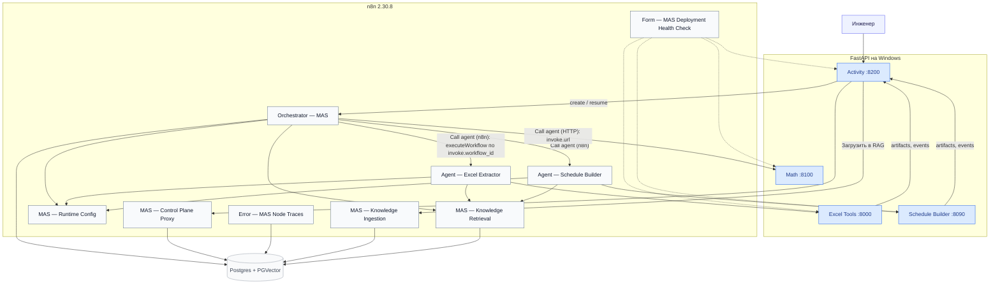

# NOVATEK RE MASter — полевой runbook (n8n 2.30.8)

Что запустить на Windows, что импортировать в корпоративный n8n, как привязать, как проверить и как расширять. Архитектурный план и долг — `MAS_REFACTORING_PLAN.md`; правила работы в репозитории — `AGENTS.md`.

Система по задаче инженера-гидродинамика собирает или правит `SCHEDULE` (`.INC`) для tNavigator/ECLIPSE: читает Excel с датами ввода и параметрами скважин, задаёт вопросы по-русски, детерминированно применяет изменения к baseline и отдаёт новый `.INC` и diff. SCHEDULE — первый агентный контур; архитектура рассчитана на добавление агентов (расчёты, кластер, результаты) без правки оркестратора (§6).

### Жёсткие правила

- **n8n на работе — только UI.** Import from File, Credentials, Settings, правки Set-нод. Никакого REST-импорта, `$env`/`$vars`, community-нод, Docker Compose на полевом ПК.
- **FastAPI-сервисы на Windows** (Activity `:8200`, Excel Tools `:8000`, Schedule Builder `:8090`, Math `:8100`) — Python + pip, без Node.js и без драйвера Postgres. В БД ходит только n8n; Activity — через webhook `MAS — Control Plane Proxy`.
- **Адреса и лимиты — в одном месте:** Set-нода `Runtime URLs` workflow `MAS — Runtime Config`. В JSON workflows и в промптах адресов нет.
- **Секреты** — только n8n Credentials и `.env` сервисов на Windows.
- **`n8n/workflows/retired/` не импортировать**, `n8n/workflows/support/` — только осознанно (§6).
- Excel Tools слушает **`:8000`**; порт `18000` не используется.

---

## 0. Перенос проекта на рабочую машину

На машине с git и интернетом: `python3 scripts/project_pack.py pack` (при лимите размера — `split`). На рабочей: перенести `scripts/project_pack.py` и `all.txt` (или части), затем `python3 project_pack.py join` (если был split) и `python3 project_pack.py unpack`. Секреты в архив не входят.

---

## 1. Архитектура

**Сервисы:** Activity `:8200`, Excel Tools `:8000`, Schedule Builder `:8090`, Math `:8100`, Postgres + PGVector, n8n **2.30.8**, task runner для Code/JS (в lab — контейнер `n8n-runners`).

**9 core workflow** (`n8n/import-manifest.json` → `runtime_import_order`): Knowledge Ingestion, Knowledge Retrieval, Runtime Config, Agent — Schedule Builder, Agent — Excel Extractor, Error — MAS Node Traces, Control Plane Proxy, Orchestrator — MAS, Form — MAS Deployment Health Check.



Как проходит задача:

1. **Инженер создаёт кейс** в Activity (`POST /cases`: цель текстом, файлы — Excel, `.inc` и его INCLUDE, при необходимости `.dev` / поверхность CPS3). Файлы уходят в `mas_artifacts` через прокси; каждый получает карточку `{artifact_id, role, kind=input, producer=user, filename, bytes}`.
2. **Activity вызывает оркестратор** (`/webhook/mas-orchestrator-step`, `action=create`). Дальше оркестратор сам POST-ит `action=step` на свой webhook (`orchestrator_step_url`). Один шаг = одно n8n execution; Activity цикл не крутит, только читает `cases`/`events`.
3. **Шаг оркестратора:** кейс из Postgres → журнал задачи → реестр агентов (`agent_registry`, только `enabled`) → срез RAG `orchestrator_routing` (политики декомпозиции) → Decision LLM (Qwen, Structured Output) → одно из действий `call_agent` / `ask_user` / `finish`. Оркестратор не знает ни одного агента по имени: описания — из реестра, способ вызова — из `invoke` (§1.4).
4. **Агент** (`Agent — …` в n8n) получает `agent_task`, открывает сессию в своём FastAPI-сервисе, LLM агента выбирает инструменты (HTTP Request Tool → `POST /agent-tools/{name}`), сервис исполняет детерминированно и хранит результат; агент возвращает `agent_result`. Файлы агент берёт сам: `GET {activity_base_url}/cases/{id}/artifacts/{artifact_id}`; прогресс в ленту — `POST /cases/{id}/events`.
5. **HITL.** Вопрос инженеру — русская фраза + варианты-кнопки (от агента через инструмент `ask_engineer` или от оркестратора `ask_user`). Ответ (`POST /cases/{id}/answer`) Activity не интерпретирует: сохраняет файлы и зовёт оркестратор `action=resume source=human` с сырым `{choice, text, label, files}`. Кнопка принимается как `choice`; свободный текст при вариантах разбирает второй LLM-проход (`confidence < 0.8` → переспрос). Ответ уходит агенту, который спрашивал (`agent_task.context.hitl.answers`).
6. **Результаты** — deliverables агентов: всё, что агент вернул в `artifacts`, оркестратор помечает `kind=deliverable, producer=<agent_id>`. Activity отдаёт `GET /cases/{id}/artifacts?kind=&producer=` и показывает их у сообщения агента, в панели «Результаты» и в итоге. `.INC` и diff Schedule Builder — два из них.
7. **Завершение** — только доказанное по журналу (§1.3). `case.finished` показывает итог оркестратора по фактам («Сдвинул даты ввода 4 скважин: …»).

Ошибки нод n8n пишет `Error — MAS Node Traces` напрямую в Postgres (`error_traces` + `events`); вместе с handoff'ами, HITL, решениями оркестратора и вызовами инструментов они складываются в **лог разработчика** кейса (§1.5). Health Check — **форма n8n**, адреса берёт из Runtime Config.

`MAS — Runtime Config` (Set `Runtime URLs`): `activity_base_url`, `excel_tools_url`, `schedule_service_url`, `math_url` (без `/agent/run`), `orchestrator_step_url`, `max_steps` (бюджет шагов на кейс, по умолчанию 12), `agent_workflow_ids` (JSON `{"<agent_id>":"<workflow id>"}`, привязка агентов после UI-импорта — §2 Шаг 3). Ключ Excel сюда не кладут.

### 1.1. HTTP-точки n8n

| Workflow | Path | Тип |
|---|---|---|
| `Orchestrator — MAS` | `/webhook/mas-orchestrator-step` | webhook, Header Auth |
| `MAS — Control Plane Proxy` | `/webhook/mas-control-plane` | webhook, Header Auth |
| `MAS — Knowledge Ingestion` | `/webhook/mas-knowledge-ingest` | webhook (Activity «Загрузить в RAG») |
| `Form — MAS Deployment Health Check` | `/form/mas-deployment-health-check` | **форма**, нужна сессия n8n |
| `Agent — Excel Extractor`, `Agent — Schedule Builder`, `MAS — Runtime Config`, `MAS — Knowledge Retrieval` | — | только `executeWorkflow` |
| `Error — MAS Node Traces` | Error Trigger | Settings → Error workflow |

### 1.2. Поле vs lab: какие URL куда

| Кто вызывает | Поле (Windows + корпоративный n8n) | Lab (Docker Compose) |
|---|---|---|
| Activity → n8n | `http://<URL-n8n>/webhook/…` | из контейнера `http://n8n:5678/webhook/…`; с хоста `http://127.0.0.1:${N8N_HOST_PORT}` (скрипты ждут **15678**) |
| n8n → Excel / Schedule / Math / Activity | `http://<IP-Windows>:8000` / `:8090` / `:8100` / `:8200` | Docker DNS `excel-tools:8000`, `schedule-builder:8090`, `math-service:8100`, `mas-activity:8200` |
| Браузер инженера | Activity `http://<IP-Windows>:8200` | `http://127.0.0.1:8200` |
| Postgres | только credential n8n (DBA) | `127.0.0.1:${POSTGRES_HOST_PORT}` с хоста |

В полевом Runtime Config не должно остаться Docker-имён (`excel-tools`, `mas-activity`, `n8n:5678`) — Health Check покажет их как `TODO`.

### 1.3. Как оркестратор решает и завершает

Паттерн — progress ledger: решение принимает LLM по **журналу задачи**, детерминированные предохранители не дают циклу пройти молча. Всё это доменно-нейтрально и живёт в `Orchestrator — MAS`.

- **Журнал** `state.ledger.history`: шаг 0 — вложения инженера; далее каждый результат агента (`agent_id`, `task_id`, `status`, `summary`, артефакты, `rework_reason`) и каждый ответ человека. Decision LLM видит журнал текстом, а не флаги.
- **Решение** — Structured Output с обязательным `progress {goal_satisfied, evidence, missing, is_repeating}` и действием `call_agent {agent_id, handoff_message}` / `ask_user {question, options}` / `finish {summary_for_human}`. В `agent_task.inputs` оркестратор кладёт только ссылки (`activity_base_url`, `schedule_root`, `artifact_ids`, `data_refs`, `rework_reason`, `unlisted_wells_policy`); факты от LLM в задачу не копируются — поручение агенту передаёт `handoff_message`.
- **Предохранители в `Parse decision`** (каждый пишет `guard` в `orchestrator.decision.payload`): ответ человека должен дойти до агента, который спросил (`answer_not_applied` — `finish` невозможен, пока тот не вернул `completed`); повторное делегирование агенту с `completed` — один раз и только с `rework_reason`, дальше review-гейт с кнопками «Принять результат / Нужна доработка»; флагу `goal_satisfied` при первом делегировании не верят (`goal_flag_ignored`); ответ человека сбрасывает stall.
- **Проверенное завершение:** `finish` не принимается на слово — второй скептический LLM-проход `Verify completion` требует для каждой части цели запись журнала `completed` (вложения инженера частью цели не считаются). Отказ → ещё один шаг с указанием пробела (`completion_unverified`); второй отказ → review-гейт прозой (`completion_review`); человек принял — `finish`. `case.finished.payload.completion_verified` показывает, прошёл ли итог проверку.
- **Ошибка агента** (`agent.failed`: узел не выполнился, агент не привязан, HTTP 5xx у LLM) — запись в журнал и новое решение; лимит ошибок и `max_steps` — из Runtime Config. По достижении `max_steps` с готовым результатом — review-гейт, без результата — честный `failed`.
- **Итог для инженера** — факты по summary агентов; если LLM написала машинный текст, оркестратор собирает итог из журнала сам.

### 1.4. Реестр агентов

`agent_registry` (Postgres, создаёт и заполняет `schema` прокси) — единственное место, где система знает об агентах:

| Колонка | Смысл |
|---|---|
| `agent_id`, `title` | id в контрактах и событиях; заголовок для ленты, панели результатов, схемы |
| `when_to_use` | текст для Decision LLM: что умеет, что ему нужно, чего не делает |
| `input_required`, `output_provides` | роли артефактов/ключи данных на входе и выходе (`excel`, `schedule_source`, `facts`, `schedule_out` …) |
| `input_schema`, `output_schema` | что положить в `inputs` и что вернётся в `data`/`artifacts` — для планирования и передачи между агентами |
| `invoke` | как вызвать: `{"kind":"n8n_workflow","workflow_id":"…"}` или `{"kind":"http","url":"{math_url}/agent/run"}` (плейсхолдеры `{поле}` — из Runtime Config) |
| `hitl_policy` | `agent_asks` — сам спрашивает инженера через `ask_engineer`; `never` |
| `enabled`, `version` | выключенный агент не показывается LLM и не вызывается; Health Check его не требует |

Decision LLM видит все колонки, кроме `invoke`; `invoke` читает только `Prepare agent call`. Результат агента оркестратор хранит в `state.agents[<agent_id>] = {status, summary, task_id, step, data, data_keys}`; следующий агент берёт нужные ключи из `GET /cases/{id}/state`. Источник колонок — `n8n/templates/mas_agent_registry.py`, seed-строки — спеки `n8n/templates/agents/*.py` (`AgentSpec.registry_row()`); из них генерируются JSON прокси и SQL-файлы (`postgres-init/02…`, `03…`, `mas-activity-service/app/sql/*`). Правки на поле — Activity → **Агенты** (`http://<IP>:8200/registry`: включить/выключить, `when_to_use`, `invoke.workflow_id`, схемы) или `PUT /agents/{agent_id}`.

Статусы кейса: `new`, `running`, `waiting_user` (HITL), `waiting_agent` (долгий агент вернул `in_progress`, §6.1), `done`, `failed`. Список — `contracts.CASE_STATUSES` в Activity и `CASE_STATUSES` в `generate_mas_control_plane_proxy.py`; `schema` прокси пересоздаёт CHECK-ограничение `cases_status_check`, поэтому существующая база подхватывает новые статусы без ручного SQL.

### 1.5. Лог разработчика (трасса кейса в UI)

Лента в чате — для инженера; всё техническое живёт в **логе разработчика**: `GET /cases/{id}/log` и вкладка **«Лог»** в Activity (появляется после галочки **«Режим разработчика»** в шапке; выбор запоминается в браузере). Отдельной таблицы нет — лог собирается из тех же `events` + `error_traces` кейса, поэтому ничего дополнительно не настраивается.

Что попадает в лог (и откуда):

| Источник | События | Что видно в подробностях |
|---|---|---|
| Оркестратор (`Orchestrator — MAS`) | `orchestrator.decision` (в т.ч. `guard`), `agent.handoff`, `hitl.request`, `hitl.answered`, `orchestrator.resume`, `case.finished/failed`, `agent.failed` | усечённая копия решения LLM (`decision`), переданная агенту `agent_task`, вопрос и варианты, ответ инженера, `execution_id`/`workflow_id` |
| Workflow агентов (`Agent — …`) | `agent.accepted`, `agent.progress`, `agent.result` | `issues`, `assumptions`, `execution_id`/`workflow_id` |
| FastAPI-сервисы агентов (kit) | `trace.tool` — каждый вызов `POST /agent-tools/{name}`: аргументы, результат или код ошибки, `duration_ms`, `ok`; `trace.note` — заметки агента (`activity.trace(...)`, свой `level`) | аргументы/результаты ограничены по размеру (`compact_for_log`); бинарь и длинный текст — метки, не содержимое |
| Error Trigger (`Error — MAS Node Traces`) | `system.node_error` + строка `error_traces` (склеиваются в одну запись; для старых трасс без события создаётся синтетическая) | workflow, узел, тип узла, сообщение, усечённый stack, ссылка на execution |

Каждая запись: `seq, at, level (debug|info|warn|error), source (engineer|orchestrator|agent:<id>|n8n), kind, step, task_id, agent_id, title, message, execution_id, execution_url, duration_ms, detail`. `level` выводится детерминированно: `agent.failed`/`system.node_error`/`case.failed` и `agent.result status=failed` → `error`; `orchestrator.decision` с `guard` и `trace.tool ok=false` → `warn`; прогресс и `trace.*` → `debug`. Записи группируются по **шагам оркестратора** (`orchestrator.decision` открывает шаг; заголовок шага — решение, агент, длительность, число вызовов инструментов, ошибки); `summary` — шаги, handoff'ы, HITL, инструменты, ошибки, длительность. `?format=ndjson` — выгрузка (кнопка «Скачать» во вкладке).

Ссылка на execution n8n собирается из `execution_id` + `workflow_id` и базового URL `N8N_PUBLIC_URL` из `mas-activity.env` — это адрес n8n **как его открывает браузер инженера** (`http://<URL-n8n>`), не адрес, по которому Activity ходит в webhooks. Пусто → `N8N_BASE_URL`, иначе хост из `ORCHESTRATOR_WEBHOOK_URL` (на поле это один и тот же корпоративный адрес, переменную можно не задавать). Error Trigger присылает готовый `execution_url`.

Вкладка «Лог»: фильтры по уровню и источнику, поиск по заголовку/сообщению/подробностям, «следовать за хвостом», раскрытие записи → JSON `detail` и ссылка «execution n8n»; в чате у сообщений об ошибке есть ссылка «Подробности в логе» (включает режим разработчика и открывает запись). События `trace.*` в чат не попадают и по SSE идут отдельным типом `trace` — лента инженера остаётся чистой. Из кода агента: `agent.activity_for_state(state).trace("что произошло", level="warn", **детали)`; вызовы инструментов kit трассирует сам (`agent_router`), писать `trace.tool` руками не нужно.

---

## 2. Развёртывание с нуля (Windows + корпоративный n8n)

Нужны: n8n **2.30.8**, PostgreSQL с расширением `vector` (ставит DBA), Python 3.11–3.13 на Windows. Порядок: сервисы Excel / Schedule / Math → импорт workflows → credentials и bindings → **Control Plane Proxy активен** → Activity → RAG → Health Check → активация оркестратора.

### Шаг 0. Локальные сервисы (четыре окна CMD)

| Сервис | Каталог | Порт | env-файл |
|---|---|---|---|
| Excel Tools | `excel-agent-tools` | **8000** | `excel-tools.env` (`API_KEY` обязателен) |
| Schedule Builder | `schedule-builder-service` | **8090** | `schedule-builder.env` |
| Math | `fastapi-math-service` | **8100** | `math-service.env` |
| Activity | `mas-activity-service` | **8200** | `mas-activity.env` |

В каждом каталоге одинаково:

```bat
setup-windows.bat
copy <сервис>.env.example <сервис>.env
notepad <сервис>.env
start-windows.bat
check-windows.bat
```

Если n8n на другом хосте — `*_HOST=0.0.0.0` в env и правило firewall на порт. `ACTIVITY_BASE_URL` в env Excel / Schedule — запасной адрес Activity (обычно приходит в `agent_task.inputs`).

Excel Tools и Schedule Builder (и любой новый агент, §6) стоят на общем ядре **`mas-agent-kit/`** — это обычный модуль репозитория, а не pip-пакет: `app/__init__.py` сервиса добавляет каталог `mas-agent-kit` в `sys.path`, дальше `from mas_agent_kit import …`. Ничего ставить не надо, но каталог `mas-agent-kit` должен лежать рядом с каталогами сервисов (как в репозитории); его зависимости (`fastapi`, `filelock`) уже в `requirements.txt` каждого сервиса. Демонстрационный агент-шаблон `agents-template/demo_agent` (порт **8300**) в поле не нужен — это образец для копирования и lab-тест.

`mas-activity.env` (Activity запускать **после** активации прокси, иначе процесс завершится на старте):

| Переменная | Значение |
|---|---|
| `ORCHESTRATOR_WEBHOOK_URL` | `http://<URL-n8n>/webhook/mas-orchestrator-step` |
| `ORCHESTRATOR_AUTH_HEADER` / `ORCHESTRATOR_AUTH_VALUE` | как в Header Auth credential webhook оркестратора |
| `CONTROL_PLANE_REQUIRED` | `true` |
| `CONTROL_PLANE_PROXY_URL` | `http://<URL-n8n>/webhook/mas-control-plane` |
| `CONTROL_PLANE_PROXY_AUTH_HEADER` / `_VALUE` | как в Header Auth credential webhook прокси |
| `KNOWLEDGE_INGEST_URL` | `http://<URL-n8n>/webhook/mas-knowledge-ingest` |
| `MAS_ACTIVITY_HOST` | `0.0.0.0`, если n8n не на этом ПК |
| `ACTIVITY_CA_BUNDLE` | PEM корпоративного CA, если n8n за TLS |
| `N8N_PUBLIC_URL` | адрес n8n для браузера (ссылки «execution n8n» в логе разработчика, §1.5); на поле обычно пусто — берётся хост webhook'а |

Проверка: `check-windows.bat` → `/health` содержит `"control_plane_backend": "n8n_proxy"`, `/ready` = 200 (в JSON видно, какой webhook n8n не отвечает).

### Шаг 1. Импорт workflows

n8n → Import from File, в порядке `runtime_import_order`. **Ничего не активировать.**

1. `tnavigator-schedule-knowledge-ingestion.workflow.json` — `MAS — Knowledge Ingestion`
2. `tnavigator-schedule-hybrid-retrieval.workflow.json` — `MAS — Knowledge Retrieval`
3. `mas-runtime-config.workflow.json` — `MAS — Runtime Config`
4. `schedule-builder-agent.workflow.json` — `Agent — Schedule Builder`
5. `excel-extractor-agent.workflow.json` — `Agent — Excel Extractor`
6. `mas-error-traces.workflow.json` — `Error — MAS Node Traces`
7. `mas-control-plane-proxy.workflow.json` — `MAS — Control Plane Proxy`
8. `mas-orchestrator.workflow.json` — `Orchestrator — MAS`
9. `mas-deployment-health-check.workflow.json` — `Form — MAS Deployment Health Check`

Все файлы — в `n8n/workflows/core/`. После импорта у workflows новые id — понадобятся на Шаге 3. Наш JS в Code-нодах не использует `require`, `$env`, `$vars`; task runner — забота администраторов n8n.

### Шаг 2. Credentials

| Где | Что |
|---|---|
| `Orchestrator — MAS` → Decision Chat Model (и Interpret free-text answer, Verify completion) | OpenAI-compatible LLM (Qwen) |
| `Agent — Excel Extractor` / `Agent — Schedule Builder` → Chat Model | тот же тип LLM |
| Knowledge Ingestion / Retrieval → Embeddings | embedding credential, модель `text-embedding-3-small`, Dimensions пустое |
| Knowledge Ingestion / Retrieval / Orchestrator / Control Plane Proxy / Error traces → Postgres | один Postgres/PGVector credential (SSL = Disable, если сервер без TLS) |
| Webhook оркестратора, нода **POST continue run**, webhook прокси | Header Auth — одно имя/значение, то же в `mas-activity.env` |
| `Agent — Excel Extractor` → все HTTP Request и HTTP Request Tool ноды | **отдельный** Header Auth `Excel Tools X-API-Key`: header `X-API-Key`, value = `API_KEY` из `excel-tools.env` |
| `MAS — Runtime Config` → `Runtime URLs` | `activity_base_url=http://<IP-Windows>:8200`, `excel_tools_url=http://<IP-Windows>:8000`, `schedule_service_url=http://<IP-Windows>:8090`, `math_url=http://<IP-Windows>:8100`, `orchestrator_step_url=http://<URL-n8n>/webhook/mas-orchestrator-step` (адрес, по которому n8n достаёт **сам себя**) |

### Шаг 3. Execute Workflow bindings

| Workflow | Нода | Цель |
|---|---|---|
| `Orchestrator — MAS` | `Runtime endpoints` | `MAS — Runtime Config` |
| `Agent — Excel Extractor`, `Agent — Schedule Builder` | `Runtime configuration` | `MAS — Runtime Config` |
| `Orchestrator — MAS` | `Call Knowledge Retrieval` | `MAS — Knowledge Retrieval` (срез `orchestrator_routing`) |
| `Agent — Excel Extractor` | `Call Knowledge Retrieval` | `MAS — Knowledge Retrieval` (срез `excel_protocol`) |
| `Agent — Schedule Builder` | `Call Knowledge Retrieval` | `MAS — Knowledge Retrieval` (срез `schedule_mvp`) |
| `Form — MAS Deployment Health Check` | `Runtime endpoints` | `MAS — Runtime Config`; плюс Header Auth credential на `Probe Orchestrator webhook` и `Probe Control Plane Proxy webhook` |

**Агентов как ноды не биндят.** Оркестратор вызывает агента универсальным узлом `Call agent (n8n)` по `agent_registry.invoke.workflow_id` (или `Call agent (HTTP)` по `invoke.url`). После UI-импорта id `Agent — Excel Extractor` и `Agent — Schedule Builder` новые — сообщите их реестру одним из способов:

- **Runtime Config:** `Runtime URLs` → `agent_workflow_ids` = `{"excel_extractor":"<id из URL workflow>","schedule_builder":"<id>"}` → Save. Переопределяет `invoke.workflow_id`; JSON не трогается.
- **Activity `http://<IP-Windows>:8200/docs`:** `PUT /agents/excel_extractor` с телом `{"invoke":{"kind":"n8n_workflow","workflow_id":"<id>"}}` (частичное обновление строки реестра, остальные поля сохраняются). Работает после Шага 4.

Агент, выбранный LLM, но не привязанный или `enabled=false`, даёт в журнал failed-результат «агент недоступен» — видно в ленте сразу.

Settings → **Error workflow** = `Error — MAS Node Traces` у оркестратора, всех `Agent — …`, Retrieval, Ingestion. В JSON агентов ссылка на error workflow уже стоит, но после импорта id новый — проверить в Settings каждого workflow. Не ставить на сам `Error — MAS Node Traces` и на `MAS — Control Plane Proxy`. Без этой привязки падение узла не попадёт в лог разработчика (§1.5) — только в Executions n8n.

### Шаг 4. Control Plane Proxy

1. `MAS — Control Plane Proxy`: Header Auth + Postgres → **активировать первым**.
2. `POST /webhook/mas-control-plane` `{"operation":"schema"}` с тем же Header Auth → `ok: true`. Создаются таблицы `cases`, `events`, `error_traces`, `executions`, `agent_registry`, `mas_artifacts` (`CREATE … IF NOT EXISTS`, `ALTER TABLE agent_registry ADD COLUMN IF NOT EXISTS …`, seed реестра без затирания того, что правили через `upsert_agent`/`PUT /agents`). DROP нет; нужны права `CREATE TABLE` у роли n8n.
3. Запустить Activity (Шаг 0, п. Activity). На старте она вызывает только `schema`.

Очистка данных MAS (кейсы, events, error_traces, executions, mas_artifacts; **не** `agent_registry`, **не** таблицы n8n) — только явно: в workflow нода **Operator flags** → `clear = true` → Save → Test workflow (pin `{operation:schema}` уже стоит) → вернуть `false`; либо `POST … {"operation":"schema","clear":true}`. Production webhook галочку игнорирует.

Операции прокси: `schema`, `wipe`, `create_case`, `get_case`, `list_cases`, `update_case`, `append_event`, `list_events`, `snapshot`, `append_error`, `list_errors`, `record_execution`, `case_id_for_execution`, `list_agents`, `upsert_agent`, `artifact_put`, `artifact_get`, `batch`. Успешные executions прокси не сохраняются (`saveDataSuccessExecution=none`). После переимпорта прокси — перезапустить Activity.

### Шаг 5. RAG

Одна база (`tnavigator_schedule_knowledge_v1` + `…_documents_v1`), изоляция срезом `target_base`: `orchestrator_routing` — политики декомпозиции для оркестратора; `excel_protocol` — протокол Excel Extractor; `schedule_mvp` — карточки keyword для Schedule Builder. Нельзя ходить «во всю базу». Пустой срез — не повод спрашивать инженера: оркестратор решает по реестру, агент — по инструментам.

Запрос оркестратора — текст цели и журнала (без regex-тегов и имён файлов); теговая ветка Retrieval — по `keyword_families` / `topics` / `task_patterns` карточек. Источник карточек — `n8n/rag/excel-agent-operating-guide.documents.json` (блок `injection_template` ingest игнорирует).

1. `MAS — Knowledge Ingestion`: тот же Postgres и embedding, что у Retrieval (Embeddings `batchSize=16`, `timeout=600`). Активировать webhook.
2. Activity → **База знаний** → **Загрузить в RAG**. В ответе — ненулевые `orchestrator_routing` и `excel_protocol`.
3. Правка карточки: увеличить `revision` и залить снова — старая ревизия помечается `superseded`, в выдачу не попадает.

Запасной путь — нода **Sync packaged MAS knowledge** в Ingestion (снимок корпуса на момент генерации).

### Шаг 6. Health Check и активация

1. Открыть `/form/mas-deployment-health-check` (сессия n8n). Пробы: Activity `/health` (`n8n_proxy`) и `/ready` (обратное направление — Windows достаёт до n8n), Excel / Schedule / Math `/health`, `POST orchestrator_step_url {"action":"probe"}`, `POST` прокси `{"operation":"list_agents"}` (в реестре есть `excel_extractor`, `schedule_builder`, `calculation_agent`). У каждого FAIL — колонка `where_to_fix`.
2. Цель — **`PASS`**. `PASS_WITH_TODO` = в Runtime Config остались lab-имена (`excel-tools`, `mas-activity` …) — на поле это ошибка.
3. Активировать: Ingestion, Retrieval, Excel Extractor, Schedule Builder, Error traces, **затем** Orchestrator. Прогнать форму ещё раз.

### Шаг 7. Работа инженера

Activity `http://<IP-Windows>:8200`: новая задача — цель текстом и файлы; лента обновляется сама; статус «ждём ответ» — ответить кнопкой и/или текстом, файлы перетаскиванием; результаты — панель «Результаты» (по агентам) и чипы под сообщениями; вкладка «Схема» — граф агентов из реестра с проигрыванием шагов; «База знаний» — карточки RAG по агентам и загрузка. Галочка **«Режим разработчика»** в шапке открывает третью вкладку **«Лог»** (§1.5) — трасса кейса: решения, handoff'ы, HITL, вызовы инструментов, ошибки узлов n8n со ссылками на executions. После обновления статики Activity — hard-refresh.

---

## 3. Инженерные правила SCHEDULE

### 3.1. Режимы и границы

- **`CREATE`** — новый SCHEDULE; **`REVISE`** — менять только то, что сказано в задаче, остальное не трогать (`preserve_unmentioned`).
- Excel читает только Excel Tools (`:8000`); Schedule Builder получает факты из результатов агента, читавшего Excel (`state.agents[*].data.facts` / `new_wells`), и из ответов инженера — сам `.xlsx` не открывает.
- LLM не пишет `.INC` руками: parse / apply / emit, commissioning (сдвиг дат, добавление и удаление скважин), group rebind — Python `schedule-builder-service` (`timeline_ops.py`, `apply.py`, `emit.py`). Раскладка keyword — по схемам `schema_catalogues.json` / RAG `schema_catalogue` → `render_ir`.
- Инженер никогда не пишет строки `WELSPECS`/`COMPDATMD`/`WCONPROD` в ответах — он даёт факты (группа, интервал MD, режим, дебит); keyword рендерит Builder.
- Удаление скважин — только по явному решению инженера (`unlisted_wells_policy`: «оставить как в baseline» / «убрать из прогноза»); wildcard-записи (`'*'`) не трогаются.
- **INCLUDE:** позиция относительно `DATES` сохраняется; текст INCLUDE не переписывается; пути как в baseline (в т.ч. `'../../INCLUDE/…'`); тело подтягивается, если файл передан (`schedule_files`), иначе вызов остаётся (`KEEP`); URL и абсолютные пути запрещены, выход `..` за корень пакета — unsafe. Несколько файлов — `schedule_files` + `schedule_root`.
- Табличный keyword закрывается голым `/` после записей, затем пустая строка перед следующим keyword/DATES.
- Сравнение `.INC` с эталоном — **семантическое** (по шагам DATES: набор keyword и мультимножество канонизированных записей), не побайтное.

### 3.2. Allowlist keywords

Только имена из руководства tNavigator (секции `12.x.y`). Единственный источник — `KEYWORDS` в `n8n/templates/schedule_rag_workflows.py` (44):

`DATES`, `INCLUDE`, `GRUPTREE`, `WELSPECS`, `WELLTRACK`, `COMPDATMD`, `WCONHIST`, `WCONPROD`, `WCONINJE`, `GCONPROD`, `GCONINJE`, `GUIDERAT`, `GSATPROD`, `GSATINJE`, `WELLSTRE`, `WINJGAS`, `GINJGAS`, `BRANPROP`, `NODEPROP`, `GNETDP`, `NETBALAN`, `FRACTURE_TEMPLATE`, `FRACTURE_SPECS`, `FRACTURE_STAGE`, `WECON`, `WTEST`, `WELTARG`, `WNETDP`, `WPIMULT`, `WDFAC`, `WEFAC`, `WELOPEN`, `WELDRAW`, `WLIST`, `WFRACP`, `WFRACPL`, `VFPPROD`, `WVFPDP`, `ACTIONX`, `DELAYACT`, `ENDACTIO`, `UDQ`, `UDT`, `APPLYSCRIPT`.

- Синонимы не эмитить отдельно (`WELTARG`, не `WELLTARG`). Legacy имя корпуса — `FRACTURE_SPECS` (макет из §`FRACTURE_WELL`); `FRACTURE_WELL` не allowlist.

Новый keyword: (1) убедиться, что имя есть в `n8n/rag/tNavUserManualRussian.pdf` как заголовок `12.x.y. KEYWORD` — иначе не выдумывать, предложить ближайшее реальное; (2) добавить в `KEYWORDS`; (3) `cd n8n/templates && python3 generate_schedule_workflows.py`; (4) карточка `schedule_mvp` / `keyword_instruction` в `excel-agent-operating-guide.documents.json` (до `injection_template`), bump `revision`, Загрузить в RAG; (5) обновить список выше. После правок, меняющих emit `.INC`, — smokes `schedule-timeline-emit-order-smoke.js`, `schedule-block-terminator-smoke.js` и `PUBLISH_ACTIVITY=0 python3 simulation-model-example/combat-dates-revise/run_integration_cases.py`.

---

## 4. Диагностика

| Симптом | Что проверить |
|---|---|
| Activity не стартует / 404 `mas-control-plane` | прокси не Active; Header Auth; Activity запущена после активации прокси |
| `/health` не `n8n_proxy` | `CONTROL_PLANE_PROXY_URL` пуст — memory-режим, для поля нельзя |
| `relation "cases" does not exist` | `POST … {"operation":"schema"}`; Postgres credential; права CREATE |
| В ленте «Агент недоступен для вызова» | агент не привязан: `agent_workflow_ids` в Runtime Config или `PUT /agents/{id}`; `enabled`; workflow агента опубликован |
| Оркестратор не видит агентов | `schema` прокси не отработал; `GET /agents` в Activity пуст |
| Excel 401 | credential `Excel Tools X-API-Key` ≠ `API_KEY` в `excel-tools.env`; сервис на `:8000` |
| n8n не видит Excel / Schedule / Activity | firewall; сервисы слушают `0.0.0.0`; в Runtime Config IP Windows, не Docker-имя |
| Health Check: `Orchestrator webhook` 404 / 403 | оркестратор не Active / `orchestrator_step_url` не тот, по которому n8n видит себя / Header Auth на пробе ≠ на webhook |
| Health Check: `Runtime Config: bound and readable` FAIL | в форме не привязан `Runtime endpoints` |
| `/webhook/mas-deployment-health-check` → 404 | это форма `/form/…` |
| Knowledge Ingestion timeout | Embeddings `batchSize=16`, `timeout=600` |
| «Загрузить в RAG» → 404 | Ingestion не Active |
| Пустая лента при живом n8n | прокси переимпортирован → перезапустить Activity |
| Один и тот же вопрос дважды / задача крутится | Activity → «Режим разработчика» → **«Лог»**: записи `warn` «Решение … · guard …» показывают, какой предохранитель сработал; в шаге видно, что агент вернул (`agent.result`) и какие инструменты вызывал (`trace.tool`). Lab: `scripts/mas_trace_case.py`. Проверить, что сервис агента работает на актуальном коде |
| Агент упал / «узел не выполнился» | «Лог» → запись `n8n: упал узел …` (источник `n8n`): workflow, узел, сообщение, stack, ссылка «execution n8n». Если записи нет — у workflow не выставлен Error workflow (Шаг 3) |
| Инструмент агента отвечает ошибкой | «Лог» → `trace.tool` уровня `warn`: аргументы, которые прислала LLM, и код ошибки (`column_not_found`, `spec_incomplete` …) — это диалог LLM ↔ сервис, инженеру такое не показывается |
| В логе нет ссылок на executions | `N8N_PUBLIC_URL` (или `N8N_BASE_URL`) в `mas-activity.env` не абсолютный URL; для старых кейсов (до этой версии workflow) `execution_id` в событиях отсутствует |
| Qwen 503 / «Gateway timed out» | оркестратор повторит делегирование один раз сам; при повторе — другой OpenAI-compatible credential |

---

## 5. Лаборатория (разработчики)

Compose на Linux: n8n `http://127.0.0.1:${N8N_HOST_PORT}` (скрипты ждут **15678**), Postgres `127.0.0.1:${POSTGRES_HOST_PORT}`, с хоста Excel `:8000`, Schedule `:8090`, Math `:8100`, Activity `:8200`; Docker DNS для нод n8n — `excel-tools`, `schedule-builder`, `math-service`, `mas-activity`; Code-ноды — `n8n-runners:5680`. **Не** `docker compose down -v` — снесёт Postgres и RAG.

Один вердикт: `python3 scripts/mas_gate.py` — регенерация всех workflow с проверкой дрейфа, 16 smokes, пять pytest-наборов (kit, Activity, Schedule Builder, Excel Tools, demo agent), offline combat; `--live` добавляет `lab_soft_redeploy.py` (импорт workflows, SQL, рестарт Python-сервисов; падает, если сервис не поднялся) и семь живых кейсов через Activity: шесть `run_live_five.py` (golden 1–2, combat 0–3; `done`, `mismatch_count: 0`, без повторных HITL / review / циклов) + `run_live_demo_agent.py` (агент-шаблон: `in_progress` → `waiting_agent` → `resume source=agent` → `done`; `--cases demo_agent` гонит только его). Разбор кейса: `python3 scripts/mas_trace_case.py CASE-… [--n8n --node "Parse decision"]` — лента, state (`agents.<id>`, журнал, HITL), аудит машинного текста, подсказки, n8n executions; то же без консоли — `http://127.0.0.1:8200/cases/CASE-…/log` и вкладка «Лог» (§1.5; в lab `N8N_PUBLIC_URL=http://localhost:5678` в compose, чтобы ссылки на executions открывались из браузера). Правила работы — `AGENTS.md`, `.cursor/rules/`, `.cursor/skills/`.

По частям:

```bash
for f in n8n/tests/*-smoke.js; do node "$f" || exit 1; done          # Node только в lab
cd mas-activity-service && PYTHONPATH=. .venv/bin/python -m pytest -q
cd ../schedule-builder-service && PYTHONPATH=. python3 -m pytest -q
PYTHONPATH=excel-agent-tools mas-activity-service/.venv/bin/python -m pytest excel-agent-tools/tests -q
PUBLISH_ACTIVITY=0 python3 simulation-model-example/combat-dates-revise/run_integration_cases.py   # offline combat
PYTHONPATH=mas-activity-service mas-activity-service/.venv/bin/python simulation-model-example/run_live_five.py [golden_case_1 …]
```

- Источник правды — `n8n/templates/*.py`; после правки шаблона `cd n8n/templates && python3 generate_<x>.py` (RAG/schedule — `generate_schedule_workflows.py`). JSON руками не править — гейт покажет дрейф.
- Compose-сервисы bind-mount'ят код без `--reload`: после правок Python — `docker compose restart excel-tools schedule-builder demo-agent math-service mas-activity` (redeploy делает это сам). `mas-agent-kit` в контейнеры примонтирован (`/mas-agent-kit`, read-only), `app/__init__.py` находит его сам — после правок kit'а тоже `restart` этих сервисов.
- Переимпорт workflows без очистки кейсов: `python3 scripts/lab_soft_redeploy.py`; очистка — `--wipe`. Goldens `*_MAS_result.INC` не переписывать без явного решения.
- Проверка стека: `python3 scripts/mas_stack_health.py`.

---

## 6. Интеграция нового агента и его сервиса инструментов

Агент = **FastAPI-сервис** на Windows (детерминированные инструменты, сессии, результат — на общем ядре `mas-agent-kit`) + **спека `AgentSpec`** в `n8n/templates/agents/<agent_id>.py`, из которой генерируются workflow n8n, поле URL в `MAS — Runtime Config` и строка реестра. Оркестратор не правится и не регенерируется: он узнаёт агента из `agent_registry` и вызывает по `invoke` (доказано live: `CASE-6a9f04a5-6f14b7`; постоянный тест — `demo_agent`, `CASE-6a9f49ce-9cb933`). Агенты не вызывают друг друга и не пишут в state — только оркестратор.

**Шаблон, с которого копировать: `agents-template/demo_agent/`** (README внутри — пошаговый рецепт) + `n8n/templates/agents/demo_agent.py`. Боевые образцы: `excel-agent-tools/` и `schedule-builder-service/` (сервисы), `agents/excel_extractor.py`, `agents/schedule_builder.py` (спеки), `agents/calculation_agent.py` (HTTP-агент без n8n).

### 6.1. Контракты

**`agent_task`** (оркестратор → агент; вход workflow — `{agent_task}`, HTTP-агент получает тот же JSON в теле POST):

```json
{
  "case_id": "CASE-…", "task_id": "TASK-3", "agent_id": "<agent_id>",
  "objective": "цель кейса", "handoff_message": "поручение этому агенту от Decision LLM",
  "inputs": {"activity_base_url": "http://…:8200", "schedule_root": "", "artifact_ids": ["excel", "schedule_source"],
             "data_refs": ["excel_extractor"], "rework_reason": "", "unlisted_wells_policy": ""},
  "context": {"hitl": {"pending": false, "answer_ids": ["Q-…"], "answers": {"Q-…": {"choice": "…", "text": "…", "files": []}}}}
}
```

Файлы и данные предыдущих агентов агент берёт сам (`CasePacket` в kit'е): карточки — `GET {activity_base_url}/cases/{case_id}/state` (`artifacts`, `agents.<id>.data`), содержимое — `GET /cases/{case_id}/artifacts/{artifact_id}`, факты предыдущих агентов — `packet.upstream_data()`.

**`agent_result`** (последняя нода workflow / ответ HTTP — плоский объект; строится `agent_result(...)` / `needs_input(...)` / `in_progress(...)` из kit'а):

```json
{
  "task_id": "TASK-3", "agent_id": "<agent_id>",
  "status": "completed | needs_input | in_progress | failed",
  "message": "русская фраза для ленты: что сделано фактически («Сдвинул даты ввода 4 скважин: …»)",
  "data": {"facts": [...], "…": "всё, что понадобится следующему агенту (ключи = output_provides)"},
  "artifacts": {"schedule_out": "<текст .INC>", "report": {"artifact_id": "report", "filename": "report.xlsx", "bytes": 5120, "summary": "…"}},
  "issues": [{"type": "…", "severity": "warning|error"}],
  "assumptions": [{"units": "METRIC"}],
  "requests": [{"question_id": "Q-topic", "question": "русская фраза", "options": [{"value": "keep", "label": "Оставить как в baseline"}], "accepts": {"free_text": true, "files": ["xlsx"]}}],
  "watch": {"kind": "poll", "ref": "job-17", "poll_hint": "20s"}
}
```

| `status` | Оркестратор | В коде агента |
|---|---|---|
| `completed` | `data` → `state.agents.<agent_id>`, артефакты → `kind=deliverable, producer=<agent_id>`, план идёт дальше | `self.new_result(state, "completed", "…факты…", data=…, artifacts=…)` |
| `needs_input` | ровно один `requests[]` → HITL инженеру; ответ вернётся этому же агенту в `context.hitl.answers` | инструмент `ask_engineer` → `engineer_request_from_args` |
| `in_progress` | кейс `waiting_agent`; шаг не тратится; `finish` невозможен до результата; `watch` — в ленту | `in_progress(agent_id, task_id, "Расчёт запущен, около двух минут.", watch=…)` |
| `failed` | ошибка в журнал; три подряд — кейс `failed` | `self.new_result(state, "failed", "…")` |

- `artifacts` — `{artifact_id: "<inline text>"}` для текстовых ролей (`schedule_out`, `diff`) или карточка `{artifact_id, filename, bytes, summary}` бинарного deliverable, который агент заранее загрузил `POST /cases/{id}/artifacts` (multipart `file`, `artifact_id`, `producer`, `summary`; kit — `activity.upload(...)`). UI скачивает через `GET /cases/{id}/artifacts/{artifact_id}`.
- `data` попадает в `state.agents[<agent_id>].data` (большие значения оркестратор урезает — держать компактным).

**Долгий агент** (часы): инструмент фиксирует `in_progress` и запускает работу в фоне; фон пишет в ленту `activity.progress("…прошло 30 минут.", status="waiting_agent")` и по завершении отдаёт итог `activity.finish_task(agent_result)` → `POST /cases/{id}/run {"action":"resume","source":"agent","task_id":"…","agent_result":{…}}`. Оркестратор применяет результат тем же `applyAgentResult`, что и синхронный, и продолжает план. Живой образец — `start_long_job` в `agents-template/demo_agent`.

**События в ленту** (`POST {activity_base_url}/cases/{case_id}/events`): `agent.accepted`, `agent.progress` — шлёт агент (`activity.accepted(...)`, `activity.progress(...)`); `agent.result` / `agent.failed` / `hitl.request` пишет оркестратор. **В лог разработчика** (не в чат, §1.5): `trace.tool` пишет `agent_router` kit'а на каждый вызов инструмента сам; свои заметки — `activity.trace("что произошло", level="info|warn|error", **детали)` → `trace.note`. Если событие содержит `execution_id`, Activity привязывает execution n8n к кейсу (`record_execution`) — так лог получает ссылки на executions.

**Текст для человека** (`message`, `status_message`, `requests[].question`, `options[].label`): русская проза без snake_case, `key=value`, JSON, `a|b`; имена файлов и листов — в `data`, не в текст. Kit проверяет это `human_text_problems` (`ask_engineer` вернёт LLM `question_not_human`); харнесс валит кейс за нарушение.

### 6.2. Сервис инструментов (FastAPI на `mas-agent-kit`, Windows)

Скопировать `agents-template/demo_agent/` → `<agent>-service/` (рядом с `mas-agent-kit/`): `app/__init__.py` (как есть — добавляет `mas-agent-kit` в `sys.path`, так `from mas_agent_kit import …` работает без установки), `app/agent.py`, `app/main.py`, `tests/`, `requirements.txt` (fastapi/uvicorn/filelock; только wheels для Python 3.11–3.13), `<agent>.env.example` (`*_HOST`, `*_PORT`, `ACTIVITY_BASE_URL`), `setup-windows.bat` / `start-windows.bat` / `start-linux.sh`. Никакого poetry/pyproject — классический `.venv` + `requirements.txt`.

**Форма сервиса одна для всех агентов** (Excel Tools, Schedule Builder, шаблон; проверяется `mas-agent-kit/tests/test_service_shape.py` в гейте):

| Файл | Что там | Чего там нет |
|---|---|---|
| `app/__init__.py` | `sys.path` → `../mas-agent-kit` | ничего другого |
| `app/agent.py` | `class <Имя>Agent(AgentService)`: `agent_id`, `store`, `tools`, `open_session(task)`, `result(state)`, при необходимости `normalize_args` / `after_tool`; внизу `agent = <Имя>Agent()` | инструментов домена (маленький агент может держать их замыканиями в `_register_tools`) |
| `app/agent_tools.py` | инструменты LLM: `@agent.tools.tool(name, описание, properties) def name(ctx, args) -> dict`; результат — `agent.store_result(ctx.state, agent.new_result(ctx.state, status, message, data=…))`; ошибки аргументов — `raise ToolError(code, подсказка, **details)` | сессий, конвертов, маршрутов, вопросов человеку мимо `ask_engineer` |
| `app/main.py` | `app = create_agent_app(agent)` или `FastAPI()` + `include_router(agent_router(agent, dependencies=[…]))` + доменные маршруты (`/render`, `/api/v1/*`) | своих `/agent-tools/*`, `/sessions/*`, логики `open_session`/`result` |
| `app/<домен>.py` | детерминированное ядро (парсинг Excel, SCHEDULE, расчёты) | обращений к LLM |

```python
# app/agent.py
class MyAgent(AgentService):
    agent_id = "my_agent"
    store = SessionStore(prefix="my")                   # сессии на диске с TTL, переживают перезапуск
    tools = ToolRegistry(store)                         # инструменты регистрируются в agent_tools.py
    def open_session(self, task):                       # пакет кейса → state сессии + inspect для LLM
        packet = self.packet(task)
        state = self.store.create({**self.base_state(packet), ...})
        return self.opened(state, inspect={...})
    def result(self, state):                            # GET /sessions/{id}/result
        return state.get("result") or self.needs_input(state, "Что именно посчитать?")

agent = MyAgent()
from . import agent_tools  # noqa: E402  — регистрирует инструменты на agent.tools

# app/main.py
app = create_agent_app(agent, title="My Agent")         # /health + /agent-tools/* + /sessions/*
```

Маршруты даёт `create_agent_app` — те же у всех агентов, workflow-шаблон на них рассчитан:

| Маршрут | Что делает |
|---|---|
| `GET /health` | `{"ok": true, "agent_id", "tools": [...]}` — Health Check |
| `POST /agent-tools/open_session` `{agent_task}` | `{ok: true, session_id, objective, engineer_answers, rework_reason, …inspect}` или `{ok: false, status, result}` (нет входа — результат финальный) |
| `POST /agent-tools/{tool}` `{session_id, …args}` | один инструмент под файловой блокировкой сессии; успех — `{ok: true, …}`; **ошибка аргументов — для LLM**: `raise ToolError("column_not_found", "…что исправить…", available_columns=[…])` → `{ok: false, error: "column_not_found", message, …}` |
| `POST /agent-tools/ask_engineer` | единственный путь к человеку: `engineer_request_from_args(args, default_topic=…)` валидирует прозу, результат сессии — `needs_input` с `requests[]` |
| `GET /sessions/{id}/result` · `POST /sessions/{id}/close` | сохранённый `agent_result`; освобождение сессии |

Правила: инструменты детерминированы (парсинг, расчёт, рендер — Python, не LLM); итог `message` — факты по сделанному (`plural_ru`), не «вызвал N tools»; ключ API (`X-API-Key`, `dependencies=` в `create_agent_app`) — если сервис доступен не только n8n.

### 6.3. Спека агента и workflow в n8n

`n8n/templates/agents/<agent_id>.py` → `SPEC = AgentSpec(...)`, регистрация в `agents/__init__.py` (`ALL`), генератор `generate_<agent>_agent.py` (три строки, копия `generate_demo_agent.py`; боевой агент пишет в `n8n/workflows/core/` и попадает в `runtime_import_order` манифеста; опциональный — в `support/` и `optional_or_non_runtime`). Генератор — в `GENERATORS` `scripts/mas_gate.py`.

Поля спеки, которые решают качество: `when_to_use` (проза для Decision LLM: что умеет, что нужно, чего не делает, когда **не** звать), `input_required` / `output_provides`, `system_prompt` («какой инструмент когда», `ask_engineer` — проза с вариантами, запрет выдумывать, форма итога), `tools` — те же имена, что маршруты `/agent-tools/<name>`, каждый аргумент как `(key, "string|number|json", required, описание)` → `$fromAI` в HTTP-ноде, `texts` (`FallbackTexts` — фразы инженеру, когда LLM закончил без результата), `service_url_key` + `lab_url` (поле `MAS — Runtime Config` и Health Check-проба появляются сами), `rag_selector` (срез знаний), `enabled` (`False` — строка в реестре есть, но планировщик её не видит).

Из одной спеки: `n8n/workflows/<core|support>/<agent>-agent.workflow.json` (`mas_agent_workflow.py`: trigger → Runtime Config → Normalize → open_session → accepted → RAG → AI Agent + `httpRequestTool` 4.4 → Summarize → Fetch result → Format → Close), поле `<service_url_key>` в `MAS — Runtime Config` (`generate_mas_runtime_config.py`), строка seed реестра с `invoke.workflow_id` (`generate_mas_control_plane_proxy.py` → `agent_registry_seed.json`, SQL), проба `/health` и «агент привязан» в Health Check — только для `enabled` агентов (`generate_mas_health_check.py`).

- AI Agent генерируется с `returnIntermediateSteps` — `Summarize` судит по `intermediateSteps`, а не по тексту ответа: если LLM закончил, не вызвав инструмент, фиксирующий результат (или `ask_engineer`), `Fetch result` пропускается и агент возвращает `needs_input` с вопросом из `texts` (`FallbackTexts`), а не пересказ модели; больше трёх вызовов одного инструмента — `issues: repeated_tools`.
- Опциональный JSON-аргумент объявлять `string` с `""` (пустой `json` не проходит валидацию `$fromAI`) — Python парсит строку (`parse_jsonish`). `@n8n/n8n-nodes-langchain.toolHttpRequest` в 2.30.8 не исполняется — генератор его не использует.
- Credentials после импорта: Chat Model (Qwen), `Runtime configuration` → `MAS — Runtime Config`, `Call Knowledge Retrieval` → `MAS — Knowledge Retrieval`, при необходимости Header Auth (`service_credentials` в спеке); Settings → Error workflow = `Error — MAS Node Traces`. Жёлтая заметка в workflow перечисляет это.
- **Агент без n8n** (как Math): один `POST /agent/run` с `agent_task` → `agent_result`; в спеке `invoke_override={"kind":"http","url":"{<key>}/agent/run"}` без `system_prompt`.

### 6.4. Регистрация и знания

1. Импорт workflow агента (UI → id из URL; lab CLI сохраняет id из JSON). Поле: вписать новый id в `MAS — Runtime Config` → `agent_workflow_ids` (`{"<agent_id>":"<id>"}`) или в `invoke.workflow_id` строки агента.
2. Строка реестра приходит из seed спеки при `schema` прокси; правки на поле — Activity → **Агенты** (`/registry`: включить/выключить, `when_to_use`, `invoke`, схемы, `hitl_policy`) или `PUT /agents/<agent_id>` (`/docs`). Без хорошего `when_to_use` Decision LLM либо не выберет агента, либо выберет не к месту.
3. Знания агента — свой `target_base` в `n8n/rag/excel-agent-operating-guide.documents.json` (namespace + карточки `*_instruction`) и селектор в `mas_retrieval_client.SELECTORS`; при необходимости карточка-политика в `orchestrator_routing` — *когда* делегировать и что проверить до делегирования, **без `agent_id`**. Bump `revision`, Загрузить в RAG.
4. UI Activity (подписи, схема, страница «Агенты») читает `GET /agents` — правок не требует.

### 6.5. Проверка

- pytest сервиса по образцу `agents-template/demo_agent/tests/test_demo_agent.py` (фейковый Activity внутри): `open_session`, каждый инструмент (успех + ошибка аргументов для LLM), `ask_engineer` отклоняет машинный текст, `in_progress` → `finish_task`; набор — в `stage_pytest` `scripts/mas_gate.py`.
- Smoke `n8n/tests/<agent>-agent-smoke.js` по образцу `demo-agent-smoke.js`: структура нод, `httpRequestTool` 4.4 у всех инструментов, URL из Runtime Config, строка seed с `invoke.workflow_id` = id workflow, оркестратор не упоминает агента, Code-ноды `Summarize` / `Format result` пропускают `needs_input` / `in_progress` (+ `watch`).
- `python3 scripts/mas_gate.py` зелёный (регенерация без дрейфа, `test_workflow_contracts.py` — манифест, реестр допустимых узлов/версий, набор файлов `n8n/templates`); затем `--live`: шесть кейсов не деградировали + свой live-кейс по образцу `simulation-model-example/run_live_demo_agent.py` (включает строку, гонит кейс, проверяет `state.agents.<agent_id>`, выключает).

### 6.6. Чего не делать

Править `Orchestrator — MAS` (промпт, узлы, JSON) под агента; хардкодить адреса, имена файлов, «типичные маршруты»; выбирать инструмент regex'ом вместо LLM; спрашивать инженера полями (`expected_format: keep|remove`) или просить его написать `.INC`; вызывать другого агента из агента; писать в state минуя оркестратор; использовать `toolHttpRequest`, `$env`, community-ноды, `require`; копировать ядро агента вместо `mas-agent-kit`. Retired-контур `specialist_packet` / `specialist_result` (`n8n/templates/retired/`, `n8n/workflows/retired|support/`) не расширять.
