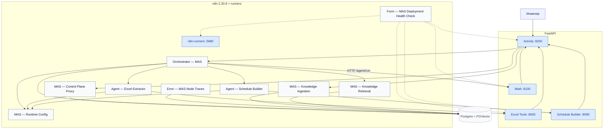

# Руководство по развёртыванию NOVATEK RE MASter (n8n 2.30.8)

Единственный полевой runbook: что запустить на Windows, что импортировать в корпоративный n8n, в каком порядке настраивать и как проверить.

MVP собирает и правит файлы `SCHEDULE` (создание с нуля или безопасный `REVISE`). На вход — `.data`/`.inc`, Excel, `.dev`, поверхности CPS3. На выход — текстовый `*.inc`.

### Жёсткие правила

- **n8n** на работе — только UI. Workflows импортируются вручную («Import from File»). Никакого REST-импорта и никакого Docker Compose на полевом ПК.
- **Локальные сервисы на Windows** (Activity, Excel Tools, Math, Schedule Builder) **не** ходят в Postgres. Стейт кейсов, HITL и артефакты — webhook `MAS — Control Plane Proxy`. Excel / Schedule / Math к Activity — только `GET /cases/{id}/artifacts/…` и `POST /cases/{id}/events`. n8n они видят как HTTP tools / Runtime URLs, не как БД.
- **Секреты** не кладут в JSON workflows, `$env` и `$vars`. Ключи — n8n Credentials либо `.env` на Windows.
- **Не импортировать** `n8n/workflows/retired/`. Это старый контур Engineering MAS (CAS, Data Tables, Entry Form, Human Gate, Trace Writer, Activity Hydrate).
- **Не задавать** `ACTIVITY_HYDRATE_URL` и не искать workflow `Activity — Hydrate`. Кейсы живут в Postgres за прокси.
- Excel Tools слушает **`:8000`**. Порт `18000` не используем (лишняя цифра). Если хостовый `:8000` занят другим контейнером — остановите его, не уводите Excel на 18000.

---

## 0. Перенос проекта на рабочую машину

На машине с git и интернетом:

```bash
python3 scripts/project_pack.py pack
# при лимите размера:
python3 scripts/project_pack.py split
```

На рабочей машине перенесите `scripts/project_pack.py` и `all.txt` (или части):

```bash
python3 project_pack.py join    # если был split
python3 project_pack.py unpack
```

Секреты в архив не входят — их задают заново.

---

## 1. Архитектура

**Сервисы:** Activity `:8200`, Excel Tools `:8000`, Schedule Builder `:8090`, Math `:8100`, Postgres+PGVector, n8n **2.30.8**, n8n-runners (Code/JS).  
**9 core workflow** (`runtime_import_order`): Ingestion, Retrieval, Runtime Config, Schedule Builder, Excel Extractor, Error traces, Control Plane Proxy, Orchestrator, Health Check.  
`n8n/workflows/support/` (6 JSON) в полевой runtime **не** входят; lab может импортировать их как `full_clean_import_set`. `retired/` не импортировать.



Как это работает:

1. Инженер создаёт задачу в Activity (`POST /cases`, multipart: `file`, `schedule_files`, `schedule_root`, при необходимости `.dev` / поверхность). Файлы кладутся в control-plane (`mas_artifacts`) через webhook прокси.
2. Activity вызывает оркестратор `mas-orchestrator-step` на **create / resume / restart**. Дальше оркестратор сам POST-ит `action:step` на свой webhook (`orchestrator_step_url` в Runtime Config). Activity читает `cases`/`events`, не крутит шаг за шагом.
3. Один шаг оркестратора = одно n8n execution: кейс из Postgres (credential n8n), агенты из `agent_registry` (`schema` прокси), решение `call_agent` / `ask_user` / `finish`. Перед LLM оркестратор вызывает `MAS — Knowledge Retrieval` со срезом `target_base=orchestrator_routing` (`routing_card`). Excel и Schedule — `executeWorkflow`; Math — HTTP `…:8100/agent/run`. На LLM-ветке Excel/Schedule сами вызывают тот же Retrieval со срезами `excel_protocol` / `schedule_mvp` (HTTP commissioning / group_rebind RAG не трогают).
4. Excel Extractor и Schedule Builder — LLM в n8n + FastAPI tools. Файлы забирают сами: `GET …:8200/cases/{id}/artifacts/{id}`. Math — тот же GET. Прогресс в ленту — `POST …/cases/{id}/events` **без** Excel `X-API-Key` (это не Header Auth webhook).
5. HITL (`waiting_user`) и лента — таблицы `cases` / `events`. Activity **не** ходит в БД. Ответ инженера — снова `mas-orchestrator-step` (оркестратор передаёт HITL-ответы в следующий `call_agent`, в т.ч. `unlisted_wells_policy`).
6. Готовый `.INC` скачивается из Activity, не из Entry Form. Ошибки нод n8n пишет `Error — MAS Node Traces` **напрямую в Postgres** (`error_traces` + `events`), не через прокси.
7. Health Check — **форма n8n** (сессия UI), не webhook. Берёт URL из `MAS — Runtime Config` и пробует четыре Windows-сервиса, Activity `/ready` и собственные webhooks n8n (оркестратор, прокси). Своих адресов не хранит.

После импорта все workflows `active: false`. Сначала credentials и bindings, затем **Control Plane Proxy** (`schema` → `agent_registry`), Health Check, и только при 0 FAIL — активация оркестратора. RAG: одна таблица, изоляция `target_base`. Оркестратор читает `orchestrator_routing`; Excel LLM — `excel_protocol`; Schedule LLM — `schedule_mvp`. Наполнение — Activity → База знаний.

Calculation — **не** отдельный n8n-агент: оркестратор бьёт в Math Service HTTP. Старый `Agent — Calculation (Math Service)` лежит в `retired/` и не импортируется. Code/JS ноды исполняет **n8n-runners**, не процесс n8n.

`MAS — Runtime Config` — единственный Set URL (`activity_base_url`, `excel_tools_url`, `schedule_service_url`, `math_url` без `/agent/run`, `orchestrator_step_url`) плюс `max_steps` — бюджет шагов оркестратора на кейс (по умолчанию 12). Ключ Excel туда **не** кладут.

### 1.3. Как оркестратор завершает задачу

Паттерн — progress ledger (Magentic-One): решение о завершении принимает LLM по **журналу задачи**, а детерминированные предохранители не дают циклу пройти молча.

- **Журнал** (`state.ledger.history`) — каждый результат агента (`agent_id`, `task_id`, `status`, `summary`, добавленные артефакты, `rework_reason`) и каждый ответ человека (вопрос, текст, `review_accept`). В `planner_input` он идёт отдельным блоком «Журнал задачи (что уже сделано, по шагам)» и в `compact.journal` — LLM видит, что сделано, а не булевые флаги.
- **`progress`** — обязательный блок решения LLM: `goal_satisfied`, `evidence`, `missing`, `is_repeating`. Только при `goal_satisfied` — `finish`; `action.result.summary_for_human` описывает фактически сделанное по summary агентов. Если LLM его не написала, итог собирается из журнала («Schedule Builder: Перепривязал 2 скважины в DKS …») — никаких «вызвал N агентов».
- **Предохранители в `Parse decision`** (без домена): (1) человек принял результат в review — `finish`; (2) LLM написала `goal_satisfied`, но делегирует — `finish`; (3) повторное делегирование агенту, который уже вернул `completed`, без нового ввода человека — допускается **один раз** и только с заполненным `rework_reason` (уходит агенту в `inputs.rework_reason`); иначе — **review-гейт** `result_review_*` (`kind=result_approval`, кнопки «Принять результат» / «Нужна доработка — опишу ниже»). Ответ человека — новый ввод: сбрасывает stall и снова разрешает делегирование.
- **Бюджет шагов** `max_steps` (Runtime Config, UI): по достижении с готовым результатом — тот же review-гейт («исчерпал лимит шагов…»), без единого результата — `failed` с честным сообщением.
- **Activity** показывает `case.finished` со `status_message` оркестратора (итог по журналу), review-гейт — как `result_approval` с кнопками. `run_live_five.py` считает такой кейс **проваленным**, если были повторные handoff без нового ввода, review-эскалации или `step_count > LIVE_STEP_BUDGET` (8): завершение должно быть осознанным, а не пережитым по лимиту.

### 1.1. Живые HTTP-точки n8n

| Workflow | Path | Тип |
|---|---|---|
| `Orchestrator — MAS` | `/webhook/mas-orchestrator-step` | webhook, Header Auth |
| `MAS — Control Plane Proxy` | `/webhook/mas-control-plane` | webhook, Header Auth |
| `MAS — Knowledge Ingestion` | `/webhook/mas-knowledge-ingest` | webhook (Activity «Загрузить в RAG») |
| `Form — MAS Deployment Health Check` | `/form/mas-deployment-health-check` | **форма**, нужна сессия n8n |
| `Agent — Excel Extractor` | нет | только `executeWorkflow` |
| `Agent — Schedule Builder` | нет | только `executeWorkflow` |
| `MAS — Runtime Config` | нет | только `executeWorkflow` (URL loader) |
| `MAS — Knowledge Retrieval` | нет | только `executeWorkflow` |
| `Error — MAS Node Traces` | Error Trigger | Settings → Error workflow |

Не существует: `/webhook/mas-deployment-health-check`, `/webhook/mas-activity-hydrate`, `/webhook/engineering-orchestrator`, Entry Form, Human Gate Form.

### 1.2. Поле vs lab: какие URL куда

| Кто вызывает | Поле (Windows + корпоративный n8n) | Lab (Docker Compose) |
|---|---|---|
| Activity → n8n | `http://<URL-n8n>/webhook/…` | контейнер: `http://n8n:5678/webhook/…`; браузер: `http://127.0.0.1:${N8N_HOST_PORT}` (lab-скрипты и `mas-activity.env.example` ждут **15678**; `.env.example` ставит **5678**) |
| n8n → Excel / Schedule / Math / Activity | `http://<IP-Windows>:8000` / `:8090` / `:8100` / `:8200` | Docker DNS: `excel-tools:8000`, `schedule-builder:8090`, `math-service:8100`, `mas-activity:8200` |
| Браузер инженера | Activity `http://127.0.0.1:8200` (или IP ПК) | `http://127.0.0.1:8200` |
| Postgres | только n8n credential (DBA) | с хоста `127.0.0.1:${POSTGRES_HOST_PORT}` (часто **15432**; compose default **5432**). Windows-сервисы **не** ходят в БД |
| Code/JS ноды | корпоративный task runner | контейнер `n8n-runners`, health `n8n-runners:5680/healthz` |

В Runtime URLs полевого n8n **не** оставляйте `http://excel-tools:8000` — это имя видно только внутри Compose. Правьте один workflow `MAS — Runtime Config`.

---

## 2. Пошаговое развёртывание с нуля (Windows + корпоративный n8n)

Нужны: n8n **2.30.8**, PostgreSQL с расширением `vector` (это делает DBA, не Activity), Python 3.11–3.13.

Четыре сервиса — четыре окна CMD. n8n должен достучаться до IP этого ПК. Сначала поднимите Excel / Schedule / Math, импортируйте и **активируйте Control Plane Proxy**, и только потом Activity: без живого `/webhook/mas-control-plane` процесс Activity завершится на старте.

### Шаг 0. Локальные сервисы

Порты канона (и lab, и поле):

| Сервис | Каталог | Порт | Зачем |
|---|---|---|---|
| Excel Tools | `excel-agent-tools` | **8000** | разбор Excel |
| Schedule Builder | `schedule-builder-service` | **8090** | parse / apply / emit `.INC` (commissioning и group-rebind — Python `timeline_ops.py`, без Node) |
| Math Service | `fastapi-math-service` | **8100** | пересечение траектории |
| Activity UI | `mas-activity-service` | **8200** | задачи, HITL, RAG upload, скачивание `.INC` |

**1. Excel Tools (`:8000`)**

```bat
cd excel-agent-tools
setup-windows.bat
copy excel-tools.env.example excel-tools.env
notepad excel-tools.env
start-windows.bat
```

Впишите уникальный `API_KEY`. Если n8n на другом хосте: `EXCEL_TOOLS_HOST=0.0.0.0`. Проверка: `check-windows.bat`. Вызовы идут с заголовком `X-API-Key`.

**2. Schedule Builder (`:8090`)**

```bat
cd schedule-builder-service
setup-windows.bat
copy schedule-builder.env.example schedule-builder.env
notepad schedule-builder.env
start-windows.bat
```

`ACTIVITY_BASE_URL=http://127.0.0.1:8200` (или `http://<IP-этого-ПК>:8200`, если Activity слушает `0.0.0.0`). Только Python `.venv` — Node.js на Windows не нужен. Проверка: `check-windows.bat`.

**3. Math Service (`:8100`)**

```bat
cd fastapi-math-service
setup-windows.bat
copy math-service.env.example math-service.env
start-windows.bat
```

Оркестратор зовёт `http://<IP>:8100/agent/run`. Проверка: `check-windows.bat`.

**4. MAS Activity (`:8200`) — после шага 4 (прокси Active)**

```bat
cd mas-activity-service
setup-windows.bat
copy mas-activity.env.example mas-activity.env
notepad mas-activity.env
start-windows.bat
```

Обязательные поля `mas-activity.env`:

| Переменная | Пример |
|---|---|
| `ORCHESTRATOR_WEBHOOK_URL` | `http://<URL-n8n>/webhook/mas-orchestrator-step` |
| `CONTROL_PLANE_REQUIRED` | `true` |
| `CONTROL_PLANE_PROXY_URL` | `http://<URL-n8n>/webhook/mas-control-plane` |
| `CONTROL_PLANE_PROXY_AUTH_*` | тот же header, что на webhook прокси |
| `ORCHESTRATOR_AUTH_*` | тот же header, что на webhook оркестратора |
| `KNOWLEDGE_INGEST_URL` | `http://<URL-n8n>/webhook/mas-knowledge-ingest` |
| `MAS_ACTIVITY_HOST` | `0.0.0.0`, если n8n не на этом ПК |

Авторизации в Activity нет. ФИО инженера — поле формы.

Проверка: `check-windows.bat` → `/health` и `/ready`. Если `/ready` = 503, в JSON видно, какой webhook не отвечает. `/health` должен содержать `"control_plane_backend": "n8n_proxy"`.

В нодах n8n URL Activity / Excel / Schedule / Math задаются **один раз** в `MAS — Runtime Config` (`http://<IP-Windows>:8200` и соседние порты).

### Шаг 1. Импорт workflows

n8n → Import from File. Порядок — `n8n/import-manifest.json` → `runtime_import_order`. **Пока ничего не активируйте.**

1. `n8n/workflows/core/tnavigator-schedule-knowledge-ingestion.workflow.json` — `MAS — Knowledge Ingestion`
2. `n8n/workflows/core/tnavigator-schedule-hybrid-retrieval.workflow.json` — `MAS — Knowledge Retrieval`
3. `n8n/workflows/core/mas-runtime-config.workflow.json` — `MAS — Runtime Config` (один Set URL)
4. `n8n/workflows/core/schedule-builder-agent.workflow.json` — `Agent — Schedule Builder`
5. `n8n/workflows/core/excel-extractor-agent.workflow.json` — `Agent — Excel Extractor`
6. `n8n/workflows/core/mas-error-traces.workflow.json` — `Error — MAS Node Traces`
7. `n8n/workflows/core/mas-control-plane-proxy.workflow.json` — `MAS — Control Plane Proxy`
8. `n8n/workflows/core/mas-orchestrator.workflow.json` — `Orchestrator — MAS`
9. `n8n/workflows/core/mas-deployment-health-check.workflow.json` — `Form — MAS Deployment Health Check`

Не импортировать `n8n/workflows/retired/` и не настраивать CAS / Trace Writer / Entry / Human Gate / Activity Hydrate / Orchestrator — Engineering MAS.

`n8n/workflows/support/` — только если сознательно добавляете нового специалиста. В runtime-контур поля они не входят.

Code/JS ноды в n8n 2.30.8 исполняет **task runner** (в lab — контейнер `n8n-runners`). На корпоративном n8n это забота его администраторов, из UI ничего настраивать не нужно; наш JS не использует `require`, `$env`, `$vars`.

### Шаг 2. Credentials

Один Postgres/PGVector на RAG, оркестратор и Control Plane Proxy. SSL = Disable, если сервер без TLS.

| Где | Что привязать |
|---|---|
| `Orchestrator — MAS` → Decision Chat Model | OpenAI-compatible LLM (часто Qwen; при 503 на lab допустим OpenAI) |
| `Agent — Excel Extractor` → Excel Extractor Chat Model | тот же тип LLM |
| `Agent — Schedule Builder` → Schedule Builder Chat Model | тот же тип LLM |
| Knowledge Ingestion / Retrieval → embeddings | тот же embedding credential, модель `text-embedding-3-small`, поле **Dimensions пустое** |
| Knowledge Ingestion / Retrieval / Orchestrator / Control Plane Proxy | Postgres credential |
| Orchestrator webhook, **POST continue run** и Control Plane Proxy webhook | Header Auth (одно и то же имя/значение, что в `mas-activity.env`) |
| Agent — Excel Extractor → HTTP / toolHttpRequest | **отдельный** Header Auth: header name `X-API-Key`, value = `API_KEY` из `excel-tools.env`. Имя credential в UI: `Excel Tools X-API-Key`. |
| `MAS — Runtime Config` → Runtime URLs | `activity_base_url=http://<IP-Windows>:8200`, `excel_tools_url=http://<IP-Windows>:8000` (**без** `/api/v1`), `schedule_service_url=http://<IP-Windows>:8090`, `math_url=http://<IP-Windows>:8100` (без `/agent/run`), `orchestrator_step_url=http://127.0.0.1:5678/webhook/mas-orchestrator-step` (n8n бьёт **сам в себя**; не Activity `/cases/{id}/run`) |
| Orchestrator / Excel / Schedule → Execute Workflow | `Runtime endpoints` / `Runtime configuration` → `MAS — Runtime Config`; `Call Knowledge Retrieval` (Orchestrator + Excel LLM + Schedule LLM) → `MAS — Knowledge Retrieval` |
| Orchestrator → Calculation | берёт `math_url` + `/agent/run` |

В JSON не должно остаться `REPLACE_IN_UI` (кроме support-заглушек, которые не импортируете в runtime).

Header Auth webhook (Authorization) — это **не** ключ Excel. Ключ Excel — отдельный Header Auth credential `X-API-Key` на нодах Agent — Excel Extractor, не поле Set.

### Шаг 3. Execute Workflow bindings (живые)

| Workflow | Нода | Цель |
|---|---|---|
| `Orchestrator — MAS` | `Runtime endpoints` | `MAS — Runtime Config` |
| `Agent — Excel Extractor` | `Runtime configuration` | `MAS — Runtime Config` |
| `Agent — Schedule Builder` | `Runtime configuration` | `MAS — Runtime Config` |
| `Orchestrator — MAS` | `Call Excel Extractor` | `Agent — Excel Extractor` |
| `Orchestrator — MAS` | `Call Schedule Builder` | `Agent — Schedule Builder` |
| `Orchestrator — MAS` | `Call Knowledge Retrieval` | `MAS — Knowledge Retrieval` (`filters.target_base=orchestrator_routing`) |
| `Agent — Excel Extractor` | `Call Knowledge Retrieval` | `MAS — Knowledge Retrieval` (`filters.target_base=excel_protocol`; только LLM-ветка operations) |
| `Agent — Schedule Builder` | `Call Knowledge Retrieval` | `MAS — Knowledge Retrieval` (`filters.target_base=schedule_mvp`; только LLM-ветка operations) |
| `Form — MAS Deployment Health Check` | `Runtime endpoints` | `MAS — Runtime Config` (плюс Header Auth webhook-credential на `Probe Orchestrator webhook` и `Probe Control Plane Proxy webhook`) |

`Call Calculation Agent` — HTTP на Math Service, не executeWorkflow. Live Excel Extractor и Schedule Builder вызывают тот же Retrieval на LLM-пути (селекторы `excel_protocol` / `schedule_mvp`). HTTP `extract_commissioning` / `apply_commissioning` / `apply_group_rebind` RAG не вызывают. `Template — Engineering Specialist` (`support/`) тоже биндит Retrieval своим `target_base`.

Settings → **Error workflow** у оркестратора, Excel Extractor, Schedule Builder, Retrieval, Ingestion: `Error — MAS Node Traces`. Не ставить error workflow на сам `Error — MAS Node Traces` и на `MAS — Control Plane Proxy`.

### Шаг 4. Control Plane Proxy (без SSH / без psql с Windows)

1. Workflow `MAS — Control Plane Proxy`: Header Auth + Postgres.
2. Активируйте webhook **первым** среди runtime-workflows.
3. `POST /webhook/mas-control-plane` с `{"operation":"schema"}` и тем же Header Auth → `ok: true`.
4. Запустите Activity с `CONTROL_PLANE_PROXY_URL`.

Создаются `CREATE TABLE/INDEX IF NOT EXISTS` и upsert в `agent_registry`. **DROP нет.** Нужны права `CREATE TABLE` у роли n8n. Расширение `vector` этот workflow **не** ставит.

Отдельный workflow только для init/wipe **не** заводим: второй webhook + вторая Postgres-привязка разъедутся с DDL. Init и контролируемая очистка живут в том же `MAS — Control Plane Proxy`.

Очистка MAS-данных (кейсы, events, error_traces, executions, mas_artifacts; **не** `agent_registry` и **не** таблицы n8n) — только явный `clear` на `schema` (один прогон: создать таблицы, если нет, и TRUNCATE содержимого):

- в n8n откройте `MAS — Control Plane Proxy` → нода **Operator flags** → галочка / boolean `clear = true` → Save → **Test workflow** (не Listen / не production webhook). В workflow уже закреплён pin `{operation:schema}`. После очистки верните `clear` в `false` и снова Save. Production `/webhook/` галочку **игнорирует**, чтобы Activity на старте не стёрла кейсы;
- или `POST /webhook/mas-control-plane` с `{"operation":"schema","clear":true}` (алиас: `{"operation":"wipe"}`).

`schema` без `clear` таблицы создаёт и **не** чистит. Activity на старте вызывает только `schema` и **никогда** не шлёт `clear`/`wipe`. Полевой FastAPI (Activity / Excel / Math / Schedule) **не** содержит драйвера Postgres. Lab-redeploy кейсы сам не трёт: `python3 scripts/lab_soft_redeploy.py --wipe`.

Таблицы прокси: `cases`, `events`, `error_traces`, `executions`, `agent_registry`, `mas_artifacts`.

Операции: `schema`, `wipe`, `create_case`, `get_case`, `list_cases`, `update_case`, `append_event`, `list_events`, `snapshot`, `append_error`, `list_errors`, `record_execution`, `case_id_for_execution`, `list_agents`, `upsert_agent`, `artifact_put`, `artifact_get`, `batch`.

`snapshot` возвращает case + events одним SQL. Activity не дергает прокси каждые 2 с на каждую вкладку: один poller на открытый кейс, 2 с пока `running`, 6 с на HITL/done/failed, сразу просыпается на запись. Несколько single-row операций (`create_case`+`append_event`, `update_case`+`append_event`) идут как `batch` — Postgres в одном n8n execution последовательно. Успешные production executions прокси **не сохраняются** (`saveDataSuccessExecution=none`, `saveExecutionProgress=false`); ошибки сохраняются. После смены прокси переимпортируйте workflow и перезапустите Activity.

### Шаг 5. RAG (одна база, селектор `target_base`)

Список агентов по-прежнему в `agent_registry` после `schema` прокси (`excel_extractor`, `calculation_agent`, `schedule_builder`). Если срез RAG пуст, оркестратор решает по реестру и compact — **не** HITL про базу.

Гибкость системы — пополнение этой базы. Оркестратор на каждом шаге решения вызывает `MAS — Knowledge Retrieval` **только** со срезом `orchestrator_routing` / `routing_card` (декомпозиция, план, handoff). Live Excel Extractor на LLM-ветке берёт `excel_protocol` / `protocol_instruction`; Schedule Builder — `schedule_mvp` / `keyword_instruction` (when-to-use; расклад полей по-прежнему `get_keyword` / FastAPI catalogue). Те же таблицы и тот же sub-workflow; клоны — `specialist_template`. Нельзя ходить «во всю базу» без `target_base`. Пустой срез у специалиста — инструменты без HITL про RAG.

Query оркестратора — цель + факты состояния (сколько скважин из Excel, нужно ли обновить baseline), без имён файлов и без rule-based hint (hint остаётся в LLM-промпте). `topics` и `task_patterns` считаются из цели и артефактов. `keyword_families` здесь — routing-теги (`XLSX`, `INC`, `COMMISSIONING`, `GROUP_CONTROL`), не keywords SCHEDULE. Теговая ветка Retrieval — **ИЛИ** по `keyword_families` / `topics` / `task_patterns`; жёсткий срез только `target_base` + `knowledge_types`. Карточки короче 50 символов и с `rrf_score<=0` отбрасываются; из оставшихся в prompt попадают лучшие по RRF (не ниже 45% от лучшего hit).

Таблицы: `tnavigator_schedule_knowledge_v1` (векторы) и `tnavigator_schedule_knowledge_documents_v1`.

Источник карточек: `n8n/rag/excel-agent-operating-guide.documents.json` (блок `injection_template` ingest игнорирует).

1. `MAS — Knowledge Ingestion`: тот же Postgres и тот же embedding, что у Retrieval. Embeddings: `batchSize=16`, `timeout=600`.
2. Активируйте production webhook `mas-knowledge-ingest`.
3. Activity → **База знаний** → **Загрузить в RAG** (живой файл, без `injection_template`).
4. В ответе должны быть ненулевые `orchestrator_routing` / `routing_card` и `excel_protocol` / `protocol_instruction`.
5. Правка уже залитой карточки: увеличьте `revision` и залейте снова.

Запасной путь в n8n: **Sync packaged MAS knowledge** (снимок на момент generate/import, не live-правки Activity).

Пустые таблицы после wipe Postgres = снова этот шаг.

### Шаг 6. Health Check и активация

1. В `Form — MAS Deployment Health Check` привяжите `Runtime endpoints` → `MAS — Runtime Config` и Header Auth credential (тот же, что на webhook оркестратора и прокси) на `Probe Orchestrator webhook` / `Probe Control Plane Proxy webhook`. Больше в форме ничего не правят — все адреса она берёт из Runtime Config.
2. Откройте форму (`/form/mas-deployment-health-check`, нужна сессия n8n). Это **форма**, не webhook. Гонять её можно до активации оркестратора: проба оркестратора тогда честно покажет `FAIL … not Active`.
3. Цель на поле — **`PASS`** (0 FAIL, 0 TODO). `PASS_WITH_TODO` означает, что в Runtime Config остались lab-имена `mas-activity` / `excel-tools` / … — на поле это ошибка конфигурации, в lab норма. У каждого FAIL есть колонка `where_to_fix`.
4. Активируйте: Control Plane Proxy (уже), Ingestion, Retrieval, Excel Extractor, Schedule Builder, Error traces, **затем** Orchestrator. Прогоните форму ещё раз — все пробы `PASS`.
5. Вход в систему — Activity UI `http://<IP>:8200`, не Entry Form.

Что пробует форма (все URL — из `MAS — Runtime Config`):

| Проба | Что подтверждает |
|---|---|
| `GET {activity_base_url}/health` | Activity жив, `control_plane_backend = n8n_proxy` (не memory) |
| `GET {activity_base_url}/ready` | **обратное направление**: Windows-ПК достаёт до webhooks n8n (`ORCHESTRATOR_WEBHOOK_URL`, `CONTROL_PLANE_PROXY_URL`, `KNOWLEDGE_INGEST_URL`, корпоративный TLS) |
| `GET {excel_tools_url}/health`, `{schedule_service_url}/health`, `{math_url}/health` | n8n → Windows: сервис запущен, слушает `0.0.0.0`, firewall открыт |
| `POST {orchestrator_step_url}` `{"action":"probe"}` | оркестратор Active, Header Auth совпадает, `orchestrator_step_url` — адрес, по которому n8n достаёт сам себя (тот же путь, что self-POST `action:step`) |
| `POST …/webhook/mas-control-plane` `{"operation":"list_agents"}` | прокси Active, Postgres credential, `schema` отработал: в `agent_registry` есть `excel_extractor`, `schedule_builder`, `calculation_agent` |

Форма не зовёт LLM, Excel и Schedule Builder и не трогает Data Tables / `n8n-runners`.

### Шаг 7. Работа инженера (HITL)

1. Activity → новая задача, цель текстом, файлы (Excel / `.inc` / `.dev` / поверхность).
2. Лента событий обновляется с прокси (`snapshot`). Пока открыт EventSource, отдельный частый poll не нужен: один poller на кейс, 2 с в работе / сразу на запись.
3. Статус `waiting_user` — ответить в панели HITL (вариант / текст). Не копировать `expected_version` / `gate_id` вручную.
4. Результат — скачать `.INC` из карточки задачи.
5. После правок UI Activity: hard-refresh. В query static есть `app.js?v=…`.

---

## 3. Инженерные правила SCHEDULE

Разрешённые keywords только из руководства tNavigator, секция 12.x.y. Не выдумывать имена.

### Режимы

- **`CREATE`:** Создание нового файла SCHEDULE.
- **`REVISE`** — менять только то, что сказано в задаче, остальное не трогать.
- Excel Extractor / n8n никогда не читает Excel-файлы напрямую: только HTTP к Excel Tools (`:8000`). Schedule Builder получает уже извлечённые факты (Handoff фактов), не xlsx.
- Excel/Schedule агенты: `returnIntermediateSteps=true`.
- LLM не пишет `.INC` руками. Parse / apply / emit, commissioning и group-rebind — Python FastAPI (`timeline_ops.py`). На Windows достаточно `.venv`. JS timeline в `n8n/templates/schedule_timeline_runtime.py` — только n8n smokes, не процесс сервиса.
- Расклад keyword не хардкодится классом на слово: RAG `schema_catalogue` → Pydantic `KeywordSchema` → `POST /render` / tool `render_ir`. `get_keyword` отдаёт `details.parameters`. Снимок каталога: `schedule-builder-service/app/data/schema_catalogues.json`.

### INCLUDE

- Позиция `INCLUDE` относительно `DATES` сохраняется, если задача не просит иное.
- Текст INCLUDE **не переписываем**. Пути как в baseline, в том числе Petrel `'../../INCLUDE/…'`.
- Тело подтягивается, если файл передан (`schedule_files` / stubs). Иначе вызов оставляют (`KEEP`).
- Запрещены URL и абсолютные пути. `..` в относительном пути пакета допустим: резолв внутри пакета; выход за корень пакета — unsafe.
- Несколько файлов: `schedule_files` и при необходимости `schedule_root` (корневой INC — первым в форме).

### Scoring

`attention_threshold = 85`, `hitl_threshold = 70`. Блокировки (неизвестный keyword, нет факта Excel, небезопасный INCLUDE, деструктив без подтверждения) не отменяются высоким баллом.

### Keywords

`DATES`, `INCLUDE`, `GRUPTREE`, `WELSPECS`, `WELLTRACK`, `COMPDATMD`, `WCONHIST`, `WCONPROD`, `WCONINJE`, `GCONPROD`, `GCONINJE`, `GUIDERAT`, `GSATPROD`, `GSATINJE`, `WELLSTRE`, `WINJGAS`, `GINJGAS`, `BRANPROP`, `NODEPROP`, `GNETDP`, `NETBALAN`, `FRACTURE_TEMPLATE`, `FRACTURE_SPECS`, `FRACTURE_STAGE`, `WECON`, `WTEST`, `WELTARG`, `WNETDP`, `WPIMULT`, `WDFAC`, `WEFAC`, `WELOPEN`, `WELDRAW`, `WLIST`, `WFRACP`, `WFRACPL`, `VFPPROD`, `WVFPDP`, `ACTIONX`, `DELAYACT`, `ENDACTIO`, `UDQ`, `UDT`, `APPLYSCRIPT`.

- Синонимы не эмитить отдельно: `WELTARG`, не `WELLTARG`.
- Старое имя корпуса: эмитить `FRACTURE_SPECS` (макет из текущего §`FRACTURE_WELL`). Не allowlist `FRACTURE_WELL`.
- Табличный keyword закрывается голым `/` после записей, затем пустая строка перед следующим keyword/DATES.

Новый keyword:

1. Проверить, что имя есть в `n8n/rag/tNavUserManualRussian.pdf` как заголовок `12.x.y. KEYWORD`. Если нет — не выдумывать, предложить ближайшее реальное.
2. Добавить в `KEYWORDS` в `n8n/templates/schedule_rag_workflows.py` (единственный источник; `generate_schedule_workflows.py` импортирует его).
3. `python3 generate_schedule_workflows.py` из `n8n/templates`.
4. Карточка `schedule_mvp` / `keyword_instruction` в `excel-agent-operating-guide.documents.json` (до `injection_template`), bump `revision`, снова RAG.
5. Обновить этот список в `docs.md`.

После правок шаблонов, которые меняют emit `.INC`, в том же ходе: `python3 generate_schedule_workflows.py` и дымовые `n8n/tests/*-smoke.js` (см. §5).

---

## 4. Диагностика

| Симптом | Что проверить |
|---|---|
| Activity не стартует, 404 `mas-control-plane` | прокси не Active; Header Auth; Activity запущена **после** активации прокси |
| `/health` не `n8n_proxy` | `CONTROL_PLANE_PROXY_URL` пуст — memory-режим, для поля нельзя |
| `relation "cases" does not exist` | `POST …/mas-control-plane` с `{"operation":"schema"}`, Postgres credential, права CREATE |
| Оркестратор не видит агентов / пустой реестр | `schema` прокси не отработал; таблица `agent_registry` |
| Knowledge Ingestion timeout | embeddings `batchSize=16`, `timeout=600` |
| Activity «Загрузить в RAG» → 404 | Ingestion не Active, path `/webhook/mas-knowledge-ingest` |
| `/webhook/mas-deployment-health-check` → 404 | это форма `/form/mas-deployment-health-check` |
| Health Check: `Runtime Config: bound and readable` FAIL | в форме не привязан `Runtime endpoints` → `MAS — Runtime Config` |
| Health Check: `Orchestrator webhook` / `Control Plane Proxy` 403 | Header Auth credential на пробе ≠ credential на webhook |
| Health Check: `Orchestrator webhook` 404 | оркестратор не Active или `orchestrator_step_url` в Runtime Config не тот URL, по которому n8n видит сам себя |
| Excel 401 | credential `Excel Tools X-API-Key` ≠ `API_KEY` в `excel-tools.env`; сервис на **:8000**; не путать с Header Auth webhook |
| n8n не видит Excel/Schedule/Activity | firewall; сервисы слушают `0.0.0.0`; URL в **MAS — Runtime Config** — IP Windows, не `excel-tools` |
| Пустая лента при живом n8n | прокси, операция `snapshot` после переимпорта Control Plane Proxy, Activity перезапущен |
| Рейл «N turn» ≠ число пузырей в чате | переимпортировать Control Plane Proxy (`list_cases` отдаёт `events`); Activity считает свёрнутую ленту |
| CORS в браузере | Activity CORSMiddleware; не сочетать `allow_credentials=True` с `"*"` |
| `REPLACE_...` в экспорте JSON | не привязан credential или executeWorkflow |
| n8n Executions забит прокси | переимпортируйте Control Plane Proxy (`saveDataSuccessExecution=none`); Activity 2.x не поллит snapshot с каждой вкладки — один poller / `batch` |
| Qwen 503 | другой OpenAI-compatible credential на Chat Model |

---

## 5. Лаборатория (разработчики)

Compose на Linux-lab: n8n с хоста `http://127.0.0.1:${N8N_HOST_PORT}` (скрипты по умолчанию **15678**, `.env.example` — **5678**), Postgres `127.0.0.1:${POSTGRES_HOST_PORT}` (часто **15432**, compose default **5432**). С хоста также Excel `:8000`, Schedule `:8090`, Math `:8100`, Activity `:8200`. Docker DNS для нод n8n: `excel-tools:8000`, `schedule-builder:8090`, `math-service:8100`, `mas-activity:8200`. Code-ноды: `n8n-runners:5680`. **Не** `docker compose down -v` — это снесёт Postgres и RAG.

Не поднимайте одновременно Docker `mas-activity` и `mas-activity-service/start-linux.sh` на одном `:8200`.

Activity в Compose **не** стартует, пока не зарегистрирован production webhook прокси (иначе lifespan падает с HTTP 404). `scripts/lab_soft_redeploy.py` импортирует workflows, активирует прокси, затем поднимает Activity.

```bash
# дымовые тесты живого контура (orchestrator, agents, proxy, RAG, health check, SCHEDULE emit / terminators) — нужен Node.js (lab). На полевой Windows Node не ставится.
for f in n8n/tests/*-smoke.js; do node "$f" || exit 1; done
# retired-контур (замороженные JSON) — отдельно, только если трогали n8n/templates/retired или workflows/retired:
# for f in n8n/tests/retired/*.js; do node "$f" || exit 1; done

cd mas-activity-service && PYTHONPATH=. .venv/bin/python -m pytest -q
cd ../schedule-builder-service && PYTHONPATH=. python3 -m pytest -q
# pytest excel-tools: из venv Activity, не системный python без pytest
PYTHONPATH=excel-agent-tools mas-activity-service/.venv/bin/python -m pytest excel-agent-tools/tests/test_agent_run.py excel-agent-tools/tests/test_workflow_contracts.py -q
```

Golden через тот же multipart, что браузер (`POST /cases`):

```bash
PYTHONPATH=mas-activity-service mas-activity-service/.venv/bin/python \
  simulation-model-example/golden-cases/run_ui_smoke.py golden_case_1
PYTHONPATH=mas-activity-service mas-activity-service/.venv/bin/python \
  simulation-model-example/golden-cases/run_ui_smoke.py golden_case_2
```

Не переписывать `*_MAS_result.INC` без явной просьбы. После правок Python у FastAPI в Compose: `docker compose restart excel-tools schedule-builder math-service mas-activity` (uvicorn **без** `--reload`). После правки Control Plane Proxy — переимпорт workflow (иначе `list_cases` без колонки `events`).

Поднять стенд и **переимпортировать** workflows (кейсы по умолчанию **не** трогает):

```bash
python3 scripts/lab_soft_redeploy.py
```

`--skip-wipe` оставлен как no-op (wipe и так выключен). Явная очистка кейсов/events/Activity state: `python3 scripts/lab_soft_redeploy.py --wipe`. Volumes не трогает.

После UI-правок Activity: hard-refresh. Версии cache-bust в `mas-activity-service/static/index.html` (`app.css?v=…`, `app.js?v=…`, `schema.js?v=…`) — цифры из этого файла не копировать сюда.

Боевой сценарий дат/REVISE: `simulation-model-example/combat-dates-revise/` (`PUBLISH_ACTIVITY=0 python3 run_integration_cases.py` если трогали commissioning/emit). Живые 6 задач через Activity UI (перед первым кейсом — чистая база, `--wipe`):

```bash
PYTHONPATH=mas-activity-service mas-activity-service/.venv/bin/python \
  simulation-model-example/run_live_five.py
```

golden_case_1 / golden_case_2 + combat 0–3 (keep / keep-half / remove-half / new wells). HITL отвечает скрипт (`unlisted_wells_policy`).

Проверка стека с хоста: `python3 scripts/mas_stack_health.py`.

---

## 6. Новый агент

LLM не выбирает `workflow_id`. Агенты не вызывают друг друга: только оркестратор, контракт `agent_task` → `agent_result`.

Сегодня (до Фазы 2 `MAS_REFACTORING_PLAN.md`) добавление агента требует правки шаблона оркестратора (`generate_mas_orchestrator.py`: SYSTEM, ROUTE, узел вызова, MERGE) и регенерации JSON, плюс:

1. Workflow агента (образец — `Agent — Excel Extractor` / `Agent — Schedule Builder`: Normalize → AI Agent + tools → Finalize `agent_result`).
2. Строка в `agent_registry` (Activity → «Агенты» → `upsert_agent`, либо SQL-seed `postgres-init/02…`).
3. Карточка в RAG (`orchestrator_routing`), bump `revision`, **Загрузить в RAG**.

Retired-контур `specialist_packet` / `specialist_result` / `specialist_registry.v1.json` заморожен в `n8n/templates/retired/`, `n8n/contracts/retired/`, `n8n/workflows/retired|support/` — не расширять.
