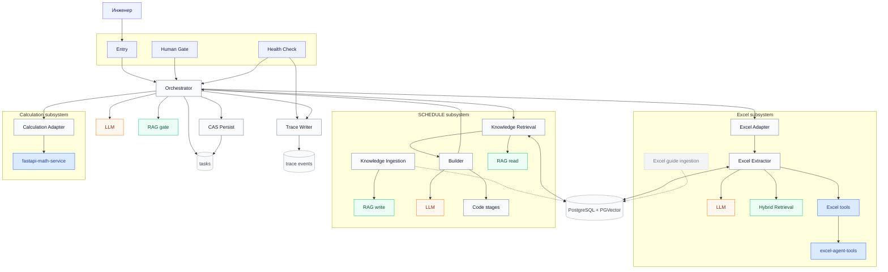

# Petroleum Engineering MAS — n8n 2.30.8

Единый документ: архитектура, компонентная схема и пошаговое развёртывание через UI n8n.

Практичный MVP для создания и проверки `SCHEDULE` в режимах `CREATE` и preserve-by-default `REVISE`. Входные `.data/.inc`, Excel, `.dev` и CPS3 обрабатываются внутри n8n и локальных FastAPI-сервисов. Результат — текст `schedule.inc`.

**Целевая версия:** строго n8n `2.30.8`.  
**Машинный контракт имён/bindings:** [`n8n/import-manifest.json`](n8n/import-manifest.json).  
**CSV шаблоны Data Tables:** [`n8n/data-tables/`](n8n/data-tables/).  
**Проверка связности:** `Form — MAS Deployment Health Check`.

Требования: PostgreSQL + PGVector, OpenAI/OpenAI-compatible credentials, Python 3.11–3.13 на Windows. Global Variables, `$env`, PowerShell и доступ к серверной файловой системе в workflow не используются.

---

## 1. Компонентная схема

Источник истины для имён — `n8n/import-manifest.json` и поле `name` в `n8n/workflows/core/` и `n8n/workflows/support/`.

**Как читать:** короткие названия — роли/сервисы. Цвет: **оранжевый = LLM**, **зелёный = RAG/memory**, **синий = FastAPI / tools**. Имена workflow в UI — в `n8n/import-manifest.json`.



**MVP runtime (активировать forms только после Health Check):** Entry, Human Gate, Health Check, Orchestrator, `CAS — Persist Task State`, Trace, Excel Adapter+Agent, `MAS — Knowledge Ingestion` / `MAS — Knowledge Retrieval`, `SCHEDULE — Builder`, Calculation Adapter.

**Не активировать:** `Adapter — Excel Form`, `Template — Engineering Specialist`, `Reference — AI Components`. `CAS — Persist Task State` остаётся inactive (его вызывает Orchestrator). `MAS — Knowledge Ingestion` не Publish: первый пакет — Manual-триггер, дальше — вставка всей простыни `excel-agent-operating-guide.documents.json`.

### Runtime shape

```text
Form / webhook
→ Universal Engineering Orchestrator (HITL + Verifier)
→ CAS — Persist Task State (единственная запись task state)
→ Calculation Adapter | Excel Adapter | MAS — Knowledge Retrieval
→ SCHEDULE Builder (intake→baseline→plan→render→merge→validate→verify)
→ accountable release gate in Orchestrator
→ bounded schedule.inc
```

SCHEDULE delivery — три workflow + shared Trace Writer. Отдельных diagnostic mirrors (`intake`, `baseline-*`, `planner`, `renderer`, …) нет: стадии живут Code-нодами внутри Builder; release — в Orchestrator (`Apply action and version guard`).

---

## 2. Зачем такая архитектура

Паттерн: **Stateful Orchestrator–Workers** с явными validation/verification и HITL.

1. **Нельзя «просто промптнуть Excel → SCHEDULE».** LLM галлюцинирует координаты, скважины и синтаксис. Оркестратор не считает геометрию и не пишет финальный SCHEDULE сам: делегирует FastAPI (Excel/Math) и проверяет результат независимым Verifier.
2. **Нельзя скормить весь Excel как Markdown.** Тысячи строк убивают контекст и бюджет. Excel Agent работает tool-ами: introspect → detect/describe → query; в модель попадает только выжимка.
3. **Нужен аудит.** Решения, tool-вызовы и gates пишутся в `Writer — MAS Trace` / `mas_trace_events_v1` без секретов и raw prompts.

### Краткий разбор компонентов

| Подсистема | Что делает |
|---|---|
| **Orchestrator** | Planner + Verifier LLM, HITL, routing на allowlisted Call-ноды; Load task by ID |
| **CAS persist** | Единственная запись `engineering_orchestrator_tasks_v1`: insert + optimistic update |
| **Excel** | Adapter → Agent (LLM + governed `excel_protocol` RAG + 7 tool-нод) → `excel-agent-tools` |
| **MAS Knowledge** | `MAS — Knowledge Ingestion` / `MAS — Knowledge Retrieval` — общий RAG всех агентов (`target_base`) |
| **SCHEDULE** | `SCHEDULE — Builder` (Code stages + 2 LLM); знания берёт из MAS Knowledge, namespace `schedule_mvp` |
| **Calculation** | Adapter → `fastapi-math-service` (DEV × CPS3/ZMAP) |
| **Infra** | Data Tables + PostgreSQL/PGVector + Trace Writer |

---

## 3. Развёртывание через UI n8n (с нуля)

### Step 0 — Preconditions

| Need | Notes |
|---|---|
| n8n **2.30.8** | Не новее/не старше для этих JSON |
| PostgreSQL + PGVector | memory + SCHEDULE/Excel RAG; credential SSL = Disable для локального Postgres без TLS |
| OpenAI-compatible chat + embeddings | Planner, Verifier, SCHEDULE, Excel Agent; **Dimensions в embeddings не задавать** |
| Excel Tools на Windows | `http://<windows-ip>:8000/api/v1` + API key |
| Math Service | `http://<windows-ip>:8100/api/v1/math` |

### Step 0b — Локальные сервисы (Windows CMD)

**Excel Tools**

```bat
cd excel-agent-tools
setup-windows.bat
copy excel-tools.env.example excel-tools.env
notepad excel-tools.env
start-windows.bat
```

Задайте уникальный `API_KEY`. Проверка: `check-windows.bat`. Локально `http://127.0.0.1:8000/api/v1`; для удалённого n8n — `EXCEL_TOOLS_HOST=0.0.0.0` и `http://<IP-Windows>:8000/api/v1`.

**Math Service**

```bat
cd fastapi-math-service
py -m venv .venv
.venv\Scripts\python.exe -m pip install -r requirements.txt
.venv\Scripts\python.exe -m uvicorn app.main:app --host 127.0.0.1 --port 8100
```

Проверка: `http://127.0.0.1:8100/health`. Batch: одна ASCII CPS3/ZMAP + до 256 `.dev` (`MD X Y Z`), одинаковые CRS/единицы/datum/Z.

### Step 1 — Import workflows (точный порядок)

**Workflows → Import from File:**

| # | File | UI name |
|---:|---|---|
| 1 | `n8n/workflows/core/calculation-specialist-adapter.workflow.json` | `Adapter — Calculation (Math Service)` |
| 2 | `n8n/workflows/core/excel-extraction-agent.workflow.json` | `Agent — Excel Extractor` |
| 3 | `n8n/workflows/core/excel-engineering-specialist-adapter.workflow.json` | `Adapter — Excel Extraction` |
| 4 | `n8n/workflows/core/tnavigator-schedule-knowledge-ingestion.workflow.json` | `MAS — Knowledge Ingestion` |
| 5 | `n8n/workflows/core/tnavigator-schedule-hybrid-retrieval.workflow.json` | `MAS — Knowledge Retrieval` |
| 6 | `n8n/workflows/core/tnavigator-schedule-builder.workflow.json` | `SCHEDULE — Builder` |
| 7 | `n8n/workflows/core/mas-trace-event-writer.workflow.json` | `Writer — MAS Trace` |
| 8 | `n8n/workflows/core/cas-persist-task.workflow.json` | `CAS — Persist Task State` |
| 9 | `n8n/workflows/core/universal-engineering-orchestrator.workflow.json` | `Orchestrator — Engineering MAS` |
| 10 | `n8n/workflows/core/mvp-entry-form.workflow.json` | `Form — MAS Entry` |
| 11 | `n8n/workflows/core/mas-human-gate-form.workflow.json` | `Form — MAS Human Gate` |
| 12 | `n8n/workflows/core/mas-deployment-health-check.workflow.json` | `Form — MAS Deployment Health Check` |

Опционально из `n8n/workflows/support/`: Excel Form adapter, AI components, specialist template.  
Полный clean-import набор — **15** JSON (`full_clean_import_set`). Все приходят с `active: false`. `CAS — Persist Task State` импортируется **до** Orchestrator.

### Step 2 — Create Data Tables

Вкладка **Data tables**.

1. `engineering_orchestrator_tasks_v1` — CAS state  
2. `mas_trace_events_v1` — redacted trace ledger  

**Предпочтительно From scratch** (типы сразу верные).

`engineering_orchestrator_tasks_v1`:

| Column | Type | Column | Type |
|---|---|---|---|
| `task_id` | String | `version` | Number |
| `status` | String | `phase` | String |
| `task_type` | String | `risk_class` | String |
| `request_json` | String | `context_json` | String |
| `plan_json` | String | `specialist_json` | String |
| `result_json` | String | `verification_json` | String |
| `pending_human_json` | String | `last_error_json` | String |
| `retry_count` | Number | `max_retries` | Number |
| `history_json` | String | `created_at` | String |
| `updated_at` | String | | |

`mas_trace_events_v1` — все String:  
`event_id`, `trace_id`, `task_id`, `at`, `stage`, `event_type`, `actor`, `status`, `summary`, `details_json`

**Ускорение — Import CSV:**  
[`n8n/data-tables/engineering_orchestrator_tasks_v1.header.csv`](n8n/data-tables/engineering_orchestrator_tasks_v1.header.csv),  
[`n8n/data-tables/mas_trace_events_v1.header.csv`](n8n/data-tables/mas_trace_events_v1.header.csv).  
После CSV смените `version`, `retry_count`, `max_retries` на **Number**.

### Step 3 — Bind Data Table nodes

Не оставляйте `REPLACE_IN_UI`.

| Open workflow | Node name | Select table |
|---|---|---|
| `Writer — MAS Trace` | `Insert MAS trace event` | `mas_trace_events_v1` |
| `CAS — Persist Task State` | `Insert durable task row` | `engineering_orchestrator_tasks_v1` |
| `CAS — Persist Task State` | `Update durable task row` | `engineering_orchestrator_tasks_v1` |
| `Orchestrator — Engineering MAS` | `Load task by ID` | `engineering_orchestrator_tasks_v1` |
| `Form — MAS Deployment Health Check` | `Probe task Data Table` | `engineering_orchestrator_tasks_v1` |
| `Form — MAS Deployment Health Check` | `Probe trace Data Table` | `mas_trace_events_v1` |

### Step 4 — Bind Execute Workflow nodes (24 обязательных)

| Open workflow | Node on canvas | Select this workflow |
|---|---|---|
| `Orchestrator — Engineering MAS` | `Call CAS persist — insert new task` | `CAS — Persist Task State` |
| `Orchestrator — Engineering MAS` | `Call CAS persist — human action then plan` | `CAS — Persist Task State` |
| `Orchestrator — Engineering MAS` | `Call CAS persist — terminal human action` | `CAS — Persist Task State` |
| `Orchestrator — Engineering MAS` | `Call CAS persist — plan or human gate` | `CAS — Persist Task State` |
| `Orchestrator — Engineering MAS` | `Call CAS persist — SCHEDULE evidence retry` | `CAS — Persist Task State` |
| `Orchestrator — Engineering MAS` | `Call CAS persist — SCHEDULE resume` | `CAS — Persist Task State` |
| `Orchestrator — Engineering MAS` | `Call CAS persist — verification` | `CAS — Persist Task State` |
| `Orchestrator — Engineering MAS` | `Call CAS persist — specialist gate or error` | `CAS — Persist Task State` |
| `Orchestrator — Engineering MAS` | `Call CAS persist — routing gate` | `CAS — Persist Task State` |
| `Orchestrator — Engineering MAS` | `Call Excel Extraction Specialist Adapter` | `Adapter — Excel Extraction` |
| `Orchestrator — Engineering MAS` | `Call routing Hybrid Retrieval` | `MAS — Knowledge Retrieval` |
| `Orchestrator — Engineering MAS` | `Call Excel protocol Hybrid Retrieval` | `MAS — Knowledge Retrieval` |
| `Orchestrator — Engineering MAS` | `Call SCHEDULE Hybrid Retrieval` | `MAS — Knowledge Retrieval` |
| `Orchestrator — Engineering MAS` | `Call SCHEDULE Builder Specialist` | `SCHEDULE — Builder` |
| `Orchestrator — Engineering MAS` | `Call Calculation Specialist` | `Adapter — Calculation (Math Service)` |
| `Orchestrator — Engineering MAS` | `Call MAS Trace Event Writer` | `Writer — MAS Trace` |
| `Agent — Excel Extractor` | `Call Excel protocol Hybrid Retrieval` | `MAS — Knowledge Retrieval` |
| `Template — Engineering Specialist` | `Call specialist Hybrid Retrieval` | `MAS — Knowledge Retrieval` |
| `Adapter — Excel Extraction` | `Call native Excel Extraction Agent` | `Agent — Excel Extractor` |
| `Form — MAS Entry` | `Call Universal Engineering Orchestrator` | `Orchestrator — Engineering MAS` |
| `Form — MAS Human Gate` | `Call Orchestrator status` | `Orchestrator — Engineering MAS` |
| `Form — MAS Human Gate` | `Call Orchestrator resume` | `Orchestrator — Engineering MAS` |
| `Form — MAS Deployment Health Check` | `Call Orchestrator probe` | `Orchestrator — Engineering MAS` |
| `Form — MAS Deployment Health Check` | `Call Trace Writer probe` | `Writer — MAS Trace` |

**Не настраивать:** `Call Data Specialist`, `Call Document Specialist` (заглушки).  
Подсказка: экспорт JSON → поиск `REPLACE_` = незавершённый binding. На `Route invocation action` picker нет — это Code routing.

### Step 5 — Credentials и URL сервисов

| Where | What |
|---|---|
| Orchestrator | `Planner Chat Model`, `Verifier Chat Model` (отдельные credentials) |
| SCHEDULE — Builder | Planner + Builder chat models |
| Agent — Excel Extractor | Runtime `excel_tools_url` + `excel_tools_api_key` (+ webhook key); chat; Postgres memory; bind `MAS — Knowledge Retrieval` |
| `MAS — Knowledge Ingestion` / `MAS — Knowledge Retrieval` | Postgres + **тот же** embedding credential/модель |
| Adapter — Calculation | `math_service_url` в ноде конфигурации (не `$env`) |
| Orchestrator webhook (если HTTP) | Header Auth |
| Postgres credential | SSL = **Disable**, Ignore SSL Issues = **off** для compose/local Postgres |

### Step 6 — Наполнить hybrid RAG

Одна физическая пара таблиц: `tnavigator_schedule_knowledge_v1` (chunks) + `tnavigator_schedule_knowledge_documents_v1` (parents). Изоляция — allowlisted `target_base`, не динамическое SQL-имя таблицы. Пустой tag-фильтр **не** возвращает весь namespace.

| Namespace | Кто читает | Тип карточек | Schema catalogue |
|---|---|---|---|
| `schedule_mvp` | Orchestrator → Builder | `keyword_instruction`, `worked_example` | обязателен |
| `excel_protocol` | Orchestrator Excel lane + Excel Extractor | `protocol_instruction` | нет |
| `orchestrator_routing` | Planner (до LLM) | `routing_card` | нет |
| `specialist_template` | Template — Engineering Specialist (клоны: `controls.target_base`) | `capability_instruction` | нет |

1. Откройте `MAS — Knowledge Ingestion`. Credentials Postgres + embedding (те же, что у Retrieval).  
2. Первый раз: триггер **Sync packaged MAS knowledge** → **Test workflow**. Пишутся только новые ключи `(target_base, knowledge_id, revision)`.  
3. Нода `Summarize RAG inventory` = `rag_inventory_ok`.  
4. Дальше правите один файл `n8n/rag/excel-agent-operating-guide.documents.json` (агент Excel, оркестратор, агент Schedule). Копируете файл целиком и вставляете в форму поле **Paste the full knowledge sheet** или в Execute Sub-workflow. Старые ключи пропускаются, новые пишутся. Последний элемент-шаблон не загружается. Чтобы заменить текст уже залитой карточки, поднимите `revision`.  
5. Проверка: `MAS — Knowledge Retrieval`.

Пакет на импорте покрывает `excel_protocol`, `orchestrator_routing` и `specialist_template`. Повторный прогон и повторная вставка простыни не дублируют уже существующие ключи. Excel Extractor больше не использует vector-tool `context_search`.

### Step 7 — Health Check, затем activate

1. В Health Check выберите таблицы (Step 3) и Orchestrator/Trace (Step 4).  
2. Publish/activate **только** этот form (или Test).  
3. Production Form URL → Submit.  
4. Читайте HTML-отчёт:
   - **FAIL** — исправить по `where_to_fix`
   - **PASS** — live probe ок
   - **TODO** — чеклист bindings/smoke; нормально при 0 FAIL  
5. «Зелёный» control-plane = **0 FAIL** (часто `PASS_WITH_TODO`).  
6. При 0 FAIL активируйте `Form — MAS Entry` и `Form — MAS Human Gate`.

### Step 8 — Пользовательский запуск

1. Production Form URL Entry.  
2. `Task Description` + Excel / `.data/.inc` / `.dev` / CPS3.  
3. Completion: `schedule.inc` или HITL с `task_id`.  
4. Продолжение: `Form — MAS Human Gate` → `task_id` → `reply` / `approve` / `reject`. Форма сама подставляет `expected_version` / `gate_id`.

---

## 4. Smoke и диагностика

**Smoke после 0 FAIL**

- Entry без objective → HITL + `task_id`
- Human Gate `status` / `reply` без ручного `gate_id`
- CREATE / REVISE при заполненном RAG
- Excel evidence path
- `.dev` + CPS3 через Calculation
- stale version / wrong gate → conflict
- CAS persist: invalid request / 0 rows / echoed attempted → `cas_succeeded=false`
- `mas_trace_events_v1` без секретов/raw prompts

**Quick fix**

| Symptom | Where to fix |
|---|---|
| Form Entry «workflow not found» | `Form — MAS Entry` → `Call Universal Engineering Orchestrator` |
| Human Gate не грузит status | `Form — MAS Human Gate` → `Call Orchestrator status` |
| Orchestrator не зовёт Excel | Orchestrator → `Call Excel Extraction Specialist Adapter` |
| Orchestrator не зовёт SCHEDULE | Orchestrator → Retrieval / Builder Call nodes |
| Trace пустой / insert error | `Writer — MAS Trace` → Data Table + Orchestrator → Trace Call |
| CAS / Load task fails | `CAS — Persist Task State` insert+update **и** Orchestrator `Load task by ID` → `engineering_orchestrator_tasks_v1` |
| Orchestrator Call CAS persist «workflow not found» | Все 9 `Call CAS persist — *` → `CAS — Persist Task State` |
| SSL / Postgres | Credential: SSL Disable |
| `toolHttpRequest has a supplyData…` | Переимпортировать `Agent — Excel Extractor`, tool-связи только `ai_tool` |
| Export JSON содержит `REPLACE_` | Незавершённый binding — Step 4 |

---

## 5. Проверка репозитория и Docker

```bash
WORKSPACE_ROOT="$PWD" node n8n/tests/cas-persist-runtime-smoke.js
WORKSPACE_ROOT="$PWD" node n8n/tests/schedule-intake-runtime-smoke.js
# …остальные n8n/tests/*.js (134 scenario)

cd excel-agent-tools
python -m pip install -r requirements-dev.txt
python -m pytest tests
```

Ожидание: smoke и pytest зелёные; clean import `n8nio/n8n:2.30.8` принимает все 15 JSON, `active=0`.

Опционально локально:

```bash
cp .env.example .env
docker compose up --build -d
```

Compose: n8n `2.30.8`, PostgreSQL/PGVector, Excel Tools. На Windows для FastAPI Docker не обязателен. n8n по умолчанию слушает `127.0.0.1:<N8N_HOST_PORT>`.

### Структура репозитория

- `n8n/` — 15 workflow JSON (`workflows/core` runtime, `workflows/support` вспомогательные), import-manifest, data-tables CSV, генераторы, smoke-тесты
- `excel-agent-tools/` — Excel FastAPI
- `fastapi-math-service/` — NumPy geometry FastAPI
- `context-seeder/` — опциональный прямой seeder (для UI-only не нужен)
- `postgres-init/` — init PostgreSQL/PGVector
- `docs/architecture/petroleum-mas-research-and-roadmap.md` — длинный research/roadmap

Секреты не должны попадать в JSON, Data Tables или git. В MVP нет Artifact Store и автоматического tNavigator runner: SCHEDULE остаётся ограниченным текстом внутри n8n.
