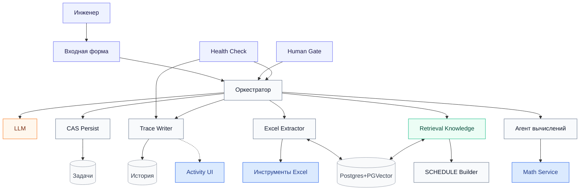

# Руководство по развёртыванию Petroleum Engineering MAS (n8n 2.30.8)

Это основной и единственный документ по развертыванию мультиагентной системы. Здесь описан пошаговый процесс: что нужно запустить, как настроить и в каком порядке это делать.

Наша система (MVP) предназначена для сборки и проверки файлов `SCHEDULE` (создание с нуля или безопасное редактирование). На вход мы подаем данные (`.data/.inc`, Excel-файлы, `.dev`, поверхности CPS3), а на выходе получаем готовый текстовый файл `schedule.inc`.

### Главные правила работы
Пожалуйста, придерживайтесь следующих ограничений, чтобы избежать проблем:
- **n8n:** Используйте только графический интерфейс (UI) корпоративного n8n. Все процессы импортируются вручную ("Import from File"), там же настраиваются Data Tables, Credentials и Bindings. Никакого REST-импорта или Docker Compose на рабочем (полевом) компьютере.
- **Внешние сервисы (Excel / Math / Activity):** Запускаются строго под Windows через `.bat` скрипты. Мы настраиваем `.env` файлы и запускаем их вручную.
- **База данных (PostgreSQL + PGVector):** Используем ту базу, что уже подключена к вашему корпоративному n8n. Если в сети нет TLS-сертификатов, не забудьте отключить проверку SSL (`SSL = Disable`).
- **Безопасность (Секреты):** Никаких паролей или токенов внутри workflows, глобальных переменных или `$env`. Все ключи должны храниться либо в защищенных credentials внутри n8n, либо в файлах `.env` на стороне Windows.

---

## 0. Перенос проекта на рабочую машину

Поскольку на рабочих компьютерах может не быть доступа к git или интернету, мы переносим проект архивом.

**На вашем компьютере с интернетом и git:**
```bash
# Упаковываем весь проект в один текстовый файл (без секретов и кэша)
python3 scripts/project_pack.py pack

# Если есть ограничения на размер переносимого файла, можно разбить архив:
python3 scripts/project_pack.py split
```

**На рабочем компьютере:**
Перенесите скрипт `scripts/project_pack.py` и получившийся файл `all.txt` (или его части).
```bash
# Если вы разбивали архив на части, сначала склейте его:
python3 project_pack.py join

# Распаковываем проект:
python3 project_pack.py unpack
```
После распаковки вы получите все необходимые папки (`n8n`, `excel-agent-tools`, `mas-activity-service` и т.д.). Пароли и секреты переносить не нужно — они задаются заново.

---

## 1. Архитектура системы

Ниже представлена схема взаимодействия компонентов.
- **Синие блоки:** Локальные FastAPI-сервисы (Activity, Math, Excel-tools).
- **Оранжевые блоки:** LLM-компоненты (Оркестратор, Планировщик).
- **Зеленые блоки:** База знаний (RAG).



**Как это работает:** Пользователь отправляет запрос через форму (или UI Activity). Оркестратор принимает задачу, сохраняет состояние в базу данных (CAS) и распределяет работу между специализированными агентами (Excel, Math, SCHEDULE). В конце формируется готовый файл расписания.

> **Важно:** После первичного импорта все workflows находятся в статусе `active: false`. Сначала нужно настроить связи с базами данных (bindings), ключи (credentials) и базу знаний (RAG). Затем запустить проверку системы (Health Check), и только если ошибок нет (0 FAIL) — активировать оркестратор и остальные процессы.

---

## 2. Пошаговое развёртывание с нуля

Этот процесс состоит из нескольких этапов: запуск локальных Windows-сервисов, импорт workflows в n8n, настройка Data Tables, связывание таблиц с нодами, ввод ключей, загрузка базы знаний и итоговая проверка.

### Шаг 0. Подготовка и запуск локальных сервисов

Убедитесь, что у вас установлен **n8n версии 2.30.8**, есть доступ к PostgreSQL с расширением PGVector, а также установлен Python 3.11-3.13.

Вам нужно запустить три сервиса в отдельных окнах командной строки (CMD). Для каждого сервиса процесс одинаков: скопировать `.env.example`, переименовать в `.env`, вписать настройки и запустить скрипт.

**1. Инструменты Excel (порт 8000)**
```bat
cd excel-agent-tools
setup-windows.bat
copy excel-tools.env.example excel-tools.env
notepad excel-tools.env
start-windows.bat
```
*Впишите уникальный `API_KEY`. Если n8n находится на другом компьютере, укажите `EXCEL_TOOLS_HOST=0.0.0.0`.*

**2. Вычислительный сервис (Math Service, порт 8100)**
```bat
cd fastapi-math-service
setup-windows.bat
copy math-service.env.example math-service.env
start-windows.bat
```
*Этот сервис будет доступен по адресу `http://<Ваш-IP>:8100/api/v1/math`.*

**3. Пользовательский интерфейс MAS Activity (порт 8200)**
```bat
cd mas-activity-service
setup-windows.bat
copy mas-activity.env.example mas-activity.env
notepad mas-activity.env
start-windows.bat
```
*Настройки для `mas-activity.env`:*
- `ORCHESTRATOR_WEBHOOK_URL`: `http://<URL-n8n>/webhook/engineering-orchestrator`
- `ACTIVITY_HYDRATE_URL` можно не задавать — выводится из того же хоста n8n (`/webhook/mas-activity-hydrate`)
- `MAS_ACTIVITY_HOST=0.0.0.0`, если n8n на другой машине
- Авторизации в Activity нет. ФИО инженера вводится в форме.

Проверка: `check-windows.bat` должен показать `/health` и `/ready`. Если `/ready` = 503, в JSON будет видно, какой webhook n8n не отвечает.

> **Как полностью очистить базу задач:**
> Зайдите в n8n Data tables и очистите таблицы `engineering_orchestrator_tasks_v1` и `mas_trace_events_v1`. Затем остановите консоль MAS Activity, удалите файл `data\activity_state.json` и запустите `.bat` снова.

### Шаг 1. Импорт Workflows в n8n

Зайдите в UI n8n, выберите "Import from File" и загрузите следующие 13 файлов строго в указанном порядке. **Ничего пока не активируйте!**

1. `n8n/workflows/core/calculation-specialist-agent.workflow.json`
2. `n8n/workflows/core/excel-extraction-agent.workflow.json`
3. `n8n/workflows/core/tnavigator-schedule-knowledge-ingestion.workflow.json`
4. `n8n/workflows/core/tnavigator-schedule-hybrid-retrieval.workflow.json`
5. `n8n/workflows/core/tnavigator-schedule-builder.workflow.json`
6. `n8n/workflows/core/mas-trace-event-writer.workflow.json`
7. `n8n/workflows/core/cas-persist-task.workflow.json`
8. `n8n/workflows/core/mas-error-handler.workflow.json`
9. `n8n/workflows/core/universal-engineering-orchestrator.workflow.json`
10. `n8n/workflows/core/mvp-entry-form.workflow.json`
11. `n8n/workflows/core/mas-human-gate-form.workflow.json`
12. `n8n/workflows/core/mas-activity-hydrate.workflow.json`
13. `n8n/workflows/core/mas-deployment-health-check.workflow.json`

### Шаг 2. Создание таблиц данных (Data Tables)

В n8n перейдите в раздел "Data tables" и создайте две таблицы.

**1. `engineering_orchestrator_tasks_v1` (Состояние задач)**

| Column | Type | Column | Type |
|---|---|---|---|
| `task_id` | String | `version` | Number |
| `status` | String | `risk_class` | String |
| `request_json` | String | `runtime_json` | String |
| `plan_json` | String | `packet_json` | String |
| `result_json` | String | `verification_json` | String |
| `gate_json` | String | `retry_count` | Number |
| `max_retries` | Number | `created_at` | String |
| `updated_at` | String | | |

`version`, `retry_count`, `max_retries` — обязательно **Number** (не String).  
Ускорение: CSV [`n8n/data-tables/engineering_orchestrator_tasks_v1.header.csv`](n8n/data-tables/engineering_orchestrator_tasks_v1.header.csv), затем сменить типы Number.

**2. `mas_trace_events_v1` (История событий)**
Все колонки имеют тип **String**: `event_id`, `trace_id`, `task_id`, `at`, `stage`, `event_type`, `actor`, `status`, `summary`, `details_json`.  
CSV: [`n8n/data-tables/mas_trace_events_v1.header.csv`](n8n/data-tables/mas_trace_events_v1.header.csv).

### Шаг 3. Привязка Data Table nodes

Не оставляйте `REPLACE_IN_UI`.

| Open workflow | Node name | Select table |
|---|---|---|
| `Writer — MAS Trace` | `Insert MAS trace event` | `mas_trace_events_v1` |
| `CAS — Persist Task State` | `Insert durable task row` | `engineering_orchestrator_tasks_v1` |
| `CAS — Persist Task State` | `Update durable task row` | `engineering_orchestrator_tasks_v1` |
| `Orchestrator — Engineering MAS` | `Load task by ID` | `engineering_orchestrator_tasks_v1` |
| `Form — MAS Deployment Health Check` | `Probe task Data Table` | `engineering_orchestrator_tasks_v1` |
| `Form — MAS Deployment Health Check` | `Probe trace Data Table` | `mas_trace_events_v1` |
| `Activity — Hydrate (Data Tables)` | `Load recent tasks` | `engineering_orchestrator_tasks_v1` |
| `Activity — Hydrate (Data Tables)` | `Load task row` | `engineering_orchestrator_tasks_v1` |
| `Activity — Hydrate (Data Tables)` | `Load trace rows` | `mas_trace_events_v1` |

После биндинга активируйте Activity webhook (`Activity — Hydrate`).

### Шаг 4. Bind Execute Workflow nodes (27 обязательных)

| Open workflow | Node on canvas | Select this workflow |
|---|---|---|
| `Orchestrator — Engineering MAS` | `Call CAS persist — insert new task` | `CAS — Persist Task State` |
| `Orchestrator — Engineering MAS` | `Call CAS persist — human action then plan` | `CAS — Persist Task State` |
| `Orchestrator — Engineering MAS` | `Call CAS persist — terminal human action` | `CAS — Persist Task State` |
| `Orchestrator — Engineering MAS` | `Call CAS persist — plan or human gate` | `CAS — Persist Task State` |
| `Orchestrator — Engineering MAS` | `Call CAS persist — SCHEDULE evidence retry` | `CAS — Persist Task State` |
| `Orchestrator — Engineering MAS` | `Call CAS persist — SCHEDULE resume` | `CAS — Persist Task State` |
| `Orchestrator — Engineering MAS` | `Call CAS persist — verification` | `CAS — Persist Task State` |
| `Orchestrator — Engineering MAS` | `Call CAS persist — specialist gate or error` | `CAS — Persist Task State` |
| `Orchestrator — Engineering MAS` | `Call CAS persist — routing gate` | `CAS — Persist Task State` |
| `Orchestrator — Engineering MAS` | `Call Excel Extraction Specialist` | `Agent — Excel Extractor` |
| `Orchestrator — Engineering MAS` | `Call SCHEDULE Hybrid Retrieval` | `MAS — Knowledge Retrieval` |
| `Orchestrator — Engineering MAS` | `Call routing Hybrid Retrieval` | `MAS — Knowledge Retrieval` |
| `Orchestrator — Engineering MAS` | `Call Excel protocol Hybrid Retrieval` | `MAS — Knowledge Retrieval` |
| `Agent — Excel Extractor` | `Call Excel protocol Hybrid Retrieval` | `MAS — Knowledge Retrieval` |
| `Template — Engineering Specialist` | `Call specialist Hybrid Retrieval` | `MAS — Knowledge Retrieval` |
| `Orchestrator — Engineering MAS` | `Call SCHEDULE Builder Specialist` | `SCHEDULE — Builder` |
| `Orchestrator — Engineering MAS` | `Call Calculation Specialist` | `Agent — Calculation (Math Service)` |
| `Orchestrator — Engineering MAS` | `Call MAS Trace Event Writer` | `Writer — MAS Trace` |
| `Orchestrator — Engineering MAS` | `Call Error — MAS Case Handler (specialist)` | `Error — MAS Case Handler` |
| `Orchestrator — Engineering MAS` | `Call Error — MAS Case Handler (verification)` | `Error — MAS Case Handler` |
| `Error — MAS Case Handler` | `Call CAS persist — error case` | `CAS — Persist Task State` |
| `Error — MAS Case Handler` | `Call Writer — MAS Trace (error)` | `Writer — MAS Trace` |
| `Form — MAS Entry` | `Call Universal Engineering Orchestrator` | `Orchestrator — Engineering MAS` |
| `Form — MAS Human Gate` | `Call Orchestrator status` | `Orchestrator — Engineering MAS` |
| `Form — MAS Human Gate` | `Call Orchestrator resume` | `Orchestrator — Engineering MAS` |
| `Form — MAS Deployment Health Check` | `Call Orchestrator probe` | `Orchestrator — Engineering MAS` |
| `Form — MAS Deployment Health Check` | `Call Trace Writer probe` | `Writer — MAS Trace` |

**Не настраивать:** `Call Data Specialist`, `Call Document Specialist` (заглушки).  
Подсказка: экспорт JSON → поиск `REPLACE_` = незавершённый binding. Канон также в `n8n/import-manifest.json` → `mandatory_execute_workflow_bindings`.

### Шаг 4b. n8n Error workflow (неперехваченные сбои)

Это **другая** механика, чем ветка `Invoke Error Handler?` на холсте оркестратора.

| | Ветка `Call Error — MAS Case Handler` | Settings → **Error workflow** |
|---|---|---|
| Когда | Оркестратор **сам** классифицировал доменную ошибку (LLM, нет данных, валидатор) | Узел **упал** (exception, timeout, падение Code) |
| Родительский прогон | Живой, ждёт `mas_error_ack` (HITL / restartable) | Уже мёртв |
| Как включить | Binding из таблицы Шага 4 | Три точки → Settings → Error workflow → `Error — MAS Case Handler` |

Один и тот же workflow `Error — MAS Case Handler`: вход **Receive MAS error event** (Execute Workflow) и вход **Error Trigger** (нативный n8n). Дальше общий путь CAS + Trace + Activity. Без `task_id` — fail-closed, Activity не трогаем.

В JSON это поле `settings.errorWorkflow`. Не ставить обработчик на сам Case Handler, `Writer — MAS Trace` и `CAS — Persist Task State` — иначе петля, если упал persist/trace во время обработки ошибки.

После UI-импорта проверьте Settings у: Orchestrator, Excel Extractor, Calculation, SCHEDULE Builder, Knowledge Retrieval/Ingestion, форм Entry/Gate/Health, Activity Hydrate, Template — Engineering Specialist.

### Шаг 5. Настройка доступов (Credentials)

Вам потребуется указать ключи для нейросетей, баз данных и локальных сервисов:
- **Оркестратор и SCHEDULE Builder:** Создайте подключения к вашей совместимой с OpenAI модели (`Planner Chat Model`, `Verifier Chat Model`).
- **Агент Excel Extractor:** В нодах HTTP укажите URL к локальному сервису Excel Tools и заданный `API_KEY`. Выберите нужное подключение к базе Postgres.
- **RAG (Знания):** Выберите подключение к Postgres и единый профиль генерации эмбеддингов. (Важно: не заполняйте поле `Dimensions` в настройках эмбеддингов).
- **Агент вычислений:** В ноде HTTP-запроса пропишите `math_service_url` (`http://<IP-вашего-ПК>:8100/api/v1/math`).
- **Trace Writer / Error Handler:** нода **Activity connection** — поле `activity_base_url` (`http://<IP-вашего-ПК>:8200`). Ключ не нужен.
- Убедитесь, что в настройках подключения к PostgreSQL отключена проверка сертификатов (`SSL = Disable`), если сервер работает без TLS.

### Шаг 6. Наполнение базы знаний (RAG) — обязательно до первой задачи

Без этого шага Оркестратор остановится на Human Gate `orchestrator_routing` («нет карточек специалистов»). База знаний хранится в `tnavigator_schedule_knowledge_v1` (векторы) и `tnavigator_schedule_knowledge_documents_v1` (parent-документы). Изоляция через `target_base`: `schedule_mvp`, `excel_protocol`, `orchestrator_routing`, `specialist_template`.

1. Откройте workflow `MAS — Knowledge Ingestion`. Credentials: **тот же** Postgres/PGVector и **тот же** OpenAI embedding credential, что у Retrieval / Excel Agent. Модель: `text-embedding-3-small`. Поле **Dimensions** не заполняйте.
2. На ноде embeddings: `batchSize=16`, `timeout=600` (при `batchSize=128` ingest часто падает `Request timed out`).
3. Активируйте workflow (нужен production webhook `mas-knowledge-ingest`).
4. Полевой путь: Activity → **База знаний** → **Загрузить в RAG**. Activity POST’ит живой `n8n/rag/excel-agent-operating-guide.documents.json` (без `injection_template`). Ответ: сколько **добавлено**, сколько **уже было**, **всего в RAG**.
5. Запасной путь в n8n: **Sync packaged MAS knowledge** — заливает snapshot из ноды **Packaged MAS corpus** (состояние файла на момент generate/import, не live-правки Activity). Форма `corpus_json` — вставка всего JSON вручную.
6. Нода `Summarize RAG inventory` / webhook lastNode `Shape MAS ingest response` → `ok` и ненулевые `orchestrator_routing` / `routing_card` и `excel_protocol` / `protocol_instruction`.
7. Если правили уже залитую карточку — увеличьте `revision` и снова **Загрузить в RAG**. Без bump revision ключ `target_base+knowledge_id+revision` считается существующим и пропускается.

> Пустые таблицы после wipe Postgres/volume = снова Шаг 6. Без RAG нельзя переходить к combat/golden кейсам.

### Шаг 7. Проверка здоровья (Health Check) и Активация

1. Откройте `Form — MAS Deployment Health Check` и запустите тестовый прогон (Test workflow → затем заполните форму и нажмите Submit).
2. Вы получите сводный HTML-отчёт. Если в нём написано **0 FAIL** — система настроена верно! Сообщения `PASS_WITH_TODO` — это просто рекомендации (например, о настройке DNS в Docker), они не критичны.
3. Если есть статус `FAIL`, обратите внимание на колонку `where_to_fix`, чтобы понять, что пошло не так.
4. **Важно:** Только после успешной проверки активируйте (переведите в "Active") Оркестратор, CAS, Trace, агентов-специалистов и Activity API. 
5. В самую последнюю очередь активируйте входную форму (Entry Form) и форму согласования (Human Gate).

---

## 3. Инженерные правила MVP

Эти правила определяют работу системы с файлами `SCHEDULE`. Разрешенные ключевые слова (keywords) строго прописаны в коде. Пожалуйста, не добавляйте ключевые слова, которых нет в официальном руководстве tNavigator (секция 12.x.y).

### Основные режимы работы
- **`CREATE`:** Создание нового файла SCHEDULE с чистого листа на основе постановки задачи.
- **`REVISE`:** Бережное редактирование существующего файла. Система изменяет только те строки, которые прямо указаны в задаче, сохраняя остальную структуру и комментарии нетронутыми.
- **Handoff фактов:** Агент-сборщик расписаний никогда не читает Excel-файлы напрямую. Извлечением фактов занимается специализированный Excel-агент, после чего "чистые" факты передаются сборщику.

### Правила работы с пакетами INCLUDE
- Вызовы `INCLUDE` должны оставаться на той же позиции относительно дат (`DATES`), где они находились в исходном файле, если в задаче не указано иное (не сдвигайте их самовольно).
- Содержимое подключаемого файла должно быть прочитано, только если этот файл был передан системе (`include_files`). Если файла нет, просто оставляйте вызов `INCLUDE` без изменений (`KEEP`), ничего не выдумывая.
- Пути к подключаемым файлам должны быть относительными (внутри папки проекта). Запрещено использовать абсолютные пути, адреса URL или выходы на уровень вверх (`..`).
- При загрузке нескольких файлов используйте параметры `schedule_files` и опционально `schedule_root`.

### Наблюдаемость и контроль (Scoring / Observability)
- Метрики внимания: `attention_threshold = 85` (внимание), `hitl_threshold = 70` (обязательное подтверждение человеком). Однако даже высокие баллы не отменяют жестких блокировок (если неизвестное ключевое слово, отсутствует факт из Excel, небезопасный INCLUDE или деструктивные действия без подтверждения).
- Для Агента Excel включен режим отображения промежуточных шагов (`returnIntermediateSteps=true`) для диагностики выполнения. При этом главный достоверный журнал аудита — это история в интерфейсе Activity (Trace ledger), которая не содержит секретных токенов и сырых промптов.

### Добавление новых ключевых слов (keywords)
Базовый список поддерживаемых ключевых слов:
`DATES`, `INCLUDE`, `GRUPTREE`, `WELSPECS`, `WELLTRACK`, `COMPDATMD`, `WCONHIST`, `WCONPROD`, `WCONINJE`, `GCONPROD`, `GCONINJE`, `GUIDERAT`, `GSATPROD`, `GSATINJE`, `WELLSTRE`, `WINJGAS`, `GINJGAS`, `BRANPROP`, `NODEPROP`, `GNETDP`, `NETBALAN`, `FRACTURE_TEMPLATE`, `FRACTURE_SPECS`, `FRACTURE_STAGE`, `WECON`, `WTEST`, `WELTARG`, `WNETDP`, `WPIMULT`, `WDFAC`, `WEFAC`, `WELOPEN`, `WELDRAW`, `WLIST`, `WFRACP`, `WFRACPL`, `VFPPROD`, `WVFPDP`, `ACTIONX`, `DELAYACT`, `ENDACTIO`, `UDQ`, `UDT`, `APPLYSCRIPT`.

**Правила работы с ключевыми словами:**
- Ключевое слово должно существовать в официальном руководстве tNavigator (раздел 12.x.y).
- Не дублируйте синонимы (например, используйте `WELTARG`, а не `WELLTARG`). Для старых версий используйте `FRACTURE_SPECS`, а не `FRACTURE_WELL`.
- Табличные блоки данных (внутри keyword-ов) всегда должны закрываться отдельным символом `/` на новой строке, после чего обязательно должна идти пустая строка перед следующим блоком или `DATES`.

Если вам нужно, чтобы система научилась писать новое ключевое слово:
1. Добавьте его в список `KEYWORDS` в файле `n8n/templates/generate_schedule_workflows.py`.
2. Запустите скрипт `python3 generate_schedule_workflows.py`.
3. Добавьте описание нового ключевого слова в карточку `schedule_mvp` в базе знаний (`excel-agent-operating-guide.documents.json`) и обновите RAG (Шаг 6).

---

## 4. Диагностика неисправностей

Если что-то пошло не так в рабочей системе, сверьтесь с этой таблицей:

| Симптом | Где искать причину |
|---|---|
| При отправке задачи пишет «workflow not found» | Во Входной Форме (Entry) не выбран процесс Оркестратора. Проверьте связи (Bindings). |
| Human Gate не загружает текущий статус | Форме не привязан процесс проверки статуса Оркестратора. |
| Система не отдаёт готовый SCHEDULE | Оркестратор не может связаться со специалистами (например, с Excel Extractor). Проверьте URL локальных сервисов. |
| История (Trace) пустая | Проверьте, привязаны ли Data Tables в процессе `Writer — MAS Trace`. |
| Интерфейс Activity пуст | Не настроен hydrate webhook в MAS Activity (`ACTIVITY_HYDRATE_URL` или `N8N_BASE_URL`). Workflow `Activity — Hydrate` должен быть Active. |
| Браузер: `blocked by CORS policy` | `mas-activity-service/app/main.py`: CORSMiddleware. Не ставить `allow_credentials=True` вместе с `allow_origins=["*"]`. Перезапустить Activity. См. README «CORS». |
| Оркестратор сразу просит загрузить `routing_card` / `orchestrator_routing` | RAG пуст или не прогнан Шаг 6. Activity → База знаний → Загрузить в RAG; либо `Summarize RAG inventory`. |
| Knowledge Ingestion: `Request timed out` на embeddings | Уменьшите `batchSize` до 16 и поднимите `timeout` до 600 на ноде Embeddings; проверьте доступ к OpenAI из хоста n8n. Activity ждёт webhook до 10 минут. |
| Activity «Загрузить в RAG» → webhook 404 | Workflow `MAS — Knowledge Ingestion` не импортирован или не Active. Production path: `/webhook/mas-knowledge-ingest`. |
| `/webhook/mas-deployment-health-check` → 404 | Это **Form**, не webhook. Открывайте `/form/mas-deployment-health-check` (нужна сессия n8n). Activity `/ready` может показывать extra webhook 404 — на core path это не блокер. |
| Builder считает все скважины «новыми», хотя они есть в baseline | После Materialize поля лежат на корне item, а webhook кладёт payload в nested `body`. Normalize должен читать `schedule_materialize_ok` / `baseline_schedule_text` с корня. Симптом в CAS: `baseline_schedule_text` = `"baseline.inc"` (имя файла). |
| Builder снова просит `BASELINE_REQUIRED` / `intake_1_baseline_required`, хотя baseline уже в задаче | HITL записал stub в `request.schedule_request` (часто только `unlisted_wells_policy`), и Apply Plan брал nested stub вместо top-level `baseline_schedule_text`. Нужен `resolveRequestSchedule`: nested + fallback на корень request. В CAS: `request.baseline_schedule_text` длинный, а `packet.inputs.schedule_request` без текста. |
| `/webhook/engineering-orchestrator` → 404 «not registered», workflow active | В n8n 2.30 у webhook-ноды должен быть стабильный `webhookId`. Без него production path не регистрируется. Также `activate` через REST (не CLI `publish:workflow` — он не пишет `workflow_published_version`). Перед activate опубликуйте leaf stubs (`Template — *`) и забиндите `REPLACE_DATA/DOCUMENT_SPECIALIST`. |
| Ошибка Excel 401 | Неверный `API_KEY` в ноде HTTP-запроса, либо закрыт порт Excel Tools (по умолчанию **8000**; в lab иногда **18000**). |
| При выгрузке JSON видны строки `REPLACE_...` | Вы пропустили привязку каких-то узлов на Шагах 3 или 4. |

---

## 5. Лаборатория и автотесты (Для разработчиков)

Если вы вносите изменения в код (например, дописываете генераторы или тестируете новые интеграции), вы можете прогонять дымовые тесты локально.

```bash
export WORKSPACE_ROOT="$PWD"

# Запуск smoke-тестов парсинга расписаний
for f in n8n/tests/*-smoke.js; do node "$f" || exit 1; done

# Тестирование Activity Service
cd mas-activity-service && PYTHONPATH=. python3 -m pytest -q

# Тестирование Excel Tools
cd ../excel-agent-tools && python -m pytest tests
```

Для быстрого перезапуска тестового полигона в Docker (сбрасывает таблицы задач, но сохраняет ключи):
```bash
python3 scripts/lab_soft_redeploy.py
```

---

## 6. Добавление нового агента-специалиста

Если вам нужно добавить нового агента (например, для работы с SSH кластером или парсинга бинарных файлов), следуйте этому алгоритму.

> **Главное правило:** LLM-модели никогда не должны сами выбирать `workflow_id`. Также агенты никогда не вызывают друг друга напрямую. Любая коммуникация проходит строго через Оркестратор по жестким шаблонам данных (`specialist_packet` и `specialist_result`).

**Входящий пакет (`specialist_packet` v1.0):** (не более 256 КБ)
Обязан содержать ключи: `contract`, `contract_version`, `task_id`, `specialist_id`, `attempt`, `objective`, `inputs`, `controls`, `acceptance_criteria`, `artifact_refs`.

**Исходящий пакет (`specialist_result` v1.0):**
Обязан возвращать `status` (один из: `succeeded`, `partial`, `needs_input`, `needs_decision`, `needs_approval`, `retryable_error`, `fatal_error`), а также содержать ключи с результатами работы: `summary`, `deliverables`, `artifact_refs`, `compact_data`, `assumptions`, `warnings`, `evidence`, `self_check`, `human_request`, `error`, `continuation` (и `decision_record` / `user_message` для логирования в Activity).

### Как это сделать:
1. **Выберите шаблон:** В папке `n8n/workflows/support/` есть готовые шаблоны (для вызова LLM, для работы с кластером, для работы с бинарниками). Склонируйте нужный шаблон и пропишите свою логику. Запомните `specialist_id` вашего агента.
2. **Зарегистрируйте агента:** Добавьте его в реестр `n8n/contracts/specialist_registry.v1.json`. Укажите новый `route` (индекс маршрута) и поставьте `configured: false`, пока логика агента не будет полностью готова.
3. **Обновите Оркестратора:** Запустите скрипт `python3 n8n/templates/generate_universal_engineering_workflows.py`. Это автоматически обновит код маршрутизатора в Оркестраторе.
4. **Привяжите процесс:** Импортируйте обновленного Оркестратора в n8n и визуально привяжите созданную новую ноду `Call ... Specialist` к вашему workflow.
5. **Обучите Планировщик:** Чтобы Оркестратор знал о новом агенте, добавьте его описание в карточку `routing_card` в базе знаний (`excel-agent-operating-guide.documents.json`). Затем снова **Загрузить в RAG** (или Knowledge Ingestion).
6. **Активация:** Поставьте `configured: true` в реестре, снова сгенерируйте Оркестратора и ре-импортируйте его. Проведите `Execute Workflow` с тестовым пакетом данных, чтобы убедиться, что агент возвращает правильный статус и корректно отображается в Activity UI.
