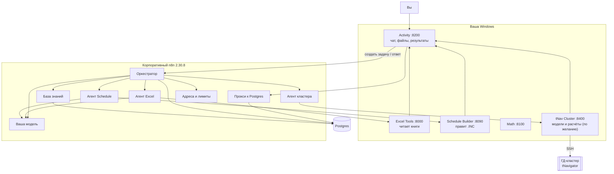

# NOVATEK RE MASter

Система собирает или правит файл `SCHEDULE` (`.INC`) для tNavigator / ECLIPSE по задаче гидродинамика. Вы пишете цель по-русски, прикладываете Excel и исходный schedule — система читает таблицы, при необходимости спрашивает вас и отдаёт новый `.INC` с diff.

Этот документ — только про развёртывание и работу. Корпоративный n8n вы трогаете из браузера (Import from File, Credentials, Settings). Сервисы крутятся на вашей Windows.

---

## Как это устроено

Вы общаетесь с **Activity** — это чат на вашем компьютере. Activity зовёт **оркестратор** в корпоративном n8n. Оркестратор решает, кого вызвать, и отдаёт работу агентам. Агенты — тоже workflows в n8n: модель выбирает инструмент, а считает уже Python на Windows.



Ещё в n8n: **Error — MAS Node Traces** (ошибки узлов попадают в лог задачи) и **форма Health Check** (проверка, что всё связано).

Как идёт одна задача:

1. Вы создаёте задачу в Activity: текст цели, Excel, исходный `.INC` и при необходимости INCLUDE.
2. Activity будит оркестратор. Дальше он сам делает шаги, пока не спросит вас или не закончит.
3. Оркестратор смотрит цель, файлы и список доступных агентов, затем либо зовёт агента, либо задаёт вопрос, либо завершает.
4. Агент Excel достаёт факты из книги. Агент Schedule применяет их к исходному файлу и собирает новый `.INC`. Сами строки `WELSPECS` / `WCONPROD` вы не пишете — только инженерные факты (группа, дата, режим, дебит).
5. Если чего-то не хватает, в чате появится вопрос по-русски, часто с кнопками. Можно нажать кнопку, написать фразу своими словами или докинуть файл.
6. Готово: в панели «Результаты» лежат файлы агентов. Скачиваете новый schedule и diff.

Оркестратор не знает агентов «наизусть»: кого звать, он читает из реестра (страница **Агенты** в Activity). Адреса сервисов и модели — в одном месте: workflow **MAS — Runtime Config**, нода `Runtime URLs`. Поле `chat_base_url` — тот же Base URL, что в credential модели; по нему оркестратор ходит за следующим шагом, проверкой «готово» и пониманием свободного ответа на вопрос.

---

## Что уже умеет и чего ещё нет

Умеет: прочитать Excel с датами ввода, параметрами скважин и любой другой таблицей; сдвинуть или убрать скважины в исходном `.INC`; записать именованный набор в keyword schedule по схеме (слово из знаний и каталога, не словарь в коде); спросить вас кнопкой или обычной фразой, если в таблице дырка; отдать новый schedule и diff. Если сервис агента не поднят — задача падает с понятным текстом, её можно перезапустить. Если чего-то не хватает — вопрос в чате, не «напишите строки WELSPECS».

Состав этой сборки — альфа (`VERSION` `0.8.0`, тег `alpha-1`).

Третий агент — **кластерный** (`tNav Cluster Agent`): по SSH находит модель на ГД-кластере, подкладывает новое расписание рядом со старым, делает копию входного `.data` с новым `INCLUDE`, запускает расчёт `tNavigator` и сам сообщает в чат, сколько он считался и чем закончился. Он **выключен из коробки** — включается после того, как вы впишете доступ к кластеру (раздел «8. Кластерный агент»). Ничего не удаляет: `rm` запрещён в коде.

Ещё нет: выгрузки результатов расчёта с кластера (профили, отчёты) — агент возвращает состояние и время расчёта, файлы из `RESULTS` не забирает. Широкий набор живых кейсов (два вопроса от разных агентов, перепривязка и даты в одной задаче, несколько INCLUDE) — Фаза 12 плана, не в этой сборке.

Если оркестратор импортирован до правки thinking: в **Orchestrator — MAS** должны быть HTTP-ноды **Decision chat**, **Verify chat**, **Interpret chat**. У агентов Excel / Schedule / Demo — HTTP-нода **Agent chat**. На все эти ноды — тот же OpenAI-compatible credential; в Runtime Config заполнен `chat_base_url`. Иначе свободный ответ и следующий шаг снова пустеют. Thinking у модели выключен телом запроса (`reasoning.enabled`, `enable_thinking`, `chat_template_kwargs.enable_thinking`), не отдельной нодой языковой модели.

Очередь работ для разработчика — `MAS_REFACTORING_PLAN.md` §2.8.

---

## Что понадобится

- Корпоративный **n8n 2.30.8** — только браузер, без доступа к серверу.
- **PostgreSQL** с расширением `vector` — ставит DBA, вам выдают учётку для credential в n8n.
- **Windows** с Python 3.11–3.13 (pip, без Node.js и без Docker).
- Распакованный проект (каталоги сервисов рядом, как в репозитории) и пакет workflows.
- Модель в n8n: credential типа OpenAI-compatible с вашим внутренним Base URL (тот же, что на **Decision chat** и **Agent chat**).

Пакет импорта: в `dist/mas-<версия>.zip` лежат десять JSON ядра, `IMPORT_ORDER.txt` и этот файл. Код сервисов — из распаковки проекта, не из zip.

Если проекта на машине ещё нет: на машине с сетью `python3 scripts/project_pack.py pack`, на работе — `python3 project_pack.py unpack` (секреты в архив не входят).

---

## Развёртывание

Делайте по порядку. Activity запускайте только после шага 5 (прокси должен быть включён).

### 1. Сервисы на Windows

| Сервис | Каталог | Порт | Файл настроек |
|---|---|---|---|
| Excel Tools | `excel-agent-tools` | 8000 | `excel-tools.env` — ключ не нужен |
| Schedule Builder | `schedule-builder-service` | 8090 | `schedule-builder.env` |
| Math | `fastapi-math-service` | 8100 | `math-service.env` |
| Activity | `mas-activity-service` | 8200 | `mas-activity.env` — заполните, но **запустите позже** |

Пятый сервис — `tnav-cluster-service` (`:8400`, `tnav-cluster.env`) — нужен только если вы будете считать модели на ГД-кластере. Он ставится так же, но настраивается отдельно: раздел «8. Кластерный агент».

В каждом каталоге:

```bat
setup-windows.bat
copy <сервис>.env.example <сервис>.env
notepad <сервис>.env
start-windows.bat
```

`start-windows.bat` у Activity и кластерного агента **не читает** `*.env` — файл читает Python (иначе CMD ломает BOM из Блокнота и пароли с `=`). Excel Tools и Schedule Builder пока ещё парсят env через bat: не ставьте в пароль знак `=` и сохраняйте файл без «UTF-8 с BOM», либо дождитесь той же правки.

Если n8n на другом компьютере — в env поставьте `*_HOST=0.0.0.0` и откройте порты в firewall.

Проверка обязательных сервисов (Activity ещё может молчать): из корня проекта `check-all-windows.bat`. Версия в `/health` должна совпасть с файлом `VERSION`. Кластерный агент в этой проверке необязателен.

В `mas-activity.env` заранее пропишите адреса **как их видит ваша Windows**:

| Переменная | Пример |
|---|---|
| `ORCHESTRATOR_WEBHOOK_URL` | `https://<ваш-n8n>/webhook/mas-orchestrator-step` |
| `CONTROL_PLANE_PROXY_URL` | `https://<ваш-n8n>/webhook/mas-control-plane` |
| `KNOWLEDGE_INGEST_URL` | `https://<ваш-n8n>/webhook/mas-knowledge-ingest` |
| `CONTROL_PLANE_REQUIRED` | `true` |
| `ORCHESTRATOR_AUTH_*` и `CONTROL_PLANE_PROXY_AUTH_*` | те же имя и значение, что Header Auth на webhook'ах в n8n |
| `MAS_ACTIVITY_HOST` | `0.0.0.0`, если n8n не на этом ПК |
| `ACTIVITY_CA_BUNDLE` | PEM корпоративного CA, если n8n по HTTPS |
| `N8N_PUBLIC_URL` | адрес n8n **в браузере** (для ссылок в логе). Часто можно не задавать |

### 2. Импорт в n8n

n8n → **Import from File**, строго по `IMPORT_ORDER.txt`. Пока **ничего не активируйте**.

1. `MAS — Knowledge Ingestion`
2. `MAS — Knowledge Retrieval`
3. `MAS — Runtime Config`
4. `Agent — Schedule Builder`
5. `Agent — Excel Extractor`
6. `Agent — tNav Cluster Agent` — можно пропустить, если расчёты на кластере не нужны
7. `Error — MAS Node Traces`
8. `MAS — Control Plane Proxy`
9. `Orchestrator — MAS`
10. `Form — MAS Deployment Health Check`

После импорта у каждого workflow новый id — он виден в адресной строке, когда workflow открыт. Запишите id Excel Extractor, Schedule Builder (и кластерного агента, если импортировали): понадобятся на шаге 4.

`support/demo-agent.workflow.json` — только если проверяете шаблон агента. Других JSON в `support/` нет.

### 3. Ключи доступа

| Куда | Какой credential |
|---|---|
| **Decision chat**, **Verify chat**, **Interpret chat** в оркестраторе; **Agent chat** у Excel Extractor, Schedule Builder, tNav Cluster Agent и Demo Agent | Один OpenAI-compatible credential вашей модели |
| Knowledge Ingestion и Retrieval → Embeddings | Отдельный embedding credential, модель `baai/bge-m3`, Dimensions пустое (таблица `tnavigator_schedule_knowledge_v2`) |
| Ingestion, Retrieval, оркестратор, прокси, Error traces → Postgres | Одна учётка Postgres / PGVector (SSL = Disable, если сервер без TLS) |
| Webhook оркестратора, нода **POST continue run**, webhook прокси | Header Auth — те же имя и значение, что в `mas-activity.env` |

В **MAS — Runtime Config** откройте Set `Runtime URLs` и замените адреса на полевые (не оставляйте имена вроде `excel-tools` или `n8n:5678`):

| Поле | Значение |
|---|---|
| `activity_base_url` | `http://<IP-этой-Windows>:8200` |
| `excel_tools_url` | `http://<IP-этой-Windows>:8000` |
| `schedule_service_url` | `http://<IP-этой-Windows>:8090` |
| `math_url` | `http://<IP-этой-Windows>:8100` |
| `tnav_cluster_url` | `http://<IP-этой-Windows>:8400` — только если поднимаете кластерный агент; иначе оставьте как есть |
| `orchestrator_step_url` | `https://<ваш-n8n>/webhook/mas-orchestrator-step` — адрес, по которому **n8n достаёт сам себя** |
| `chat_model` | id модели, как в credential |
| `chat_base_url` | Base URL из того же credential, **без** `/chat/completions`. Нужен Decision, Verify, Interpret и Agent chat |
| `chat_extra_params` | JSON-объект поверх сэмплинга и thinking-off (`{}` = значения шаблона). Не кладите сюда ключи и `messages` |
| `mas_version` | строка из файла `VERSION` |
| `max_steps` | обычно `12` |
| `agent_workflow_ids` | пока `{}` — заполните на следующем шаге |

Excel Tools без Header Auth — ключ в Runtime Config и на агенте не нужен.

Проверка связи: на Windows `check-all-windows.bat` / `python scripts/field_check.py` (`/health` Excel, Schedule, Math, Activity `/ready`; кластерный агент — если запущен, иначе строка пропускается). В n8n — форма **MAS Deployment Health Check**.

#### Матрица секретов и связей

Секреты живут в Credentials n8n и в `*.env` на Windows. В JSON workflows их нет.

**Credentials n8n → ноды**

| Секрет | Где задаётся | Кто читает | Как проверить |
|---|---|---|---|
| OpenAI-compatible (чат) | Credentials → тот же Base URL, что `chat_base_url` | **Decision chat**, **Verify chat**, **Interpret chat**; **Agent chat** у Excel / Schedule / Demo | Health Check PASS; в Логе `trace.llm` с `finish_reason` не `length`. Корп. vLLM/SGLang: `--enable-auto-tool-choice --tool-call-parser hermes` (иначе цикл агента не получит `tool_calls`). Thinking off: в `trace.llm` нет `think N`, `chat_extra_params` не включает thinking |
| Embeddings `baai/bge-m3`, Dimensions пусто | Отдельный credential (тот же OpenAI-compatible endpoint, что у корпоративного контура) | Knowledge Ingestion, Knowledge Retrieval | «Загрузить в RAG» → ненулевые срезы |
| Postgres / PGVector | Одна учётка (SSL = Disable, если сервер без TLS) | Ingestion, Retrieval, оркестратор, прокси, Error traces | `{"operation":"schema"}` → `ok: true` |
| Header Auth | Имя и значение = `ORCHESTRATOR_AUTH_*` и `CONTROL_PLANE_PROXY_AUTH_*` в `mas-activity.env` | Webhook оркестратора, **POST continue run**, webhook прокси, пробы Health Check | Activity `/ready` 200; `/health` `control_plane_backend=n8n_proxy` |

**Runtime Config (`Runtime URLs`) → потребители**

| Поле | Кто читает | Поле / lab |
|---|---|---|
| `activity_base_url` | агенты (Activity API), оркестратор | IP этой Windows `:8200` / Compose `http://mas-activity:8200` |
| `excel_tools_url` | агент Excel | `:8000` / `http://excel-tools:8000` |
| `schedule_service_url` | агент Schedule | `:8090` / `http://schedule-builder:8090` |
| `math_url` | HTTP-агент Math | `:8100` / `http://math-service:8100` |
| `tnav_cluster_url` | агент кластера | `:8400` / `http://tnav-cluster:8400`. Доступ к самому кластеру (адрес, логин, пароль) здесь **не** хранится — он в `tnav-cluster.env` |
| `orchestrator_step_url` | Activity и n8n «сам в себя» | корпоративный URL `/webhook/mas-orchestrator-step` / lab `http://n8n:5678/…` с хоста Windows — тот адрес, с которого n8n достаёт себя |
| `chat_model` | HTTP `/chat/completions` | id как в credential |
| `chat_base_url` | Decision, Verify, Interpret, Agent chat (без `/chat/completions`) | Base URL credential |
| `chat_extra_params` | те же HTTP-чаты (overlay `top_k` / `reasoning` / `enable_thinking`) | `{}` или JSON объекта; секретов нет |
| `mas_version` | Health Check | строка из `VERSION` |
| `max_steps` | оркестратор | обычно `12` |
| `agent_workflow_ids` | оркестратор | id из URL после UI-импорта; lab CLI может оставить `{}` |

**`.env` сервисов (полный список — в `*.env.example`)**

| Файл | Назначение | Поле / lab |
|---|---|---|
| `mas-activity-service/mas-activity.env` | слушатель `:8200`, webhook оркестратора, прокси, TLS, таймауты, ссылки лога | `MAS_ACTIVITY_HOST=0.0.0.0`, корпоративные URL, `ACTIVITY_CA_BUNDLE`; lab — значения из корневого `.env` / Compose |
| `excel-agent-tools/excel-tools.env` | слушатель `:8000`, сессии, лимиты книг | `EXCEL_TOOLS_HOST=0.0.0.0`; ключ не нужен |
| `schedule-builder-service/schedule-builder.env` | слушатель `:8090`, `ACTIVITY_BASE_URL` | то же |
| `fastapi-math-service/math-service.env` | слушатель `:8100` | то же |
| `tnav-cluster-service/tnav-cluster.env` | слушатель `:8400`, **доступ к ГД-кластеру** (адрес, логин, пароль или ключ), рабочий каталог на кластере, команда `tNavigator`, интервалы наблюдения | единственное место с паролем кластера; раздел «8. Кластерный агент» |
| `agents-template/demo_agent/demo-agent.env` | шаблон агента `:8300` (не полевой контур) | lab / проверка шаблона |
| корневой `.env` | только lab Compose (Postgres, n8n, порты) | на поле не используется |

Проверка переменных Activity: каждая строка `Settings` есть в `mas-activity.env.example` (pytest `test_settings`).

### 4. Связать workflows

В каждом workflow нода **Execute Workflow** должна указывать на живой workflow, не на `REPLACE_…`.

| Workflow | Нода | Цель |
|---|---|---|
| Orchestrator — MAS | Runtime endpoints | MAS — Runtime Config |
| Каждый агент (Excel, Schedule, кластер) | Runtime configuration | MAS — Runtime Config |
| Оркестратор | Call Knowledge Retrieval | MAS — Knowledge Retrieval |
| Каждый агент (Excel, Schedule, кластер) | Call Knowledge Retrieval **и** Retrieve knowledge | MAS — Knowledge Retrieval — **две** ноды, обе на один workflow. Первая — краткий срез на старте, вторая — полный текст по запросу модели |
| Форма Health Check | Runtime endpoints | MAS — Runtime Config; на пробах webhook — тот же Header Auth |

Агентов к оркестратору кнопкой «привязать ноду» не цепляют. После импорта впишите новые id в `Runtime URLs` → `agent_workflow_ids`:

```json
{"excel_extractor":"<id из URL Excel>","schedule_builder":"<id из URL Schedule>","tnav_cluster":"<id из URL кластерного>"}
```

Кластерную строку добавляйте только если импортировали его workflow. Save. Либо позже, когда Activity уже жива: страница **Агенты** → правите `invoke.workflow_id`.

Settings каждого из: оркестратор, все агенты, Retrieval, Ingestion → **Error workflow** = `Error — MAS Node Traces`. На сам Error traces и на прокси это не ставьте.

### 5. Прокси и таблицы

1. В **MAS — Control Plane Proxy** проверьте Header Auth и Postgres → **Activate**.
2. Вызовите `POST /webhook/mas-control-plane` с телом `{"operation":"schema"}` и тем же Header Auth. Ответ `ok: true`. Роли n8n нужны права `CREATE TABLE`.
3. Теперь запускайте Activity (`start-windows.bat` в `mas-activity-service`).
4. `check-all-windows.bat` — Excel, Schedule, Math и Activity OK, Activity `/ready` = 200, в `/health` поле `control_plane_backend` = `n8n_proxy`. Кластерный сервис в этой проверке необязателен.

Очистку кейсов (`clear`) сами не включайте.

### 6. База знаний

1. В **MAS — Knowledge Ingestion** те же Postgres и Embeddings, что у Retrieval. Активируйте webhook.
2. Activity → **База знаний**. Вкладки агентов с числом карточек, поиск и клик по тегу идут на сервер (полный текст, не только превью). После правок — **Загрузить в RAG** (весь корпус) или **Загрузить эту карточку**. Галочка «Удалить заменённые фрагменты» снимает из PGVector чанки со статусом superseded. Первый ingest после импорта пишет `tnavigator_schedule_knowledge_v2` (`baai/bge-m3`). В ответе должны быть ненулевые срезы для оркестратора и Excel.
3. Та же карточка с тем же номером версии, но другим текстом, в RAG не попадёт, пока не поднимете версию (сохранение в UI поднимает её само). Страница знаний не ходит в интернет: шрифты и разметка карточек лежат в `static/vendor/`.

Полевая форма n8n Ingestion по-прежнему принимает вставку JSON; опция `purge_superseded` и поля одной карточки — необязательны.

### 7. Проверка и включение

1. В n8n откройте `/form/mas-deployment-health-check` (нужна ваша сессия). Цель — **PASS**, ни одного FAIL. Строка версии = `VERSION`.
2. Активируйте по очереди: Ingestion, Retrieval, Excel Extractor, Schedule Builder, кластерный агент (если импортировали), Error traces, **последним** оркестратор.
3. Прогоните форму ещё раз.

### 8. Кластерный агент (расчёт на ГД-кластере)

Нужен, если после сборки расписания модель надо посчитать на гидродинамическом кластере. Агент по SSH находит модель, кладёт новое расписание рядом со старым, делает **копию** входного `.data` с новым `INCLUDE`, запускает `tNavigator` и сам пишет в чат, когда расчёт закончится. Исходные файлы остаются на месте: удаление в агенте запрещено.

Если расчёты вам не нужны — пропустите раздел целиком. Агент выключен по умолчанию и системе не мешает.

#### 8.1. Сервис на Windows

```bat
cd tnav-cluster-service
setup-windows.bat
copy tnav-cluster.env.example tnav-cluster.env
notepad tnav-cluster.env
start-windows.bat
```

`start-windows.bat` сам файл не читает: его читает Python (`load_service_env`, как `mas-activity.env`). Иначе CMD ломает пароль с `=` и BOM из Блокнота.

#### 8.2. Куда вписывать адрес кластера, логин и пароль

**Только в `tnav-cluster-service\tnav-cluster.env` на этой Windows.** В n8n, в базе и в workflow доступа к кластеру нет.

| Строка в `tnav-cluster.env` | Что вписать |
|---|---|
| `TNAV_SSH_HOST` | адрес ГД-кластера, как он виден с этой Windows (имя или IP) |
| `TNAV_SSH_PORT` | `22`, если SSH на другом порту — свой |
| `TNAV_SSH_USER` | ваша учётка на кластере |
| `TNAV_SSH_PASSWORD` | пароль этой учётки |
| `TNAV_SSH_KEY_PATH` | **вместо пароля** — путь к приватному ключу на этой Windows, например `C:\Users\me\.ssh\id_ed25519` (и `TNAV_SSH_KEY_PASSPHRASE`, если ключ с фразой) |
| `TNAV_CLUSTER_HOST` | `0.0.0.0` (иначе корпоративный n8n до сервиса не дотянется) + открыть порт 8400 в firewall |
| `TNAV_CLUSTER_PORT` | `8400` |
| `ACTIVITY_BASE_URL` | `http://127.0.0.1:8200` |

Пароль **или** ключ — что-то одно обязательно. Пока не заполнено, сервис запускается, но в `http://127.0.0.1:8400/health` в поле `cluster_problems` написано по-русски, чего не хватает; задача с расчётом в этом случае падает с понятным текстом, а не задаёт вопрос инженеру.

#### 8.3. Куда вписывать пути

| Строка | Что вписать | Пример |
|---|---|---|
| `TNAV_CLUSTER_ROOT` | **единственный** каталог на кластере, внутри которого агенту разрешено работать | `/data/models` |
| `TNAV_RESULTS_DIRNAME` | имя каталога, куда `tNavigator` кладёт `.log` / `.err` / `.end` рядом с моделью | `RESULTS` |

Всё, что агент делает и показывает, — **внутри** `TNAV_CLUSTER_ROOT` и путями относительно него: в чате вы увидите `SEVER/SEVER.data`, а не полный путь. Выйти наружу (`..`, абсолютный путь, ссылка за пределы) агент не может — такая попытка отклоняется. Если модели разложены по разным каталогам, укажите общий каталог выше и увеличьте `TNAV_SCAN_DEPTH`.

#### 8.4. Куда вписывать команду запуска расчёта

Одна строка `TNAV_CLI_COMMAND`. Путь к исполняемому файлу и опции — ваши, агент подставляет вместо `{model}` путь к входному `.data` файлу:

```
TNAV_CLI_COMMAND=/opt/tNavigator/tNavigator-con --cpu-num=8 --log-lang=ru --dump-res {model}
                 └── путь к tNavigator ──┘ └─── ваши опции ───┘ └ подставит агент
```

- `{model}` обязателен, без него сервис не стартует и скажет об этом в логе запуска.
- Опции агент не разбирает и передаёт кластеру как есть. Из мануала tNavigator (раздел про запуск из командной строки) полезны `--cpu-num`, `--mpi-num`, `--log-lang=ru`, `--dump-res`, `--max-calc-time`.
- Спросите у администратора кластера точный путь к `tNavigator-con` и принятые у вас опции (число ядер, очередь). Больше нигде эту команду менять не нужно.

#### 8.5. Куда вписывать параметры наблюдения

| Строка | Смысл | Обычное значение |
|---|---|---|
| `TNAV_POLL_SECONDS` | как часто агент спрашивает кластер о состоянии расчёта | `60` |
| `TNAV_PROGRESS_EVERY_S` | как часто в чате появляется строка «расчёт идёт» | `900` |
| `TNAV_MAX_WAIT_HOURS` | сколько агент готов ждать; дольше — сообщает, что ждать перестал (расчёт на кластере продолжается) | `72` |
| `TNAV_COMMAND_TIMEOUT_S` | таймаут короткой команды на кластере | `120` |
| `TNAV_SCAN_DEPTH` | на какую глубину под корнем искать `.data` | `4` |

Остальные строки файла — с комментариями, менять не обязательно. Полное описание каждой — `tnav-cluster-service/README.md`.

#### 8.6. Что сделать в n8n

1. **Import from File** → `Agent — tNav Cluster Agent` (шестым в порядке импорта).
2. В нём привязать: `Runtime configuration` → **MAS — Runtime Config**, **обе** ноды `Call Knowledge Retrieval` и `Retrieve knowledge` → **MAS — Knowledge Retrieval**, на `tNav Cluster Agent Agent chat` — тот же OpenAI-compatible credential, что на Decision chat.
3. Settings этого workflow → **Error workflow** = `Error — MAS Node Traces`.
4. В **MAS — Runtime Config** → `Runtime URLs`: `tnav_cluster_url` = `http://<IP-этой-Windows>:8400`.
5. Там же в `agent_workflow_ids` добавить `"tnav_cluster":"<id из адресной строки этого workflow>"`.
6. **Activate** workflow агента.

#### 8.7. Включить агента в системе

Activity → **Агенты** → строка `tNav Cluster Agent` → включить. Пока она выключена, оркестратор агента не видит и задачи про кластер до него не доходят. После включения он появляется на вкладке **Схема** рядом с Excel и Schedule.

Порядок именно такой: сначала заполненный `tnav-cluster.env` и живой `/health`, потом включение строки. Иначе первая же задача упрётся в ненастроенный доступ.

#### 8.8. Проверка

1. `http://<IP-Windows>:8400/health` → `ok: true`, `cluster_ready: true`, в `cluster` видны рабочий каталог и путь к `tNavigator` (пароля там нет).
2. Задача в Activity: приложите готовый `.INC` и напишите, например: «На кластере лежит модель SEVER. Примени приложенное расписание и запусти расчёт». В чате должно появиться: какая модель разобрана, что собрана новая версия, что расчёт запущен, затем — итог с временем расчёта.
3. Пока расчёт идёт, задача в состоянии «ждём агента»; закрывать Activity не нужно, итог придёт сам.

Файлы результатов расчёта агент с кластера не забирает — он возвращает состояние, время и число шагов, а профили и отчёты лежат на кластере в каталоге результатов.

---

## Как пользоваться

Откройте Activity: `http://<IP-Windows>:8200`.

Новая задача — текст цели и файлы. Лента обновляется сама. Когда статус «ждём ответ» — нажмите кнопку или напишите обычную фразу своими словами (система поймёт и сопоставит с вариантами). Файлы можно докинуть перетаскиванием. Результаты — панель справа и чипы под сообщениями. Вкладка **Схема** показывает, какие агенты уже отработали. **База знаний** — карточки и повторная загрузка в RAG.

Галочка **Режим разработчика** открывает вкладку **Лог**: шаги оркестратора, запрос в базу знаний и найденные карточки, токены и `finish_reason` каждого решения, вызовы инструментов, ошибки узлов n8n со ссылкой на execution. Эти строки в чат инженера не попадают. Для обычной работы вкладка не нужна.

## Что видно в логе

Лог — те же события кейса, что лента, плюс технические виды. Чат их скрывает. Открывается галочкой **Режим разработчика** → **Лог**, либо `GET /cases/{id}/log` (скачать: `?format=ndjson`).

| Вид | Что это | Как читать |
|---|---|---|
| `orchestrator.decision` | шаг оркестратора | действие, `guard`, токены, `finish_reason`; в payload всегда `llm` и `rag`. В логе **после** `trace.rag` / `trace.llm` того же шага |
| `trace.llm` | ход модели (Decision / Verify / Interpret / агент `role=agent`) | токены, `finish_reason`; `length` = ответ съеден thinking — гейт `llm_truncated`. Промпт — блоки `role` + текст, не одна JSON-строка |
| `trace.rag` | запрос в базу знаний | query, status, карточки (`knowledge_id`, score, ветки). На задачах «даты ввода» у Builder должен быть `ready` и ненулевой срез; пустой срез — дефект (`rag_empty`) |
| `trace.tool` | вызов инструмента FastAPI | имя, ok, длительность, аргументы; в α2 не входит `retrieve_knowledge` |
| `orchestrator.resume` | продолжение `source=agent` или `system` | ссылка на execution, если в payload есть `execution_id` и `workflow_id` |
| `system.node_error` | упал узел n8n | имя узла + ссылка на execution |

Сводка шапки лога: шаги, передачи, инструменты, **запросы в базу** (`kb_calls` — только `retrieve_knowledge`, `phase=on_demand`), **пустой RAG** (`rag_empty`), **усечения LLM** (`llm_truncated`), вопросы инженеру, предупреждения. Ссылка на execution появляется только при паре id в payload и заданном `N8N_PUBLIC_URL` (адрес n8n в браузере). В lab с консоли: `python3 scripts/mas_trace_case.py CASE-…`.

Если задача зависла в «идёт» без новых сообщений дольше пары минут — в ленте есть **Продолжить**. **Закрыть задачу** помечает её отменённой. **Перезапустить с теми же файлами** — если сервис агента не был поднят.

---

## Если не заводится

| Что видите | Что сделать |
|---|---|
| Activity не стартует или 404 на `mas-control-plane` | Сначала активируйте прокси, потом Activity. Проверьте Header Auth. |
| `/health` без `n8n_proxy` | Не задан `CONTROL_PLANE_PROXY_URL` — для работы так нельзя. |
| `relation "cases" does not exist` | Ещё раз `{"operation":"schema"}`. Проверьте Postgres и права CREATE. |
| «Агент недоступен» | Не прописаны id в `agent_workflow_ids` или агент выключен на странице «Агенты». Workflow агента должен быть Active. |
| Excel 401 | В `excel-tools.env` остался старый `API_KEY` — уберите его. Сервис слушает `:8000`. |
| n8n не видит сервисы | Firewall; в env `0.0.0.0`; в Runtime Config IP Windows, не docker-имя. |
| Health Check 404 / 403 на оркестратор | Оркестратор не Active, или `orchestrator_step_url` — не тот адрес, с которого n8n ходит сам в себя, или Header Auth не совпал. |
| Форма Health Check по адресу `/webhook/…` даёт 404 | Это форма: `/form/mas-deployment-health-check`. |
| «Загрузить в RAG» → 404 | Ingestion не Active. |
| Пустая лента при живом n8n | Переимпортировали прокси — перезапустите Activity. |
| «Сервис агента не отвечает», задача сразу упала | Не запущен Excel/Schedule или неверный URL в Runtime Config. Поднимите сервис и перезапустите задачу. То же, если сервис упал **в середине** цикла инструментов. |
| «Модель чата не ответила», задача сразу упала | Нет ответа `/chat/completions` (сеть, 5xx, пустой choices). Проверьте credential, `chat_base_url` и что корп. vLLM умеет function calling. Не путать с «агент не вернул факты». |
| Кластерный агент пишет, что доступ к кластеру не настроен | В `tnav-cluster.env` нет адреса, пользователя или пароля/ключа. Что именно — в `http://<IP-Windows>:8400/health`, поле `cluster_problems`. После правки перезапустите сервис. |
| «Рабочий каталог кластера не найден» | `TNAV_CLUSTER_ROOT` не существует на кластере или у учётки нет прав. Проверьте вручную: `ssh <user>@<host> ls <каталог>`. |
| Агент не находит модель | Модель лежит глубже `TNAV_SCAN_DEPTH` от корня или вне `TNAV_CLUSTER_ROOT`. Поднимите корень выше / увеличьте глубину, либо назовите путь модели в задаче. |
| Расчёт «не запустился» сразу после запуска | Неверный путь к `tNavigator-con` или опции в `TNAV_CLI_COMMAND`. Хвост лога кластера агент кладёт в лог задачи; проверьте команду у администратора кластера. |
| Расчёт по этой модели уже идёт | В каталоге результатов лежит файл блокировки от предыдущего запуска. Дождитесь окончания или посчитайте другую версию модели — агент намеренно не запускает вторую копию. |
| «Не удалось разобрать следующий шаг» | Модель вернула пустой ответ. В Логе смотрите строку решения. Три раза подряд задача падает. Проверьте, что на Decision chat, Verify chat и Interpret chat висит тот же credential и `chat_base_url` совпадает с Base URL модели. |
| Вопрос с кнопками, вы ответили текстом, система переспросила «не поняла» | Напишите ближе к подписи кнопки или нажмите кнопку. Interpret chat должен быть на том же credential, что Decision. |
| Activity пишет, что не дождалась шага, задача остаётся «идёт» | n8n ещё считает (лимит ожидания 30 мин). Это не «неверный адрес». Если connection refused — тогда да, адрес оркестратора. |
| В логе нет ссылок на execution | Задайте `N8N_PUBLIC_URL` — адрес n8n, как вы его открываете в браузере. |
