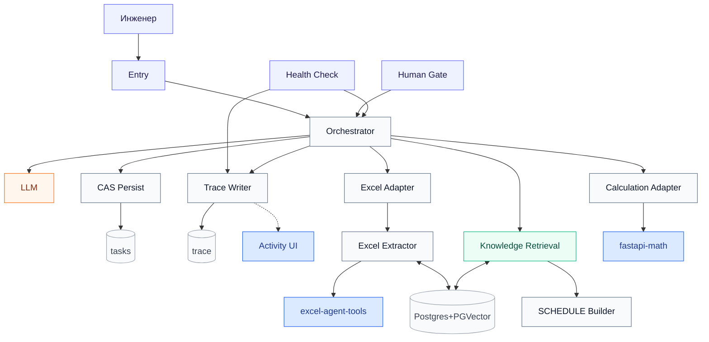

# Petroleum Engineering MAS — развёртывание (n8n 2.30.8)

**Единственный канонический документ.** Пошаговый гайд: что поднять, что настроить, в каком порядке.

MVP строит и проверяет `SCHEDULE` (`CREATE` / preserve-by-default `REVISE`). Входы: `.data/.inc`, Excel, `.dev`, CPS3. Выход: текст `schedule.inc`.

| Артефакт | Роль |
|---|---|
| Этот файл | Runbook: Windows-сервисы → UI-импорт → bindings → RAG → Health → activate |
| [`n8n/import-manifest.json`](n8n/import-manifest.json) | Имена workflow, 28 bindings, credentials |
| [`n8n/data-tables/`](n8n/data-tables/) | CSV lean CAS + trace |
| [`n8n/workflows/`](n8n/workflows/) | JSON для Import from File |

### Жёсткие правила (работа)

| Что | Как только так |
|---|---|
| **n8n** | Только **UI**: Import from File, Data Tables, credentials, bindings, Activate. Без REST-импорта workflow и без Compose-n8n на полевом ПК. |
| **Excel / Math / Activity** | Только **Windows** `setup-windows.bat` → `.env` → `start-windows.bat`. |
| **Postgres + PGVector** | Тот, что у корпоративного n8n; credential SSL = Disable, если без TLS. |
| **Секреты** | Не в workflow / `$env` / Global Variables. URL и ключи — в нодах, credentials, Windows `*.env`. |

Лабораторный Compose — §6, не полевой канон.

---

## 0. Перенос репозитория на работу (`all.txt`)

На машине с git:

```bash
python3 scripts/project_pack.py pack          # → all.txt (gitignore / .venv / *.env не входят)
python3 scripts/project_pack.py split         # опционально: all1, all2, … если лимит на файл
```

На работу копируете **`scripts/project_pack.py`** + **`all.txt`** (или чанки `all1…`).

```bash
python3 project_pack.py join                  # только если принесли чанки
python3 project_pack.py unpack                # восстанавливает дерево рядом со скриптом
```

В архив входят: `excel-agent-tools/`, `fastapi-math-service/`, `mas-activity-service/`, `n8n/`, `scripts/`, плюс корневые `.env.example`, `docs.md`, `README.md`, `docker-compose.yml`, `.gitignore`. Секреты и прочие gitignored файлы **не** пакуются. Дальше — Step 0 ниже.

---

## 1. Карта системы

Имена — `n8n/import-manifest.json` и поле `name` в JSON.  
Цвет: **оранжевый = LLM**, **зелёный = RAG**, **синий = FastAPI**.



**Поток:** Form/webhook → Orchestrator (HITL + Verifier) → CAS → Excel / Knowledge Retrieval / Calculation → Builder → release gate → `schedule.inc`.

**Активация:** после импорта всё `active: false`. Сначала bindings + credentials + RAG → Health Check → при 0 FAIL активируйте runtime, **потом** Entry / Human Gate.  
Не Publish как вход: Excel Form adapter, Specialist template, AI Components. Knowledge Ingestion — не Publish; первый пакет — Manual Test.

---

## 2. Развёртывание с нуля (Windows + UI n8n)

Порядок: **три Windows-сервиса** → **UI-импорт** → Data Tables → bindings → credentials → RAG → Health → activate → пользовательский запуск.

### Step 0 — Preconditions

| Need | Notes |
|---|---|
| n8n **2.30.8** | Корпоративный UI; JSON из репо под эту версию |
| PostgreSQL + PGVector | Уже за n8n |
| OpenAI-compatible chat + embeddings | Planner, Verifier, Builder, Excel; **Dimensions в embeddings не задавать** |
| Windows 64-bit, Python 3.11–3.13 | Три FastAPI |
| Сеть | n8n → Windows `:8000` / `:8100` / `:8200`; Windows → URL n8n (hydrate) |

### Step 0b — Windows-сервисы (три окна CMD)

Шаблон: `setup-windows.bat` → скопировать `*.env.example` → `*.env` → править → `start-windows.bat` → во втором CMD `check-windows.bat`.

**1) Excel Tools** (`:8000`)

```bat
cd excel-agent-tools
setup-windows.bat
copy excel-tools.env.example excel-tools.env
notepad excel-tools.env
start-windows.bat
```

- `API_KEY` — уникальный; тот же ключ в Agent Runtime в n8n.  
- n8n на другом хосте: `EXCEL_TOOLS_HOST=0.0.0.0`, URL = `http://<IP-Windows>:8000/api/v1`.

**2) Math Service** (`:8100`)

```bat
cd fastapi-math-service
setup-windows.bat
copy math-service.env.example math-service.env
start-windows.bat
```

В Adapter — Calculation: `math_service_url` = `http://<IP-Windows>:8100/api/v1/math` (не `$env`).

**3) MAS Activity** (`:8200`)

```bat
cd mas-activity-service
setup-windows.bat
copy mas-activity.env.example mas-activity.env
notepad mas-activity.env
start-windows.bat
```

| Переменная | На работе |
|---|---|
| `MAS_ACTIVITY_KEY` | Свой ключ (не `change-me-…`) |
| `MAS_ACTIVITY_HOST` | `0.0.0.0` если n8n с другой машины |
| `HITL_MODE` | Сначала `local`; live — `webhook` / `n8n_rest` / `auto` |
| `ACTIVITY_LIST_URL` | `http://<URL-n8n>/webhook/mas-activity-list-tasks` (после Step 3) |
| `ACTIVITY_FEED_URL` | `http://<URL-n8n>/webhook/mas-activity-load-feed` |

UI: `http://127.0.0.1:8200/` — **Новая задача**, F5 / бренд тянет список из Data Tables, deep-link `/t/<task_id>`. Diff версий SCHEDULE — expander в чате.  
После импорта Trace (Step 5): в **Prepare MAS activity sync** — `ACTIVITY_BASE_URL=http://<IP-Windows>:8200`, `ACTIVITY_KEY` = `MAS_ACTIVITY_KEY`.

### Step 0c — Wipe задач (переустановка)

В UI Data tables очистить строки `engineering_orchestrator_tasks_v1` и `mas_trace_events_v1`.  
На Windows: стоп Activity → удалить `data\activity_state.json` → снова `start-windows.bat`.

### Step 1 — Import workflows (UI, точный порядок)

**Workflows → Import from File:**

| # | File | UI name |
|---:|---|---|
| 1 | `n8n/workflows/core/calculation-specialist-adapter.workflow.json` | `Adapter — Calculation (Math Service)` |
| 2 | `n8n/workflows/core/excel-extraction-agent.workflow.json` | `Agent — Excel Extractor` |
| 3 | `n8n/workflows/core/excel-engineering-specialist-adapter.workflow.json` | `Adapter — Excel Extraction` |
| 4 | `n8n/workflows/core/tnavigator-schedule-knowledge-ingestion.workflow.json` | `MAS — Knowledge Ingestion` |
| 5 | `n8n/workflows/core/tnavigator-schedule-hybrid-retrieval.workflow.json` | `MAS — Knowledge Retrieval` |
| 6 | `n8n/workflows/core/tnavigator-schedule-builder.workflow.json` | `SCHEDULE — Builder` |
| 7 | `n8n/workflows/core/mas-trace-event-writer.workflow.json` | `Writer — MAS Trace` |
| 8 | `n8n/workflows/core/cas-persist-task.workflow.json` | `CAS — Persist Task State` |
| 9 | `n8n/workflows/core/mas-error-handler.workflow.json` | `Error — MAS Case Handler` |
| 10 | `n8n/workflows/core/universal-engineering-orchestrator.workflow.json` | `Orchestrator — Engineering MAS` |
| 11 | `n8n/workflows/core/mvp-entry-form.workflow.json` | `Form — MAS Entry` |
| 12 | `n8n/workflows/core/mas-human-gate-form.workflow.json` | `Form — MAS Human Gate` |
| 13 | `n8n/workflows/core/mas-activity-list-tasks.workflow.json` | `Activity — List Tasks (Data Table)` |
| 14 | `n8n/workflows/core/mas-activity-load-feed.workflow.json` | `Activity — Load Feed (Data Tables)` |
| 15 | `n8n/workflows/core/mas-deployment-health-check.workflow.json` | `Form — MAS Deployment Health Check` |

Clean-import set — **18** JSON (`full_clean_import_set` в manifest). Все `active: false`. CAS + Error Handler — **до** Orchestrator.  
Опционально `n8n/workflows/support/` (Form Excel, template, AI components) — не пользовательский вход.

### Step 2 — Data Tables

Вкладка **Data tables** → From scratch (или Import CSV из `n8n/data-tables/*.header.csv`).

**`engineering_orchestrator_tasks_v1`**

| Column | Type | Column | Type |
|---|---|---|---|
| `task_id` | String | `version` | Number |
| `status` | String | `risk_class` | String |
| `request_json` | String | `runtime_json` | String |
| `plan_json` | String | `packet_json` | String |
| `result_json` | String | `verification_json` | String |
| `gate_json` | String | `retry_count` | Number |
| `max_retries` | Number | `created_at` | String |
| `updated_at` | String | | |

После CSV: `version`, `retry_count`, `max_retries` → **Number**.

**`mas_trace_events_v1`** — все String:  
`event_id`, `trace_id`, `task_id`, `at`, `stage`, `event_type`, `actor`, `status`, `summary`, `details_json`

### Step 3 — Bind Data Table nodes

Не оставляйте `REPLACE_IN_UI`.

| Workflow | Node | Table |
|---|---|---|
| `Writer — MAS Trace` | `Insert MAS trace event` | `mas_trace_events_v1` |
| `CAS — Persist Task State` | `Insert durable task row` | `engineering_orchestrator_tasks_v1` |
| `CAS — Persist Task State` | `Update durable task row` | `engineering_orchestrator_tasks_v1` |
| `Orchestrator — Engineering MAS` | `Load task by ID` | `engineering_orchestrator_tasks_v1` |
| `Form — MAS Deployment Health Check` | `Probe task Data Table` | `engineering_orchestrator_tasks_v1` |
| `Form — MAS Deployment Health Check` | `Probe trace Data Table` | `mas_trace_events_v1` |
| `Activity — List Tasks (Data Table)` | `Load recent tasks` | `engineering_orchestrator_tasks_v1` |
| `Activity — Load Feed (Data Tables)` | `Load task row` | `engineering_orchestrator_tasks_v1` |
| `Activity — Load Feed (Data Tables)` | `Load trace rows` | `mas_trace_events_v1` |

Активируйте оба Activity webhook. В `mas-activity.env`:

```bat
ACTIVITY_LIST_URL=http://<хост-n8n>:<порт>/webhook/mas-activity-list-tasks
ACTIVITY_FEED_URL=http://<хост-n8n>:<порт>/webhook/mas-activity-load-feed
```

### Step 4 — Bind Execute Workflow (28 обязательных)

| Open workflow | Node | Select workflow |
|---|---|---|
| Orchestrator | `Call CAS persist — insert new task` | `CAS — Persist Task State` |
| Orchestrator | `Call CAS persist — human action then plan` | `CAS — Persist Task State` |
| Orchestrator | `Call CAS persist — terminal human action` | `CAS — Persist Task State` |
| Orchestrator | `Call CAS persist — plan or human gate` | `CAS — Persist Task State` |
| Orchestrator | `Call CAS persist — SCHEDULE evidence retry` | `CAS — Persist Task State` |
| Orchestrator | `Call CAS persist — SCHEDULE resume` | `CAS — Persist Task State` |
| Orchestrator | `Call CAS persist — verification` | `CAS — Persist Task State` |
| Orchestrator | `Call CAS persist — specialist gate or error` | `CAS — Persist Task State` |
| Orchestrator | `Call CAS persist — routing gate` | `CAS — Persist Task State` |
| Orchestrator | `Call Excel Extraction Specialist Adapter` | `Adapter — Excel Extraction` |
| Orchestrator | `Call routing Hybrid Retrieval` | `MAS — Knowledge Retrieval` |
| Orchestrator | `Call Excel protocol Hybrid Retrieval` | `MAS — Knowledge Retrieval` |
| Orchestrator | `Call SCHEDULE Hybrid Retrieval` | `MAS — Knowledge Retrieval` |
| Orchestrator | `Call SCHEDULE Builder Specialist` | `SCHEDULE — Builder` |
| Orchestrator | `Call Calculation Specialist` | `Adapter — Calculation (Math Service)` |
| Orchestrator | `Call MAS Trace Event Writer` | `Writer — MAS Trace` |
| Orchestrator | `Call Error — MAS Case Handler (specialist)` | `Error — MAS Case Handler` |
| Orchestrator | `Call Error — MAS Case Handler (verification)` | `Error — MAS Case Handler` |
| Error Handler | `Call CAS persist — error case` | `CAS — Persist Task State` |
| Error Handler | `Call Writer — MAS Trace (error)` | `Writer — MAS Trace` |
| Agent — Excel Extractor | `Call Excel protocol Hybrid Retrieval` | `MAS — Knowledge Retrieval` |
| Template — Engineering Specialist | `Call specialist Hybrid Retrieval` | `MAS — Knowledge Retrieval` |
| Adapter — Excel Extraction | `Call native Excel Extraction Agent` | `Agent — Excel Extractor` |
| Form — MAS Entry | `Call Universal Engineering Orchestrator` | `Orchestrator — Engineering MAS` |
| Form — MAS Human Gate | `Call Orchestrator status` | `Orchestrator — Engineering MAS` |
| Form — MAS Human Gate | `Call Orchestrator resume` | `Orchestrator — Engineering MAS` |
| Health Check | `Call Orchestrator probe` | `Orchestrator — Engineering MAS` |
| Health Check | `Call Trace Writer probe` | `Writer — MAS Trace` |

Не настраивать: `Call Data Specialist`, `Call Document Specialist`.  
Контроль: экспорт JSON → поиск `REPLACE_` = незавершённый binding.

### Step 5 — Credentials и URL

| Where | What |
|---|---|
| Orchestrator | `Planner Chat Model`, `Verifier Chat Model` |
| SCHEDULE — Builder | Planner + Builder chat |
| Agent — Excel Extractor | `excel_tools_url` + `excel_tools_api_key`; chat; Postgres memory; Call → Knowledge Retrieval |
| Knowledge Ingestion / Retrieval | Postgres + **один** embedding credential |
| Adapter — Calculation | `math_service_url` = `http://<IP-Windows>:8100/api/v1/math` |
| Trace → Prepare activity sync | `ACTIVITY_BASE_URL`, `ACTIVITY_KEY` |
| Postgres | SSL = **Disable**, если без TLS |

### Step 6 — Hybrid RAG

Одна пара таблиц: `tnavigator_schedule_knowledge_v1` + `tnavigator_schedule_knowledge_documents_v1`. Изоляция — `target_base`, не динамическое SQL-имя.

| Namespace | Кто читает | Карточки |
|---|---|---|
| `schedule_mvp` | Builder | `keyword_instruction`, `worked_example` (+ schema catalogue) |
| `excel_protocol` | Excel lane | `protocol_instruction` |
| `orchestrator_routing` | Planner | `routing_card` |
| `specialist_template` | Template clones | `capability_instruction` |

1. `MAS — Knowledge Ingestion` → credentials.  
2. Триггер **Sync packaged MAS knowledge** → **Test workflow**.  
3. `Summarize RAG inventory` = `rag_inventory_ok`.  
4. Дальше правки в `n8n/rag/excel-agent-operating-guide.documents.json` → вставка в **Paste the full knowledge sheet**. Новые ключи пишутся; для замены текста — поднять `revision`.  
5. Проверка: `MAS — Knowledge Retrieval`.

### Step 7 — Health Check → activate

1. Bind таблицы (Step 3) и Orch/Trace (Step 4) в Health Check.  
2. Publish/Test только этот form → Submit.  
3. HTML-отчёт: **FAIL** → `where_to_fix`; Docker DNS TODO на полевом контуре — норма (сервисы на Windows).  
4. Зелёные live probes: DT get, Orch `status`, Trace `mas_trace_ack`; Windows `check-windows.bat` + `/health` на `:8000`/`:8100`/`:8200`.  
5. При 0 FAIL: активируйте Orchestrator, CAS, Trace, specialists, Activity hydrate → затем Entry и Human Gate.

### Step 8 — Пользовательский запуск

1. Form Entry **или** Activity → **Новая задача**.  
2. Описание + Excel / `.data/.inc` / `.dev` / CPS3.  
3. Результат: скачать `.INC` в морде или HITL.  
4. Продолжение: composer / Human Gate → `reply` / `approve` / `reject` / restart.  
5. Commissioning: новые скважины — HITL с файлами; `unlisted_wells_policy` = `keep` \| `remove` только типизированно.

---

## 3. Инженерные правила MVP (кратко)

Нужны оператору и при расширении allowlist. Источник имён keywords в коде: `KEYWORDS` в `n8n/templates/generate_schedule_workflows.py` (+ regenerate).

### 3.1. Режимы

- **`CREATE`: создание SCHEDULE с нуля** из objective + evidence.  
- **`REVISE`:** lossless baseline + preserve-by-default; менять только согласованный scope.  
- Commissioning дат ввода: timeline `parse → shift / keep|remove / new-well HITL → emit`.  
- Канонический handoff фактов: **Excel→RAG→Builder handoff** (пакет `source_facts`, не сырой workbook в Builder).  
- **Прямой вызов Excel Extractor из Schedule Builder запрещён** — только через Orchestrator.

### 3.2. Keyword allowlist (emit targets)

`DATES`, `INCLUDE`, `GRUPTREE`, `WELSPECS`, `WELLTRACK`, `COMPDATMD`, `WCONHIST`, `WCONPROD`, `WCONINJE`, `GCONPROD`, `GCONINJE`, `GUIDERAT`, `GSATPROD`, `GSATINJE`, `WELLSTRE`, `WINJGAS`, `GINJGAS`, `BRANPROP`, `NODEPROP`, `GNETDP`, `NETBALAN`, `FRACTURE_TEMPLATE`, `FRACTURE_SPECS`, `FRACTURE_STAGE`, `WECON`, `WTEST`, `WELTARG`, `WNETDP`, `WPIMULT`, `WDFAC`, `WEFAC`, `WELOPEN`, `WELDRAW`, `WLIST`, `WFRACP`, `WFRACPL`, `VFPPROD`, `WVFPDP`, `ACTIONX`, `DELAYACT`, `ENDACTIO`, `UDQ`, `UDT`, `APPLYSCRIPT`.

Правила: keyword должен быть в tNav manual (`12.x.y.`); синонимы не дублировать (`WELTARG`, не `WELLTARG`); legacy emit `FRACTURE_SPECS` (не `FRACTURE_WELL`). После добавления — regenerate Builder + RAG-карточка `schedule_mvp`. Табличные keyword-блоки закрывать голым `/` + пустая строка перед следующим keyword/DATES.

### 3.3. INCLUDE package

- Call-site `INCLUDE` на той же DATES-позиции, что в baseline (без явной инструкции не сдвигать).  
- Тело читать, если файл в `include_files`; иначе KEEP вызов, не выдумывать.  
- Только package-relative paths; без `..` escape, URL, absolute.  
- Multi-file upload: `schedule_files` + optional `schedule_root`.

### 3.4. Scoring / observability

- `attention_threshold = 85`, `hitl_threshold      = 70` — score не отменяет hard blockers (unknown keyword, missing fact, unsafe INCLUDE, destructive без approval).  
- Excel Agent: `returnIntermediateSteps=true` для диагностики execution; authoritative audit — Trace ledger без секретов/raw prompts.

---

## 4. Smoke и диагностика

**После 0 FAIL:** Entry без objective → HITL; Human Gate status/reply; CREATE/REVISE при RAG; Excel evidence; `.dev`+CPS3; stale version → conflict; CAS fail closed; Trace без секретов; Activity F5 + русский brief + expander diff.

| Symptom | Where |
|---|---|
| Entry «workflow not found» | Entry → Call Orchestrator |
| Gate не грузит status | Human Gate → Call Orchestrator status |
| Нет Excel / SCHEDULE | Orchestrator Call Excel / Retrieval / Builder |
| Trace пустой | Trace Data Table + Orch → Trace Call |
| CAS / Load task | CAS insert+update **и** Load task by ID |
| Activity пустая | Trace `ACTIVITY_BASE_URL`; hydrate URL; F5 |
| Excel 401 | Agent URL/key; `0.0.0.0` + firewall |
| Export содержит `REPLACE_` | Step 3–4 |

---

## 5. Лаборатория / CI (не полевой канон)

```bash
export WORKSPACE_ROOT="$PWD"
for f in n8n/tests/*-smoke.js; do node "$f" || exit 1; done
cd mas-activity-service && PYTHONPATH=. python3 -m pytest -q
cd ../excel-agent-tools && python -m pytest tests
python3 simulation-model-example/combat-dates-revise/run_integration_cases.py
```

```bash
cp .env.example .env
docker compose up --build -d
python3 scripts/mas_stack_health.py
```

На работе Activity / Excel / Math — Windows `.bat`; n8n — только UI в корпоративный инстанс.

### Структура репозитория

- `n8n/` — workflows, manifest, data-tables, generators, smokes, RAG sheet  
- `mas-activity-service/` · `excel-agent-tools/` · `fastapi-math-service/` — Windows `.bat`  
- `scripts/mas_stack_health.py` — пинг Compose  
- `scripts/project_pack.py` — упаковка в `all.txt` для переноса на работу  
- `simulation-model-example/` — локальные combat/golden (весь каталог в `.gitignore`, в `all.txt` не входит)  
- `context-seeder/` — опционально (UI-only не нужен)  
- `postgres-init/` — lab Postgres/PGVector  

Секреты не в JSON / Data Tables / git. Нет Artifact Store и авто-tNavigator runner: SCHEDULE остаётся bounded text внутри n8n.
