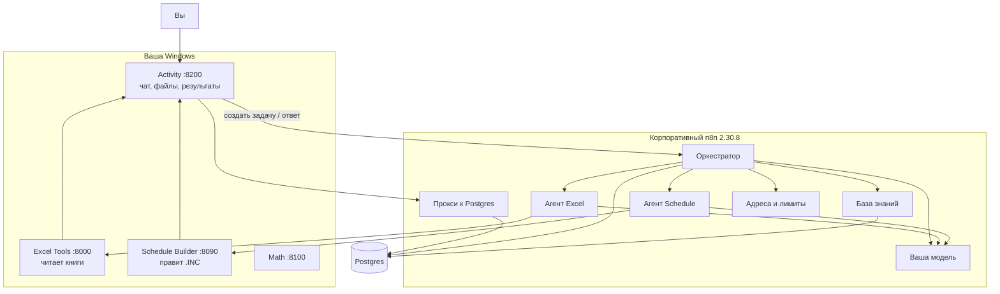

# NOVATEK RE MASter

Система собирает или правит файл `SCHEDULE` (`.INC`) для tNavigator / ECLIPSE по задаче гидродинамика. Вы пишете цель по-русски, прикладываете Excel и исходный schedule — система читает таблицы, при необходимости спрашивает вас и отдаёт новый `.INC` с diff.

Этот документ — только про развёртывание и работу. Корпоративный n8n вы трогаете из браузера (Import from File, Credentials, Settings). Сервисы крутятся на вашей Windows.

---

## Как это устроено

Вы общаетесь с **Activity** — это чат на вашем компьютере. Activity зовёт **оркестратор** в корпоративном n8n. Оркестратор решает, кого вызвать, и отдаёт работу агентам. Агенты — тоже workflows в n8n: модель выбирает инструмент, а считает уже Python на Windows.



Ещё в n8n: **Error — MAS Node Traces** (ошибки узлов попадают в лог задачи) и **форма Health Check** (проверка, что всё связано).

Как идёт одна задача:

1. Вы создаёте задачу в Activity: текст цели, Excel, исходный `.INC` и при необходимости INCLUDE.
2. Activity будит оркестратор. Дальше он сам делает шаги, пока не спросит вас или не закончит.
3. Оркестратор смотрит цель, файлы и список доступных агентов, затем либо зовёт агента, либо задаёт вопрос, либо завершает.
4. Агент Excel достаёт факты из книги. Агент Schedule применяет их к исходному файлу и собирает новый `.INC`. Сами строки `WELSPECS` / `WCONPROD` вы не пишете — только инженерные факты (группа, дата, режим, дебит).
5. Если чего-то не хватает, в чате появится вопрос по-русски, часто с кнопками. Можно докинуть файл.
6. Готово: в панели «Результаты» лежат файлы агентов. Скачиваете новый schedule и diff.

Оркестратор не знает агентов «наизусть»: кого звать, он читает из реестра (страница **Агенты** в Activity). Адреса сервисов и модели — в одном месте: workflow **MAS — Runtime Config**, нода `Runtime URLs`.

---

## Что понадобится

- Корпоративный **n8n 2.30.8** — только браузер, без доступа к серверу.
- **PostgreSQL** с расширением `vector` — ставит DBA, вам выдают учётку для credential в n8n.
- **Windows** с Python 3.11–3.13 (pip, без Node.js и без Docker).
- Распакованный проект (четыре каталога сервисов рядом, как в репозитории) и пакет workflows.
- Модель в n8n: credential типа OpenAI-compatible с вашим внутренним Base URL (тот же, что уже стоит на Chat Model).

Пакет импорта: в `dist/mas-<версия>.zip` лежат девять JSON, `IMPORT_ORDER.txt` и этот файл. Код сервисов — из распаковки проекта, не из zip.

Если проекта на машине ещё нет: на машине с сетью `python3 scripts/project_pack.py pack`, на работе — `python3 project_pack.py unpack` (секреты в архив не входят).

---

## Развёртывание

Делайте по порядку. Activity запускайте только после шага 5 (прокси должен быть включён).

### 1. Четыре сервиса на Windows

| Сервис | Каталог | Порт | Файл настроек |
|---|---|---|---|
| Excel Tools | `excel-agent-tools` | 8000 | `excel-tools.env` — обязателен `API_KEY` |
| Schedule Builder | `schedule-builder-service` | 8090 | `schedule-builder.env` |
| Math | `fastapi-math-service` | 8100 | `math-service.env` |
| Activity | `mas-activity-service` | 8200 | `mas-activity.env` — заполните, но **запустите позже** |

В каждом каталоге:

```bat
setup-windows.bat
copy <сервис>.env.example <сервис>.env
notepad <сервис>.env
start-windows.bat
```

Если n8n на другом компьютере — в env поставьте `*_HOST=0.0.0.0` и откройте порты в firewall.

Проверка трёх сервисов (Activity ещё может молчать): из корня проекта `check-all-windows.bat`. Версия в `/health` должна совпасть с файлом `VERSION`.

В `mas-activity.env` заранее пропишите адреса **как их видит ваша Windows**:

| Переменная | Пример |
|---|---|
| `ORCHESTRATOR_WEBHOOK_URL` | `https://<ваш-n8n>/webhook/mas-orchestrator-step` |
| `CONTROL_PLANE_PROXY_URL` | `https://<ваш-n8n>/webhook/mas-control-plane` |
| `KNOWLEDGE_INGEST_URL` | `https://<ваш-n8n>/webhook/mas-knowledge-ingest` |
| `CONTROL_PLANE_REQUIRED` | `true` |
| `ORCHESTRATOR_AUTH_*` и `CONTROL_PLANE_PROXY_AUTH_*` | те же имя и значение, что Header Auth на webhook'ах в n8n |
| `MAS_ACTIVITY_HOST` | `0.0.0.0`, если n8n не на этом ПК |
| `ACTIVITY_CA_BUNDLE` | PEM корпоративного CA, если n8n по HTTPS |
| `N8N_PUBLIC_URL` | адрес n8n **в браузере** (для ссылок в логе). Часто можно не задавать |

### 2. Импорт в n8n

n8n → **Import from File**, строго по `IMPORT_ORDER.txt`. Пока **ничего не активируйте**.

1. `MAS — Knowledge Ingestion`
2. `MAS — Knowledge Retrieval`
3. `MAS — Runtime Config`
4. `Agent — Schedule Builder`
5. `Agent — Excel Extractor`
6. `Error — MAS Node Traces`
7. `MAS — Control Plane Proxy`
8. `Orchestrator — MAS`
9. `Form — MAS Deployment Health Check`

После импорта у каждого workflow новый id — он виден в адресной строке, когда workflow открыт. Запишите id Excel Extractor и Schedule Builder: понадобятся на шаге 4.

`support/demo-agent.workflow.json` — только если проверяете шаблон агента. Других JSON в `support/` нет.

### 3. Ключи доступа

| Куда | Какой credential |
|---|---|
| **Decision chat**, **Verify chat** и Decision Chat Model в оркестраторе; Chat Model у обоих агентов | Один OpenAI-compatible credential вашей модели |
| Knowledge Ingestion и Retrieval → Embeddings | Отдельный embedding credential, модель `text-embedding-3-small`, Dimensions пустое |
| Ingestion, Retrieval, оркестратор, прокси, Error traces → Postgres | Одна учётка Postgres / PGVector (SSL = Disable, если сервер без TLS) |
| Webhook оркестратора, нода **POST continue run**, webhook прокси | Header Auth — те же имя и значение, что в `mas-activity.env` |
| Все HTTP-ноды **Agent — Excel Extractor** | Отдельный Header Auth: заголовок `X-API-Key`, значение = `API_KEY` из `excel-tools.env` |

В **MAS — Runtime Config** откройте Set `Runtime URLs` и замените адреса на полевые (не оставляйте имена вроде `excel-tools` или `n8n:5678`):

| Поле | Значение |
|---|---|
| `activity_base_url` | `http://<IP-этой-Windows>:8200` |
| `excel_tools_url` | `http://<IP-этой-Windows>:8000` |
| `schedule_service_url` | `http://<IP-этой-Windows>:8090` |
| `math_url` | `http://<IP-этой-Windows>:8100` |
| `orchestrator_step_url` | `https://<ваш-n8n>/webhook/mas-orchestrator-step` — адрес, по которому **n8n достаёт сам себя** |
| `chat_model` | id модели, как в credential |
| `chat_base_url` | Base URL из того же credential, **без** `/chat/completions` |
| `mas_version` | строка из файла `VERSION` |
| `max_steps` | обычно `12` |
| `agent_workflow_ids` | пока `{}` — заполните на следующем шаге |

Ключ Excel в Set не кладите — только в credential.

### 4. Связать workflows

В каждом workflow нода **Execute Workflow** должна указывать на живой workflow, не на `REPLACE_…`.

| Workflow | Нода | Цель |
|---|---|---|
| Orchestrator — MAS | Runtime endpoints | MAS — Runtime Config |
| Оба агента | Runtime configuration | MAS — Runtime Config |
| Оркестратор и оба агента | Call Knowledge Retrieval | MAS — Knowledge Retrieval |
| Форма Health Check | Runtime endpoints | MAS — Runtime Config; на пробах webhook — тот же Header Auth |

Агентов к оркестратору кнопкой «привязать ноду» не цепляют. После импорта впишите новые id в `Runtime URLs` → `agent_workflow_ids`:

```json
{"excel_extractor":"<id из URL Excel>","schedule_builder":"<id из URL Schedule>"}
```

Save. Либо позже, когда Activity уже жива: страница **Агенты** → правите `invoke.workflow_id`.

Settings каждого из: оркестратор, оба агента, Retrieval, Ingestion → **Error workflow** = `Error — MAS Node Traces`. На сам Error traces и на прокси это не ставьте.

### 5. Прокси и таблицы

1. В **MAS — Control Plane Proxy** проверьте Header Auth и Postgres → **Activate**.
2. Вызовите `POST /webhook/mas-control-plane` с телом `{"operation":"schema"}` и тем же Header Auth. Ответ `ok: true`. Роли n8n нужны права `CREATE TABLE`.
3. Теперь запускайте Activity (`start-windows.bat` в `mas-activity-service`).
4. `check-all-windows.bat` — все четыре сервиса OK, Activity `/ready` = 200, в `/health` поле `control_plane_backend` = `n8n_proxy`.

Очистку кейсов (`clear`) сами не включайте.

### 6. База знаний

1. В **MAS — Knowledge Ingestion** те же Postgres и Embeddings, что у Retrieval. Активируйте webhook.
2. Activity → **База знаний** → **Загрузить в RAG**. В ответе должны быть ненулевые срезы для оркестратора и Excel.

### 7. Проверка и включение

1. В n8n откройте `/form/mas-deployment-health-check` (нужна ваша сессия). Цель — **PASS**, ни одного FAIL. Строка версии = `VERSION`.
2. Активируйте по очереди: Ingestion, Retrieval, Excel Extractor, Schedule Builder, Error traces, **последним** оркестратор.
3. Прогоните форму ещё раз.

---

## Как пользоваться

Откройте Activity: `http://<IP-Windows>:8200`.

Новая задача — текст цели и файлы. Лента обновляется сама. Когда статус «ждём ответ» — кнопка и/или текст, файлы можно докинуть перетаскиванием. Результаты — панель справа и чипы под сообщениями. Вкладка **Схема** показывает, какие агенты уже отработали. **База знаний** — карточки и повторная загрузка в RAG.

Галочка **Режим разработчика** открывает вкладку **Лог**: шаги оркестратора, вызовы инструментов, ошибки узлов n8n со ссылкой на execution. Для обычной работы не нужна.

Если задача зависла в «идёт» без новых сообщений дольше пары минут — в ленте есть **Продолжить**. **Закрыть задачу** помечает её отменённой. **Перезапустить с теми же файлами** — если сервис агента не был поднят.

---

## Если не заводится

| Что видите | Что сделать |
|---|---|
| Activity не стартует или 404 на `mas-control-plane` | Сначала активируйте прокси, потом Activity. Проверьте Header Auth. |
| `/health` без `n8n_proxy` | Не задан `CONTROL_PLANE_PROXY_URL` — для работы так нельзя. |
| `relation "cases" does not exist` | Ещё раз `{"operation":"schema"}`. Проверьте Postgres и права CREATE. |
| «Агент недоступен» | Не прописаны id в `agent_workflow_ids` или агент выключен на странице «Агенты». Workflow агента должен быть Active. |
| Excel 401 | `X-API-Key` в n8n ≠ `API_KEY` в `excel-tools.env`. Сервис слушает `:8000`. |
| n8n не видит сервисы | Firewall; в env `0.0.0.0`; в Runtime Config IP Windows, не docker-имя. |
| Health Check 404 / 403 на оркестратор | Оркестратор не Active, или `orchestrator_step_url` — не тот адрес, с которого n8n ходит сам в себя, или Header Auth не совпал. |
| Форма Health Check по адресу `/webhook/…` даёт 404 | Это форма: `/form/mas-deployment-health-check`. |
| «Загрузить в RAG» → 404 | Ingestion не Active. |
| Пустая лента при живом n8n | Переимпортировали прокси — перезапустите Activity. |
| «Сервис агента не отвечает», задача сразу упала | Не запущен Excel/Schedule или неверный URL в Runtime Config. Поднимите сервис и перезапустите задачу. |
| «Не удалось разобрать следующий шаг» | Модель вернула пустой ответ. В Логе смотрите строку решения. Три раза подряд задача падает. Проверьте, что на Decision/Verify висит тот же credential и `chat_base_url` совпадает с Base URL модели. |
| Activity пишет, что не дождалась шага, задача остаётся «идёт» | n8n ещё считает (лимит ожидания 30 мин). Это не «неверный адрес». Если connection refused — тогда да, адрес оркестратора. |
| В логе нет ссылок на execution | Задайте `N8N_PUBLIC_URL` — адрес n8n, как вы его открываете в браузере. |
