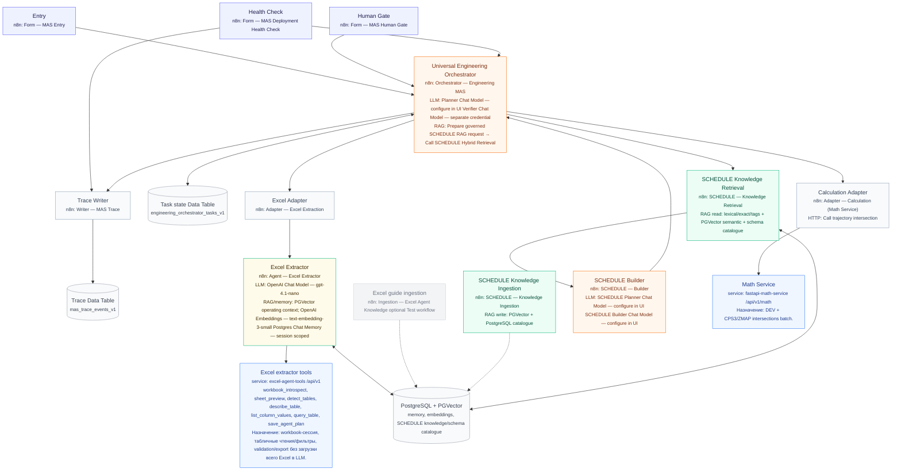

# Corporate n8n 2.30.8 — deploy MAS from scratch

Единственный пошаговый UI-runbook. Целевая версия строго **n8n 2.30.8**.  
Машинный контракт: [`n8n/import-manifest.json`](../n8n/import-manifest.json).  
После настройки жмите **Form — MAS Deployment Health Check** — отчёт скажет, что связано и **где чинить**.

## Component map

**MVP runtime (активировать только forms после Health Check):** Entry, Human Gate, Health Check, Orchestrator, Trace, Excel Adapter+Agent, SCHEDULE Ingestion/Retrieval/Builder, Calculation Adapter.

**Не активировать:** `Legacy — Excel Orchestrator`, `Adapter — Excel Form` (отдельный Excel UI), `Template — Engineering Specialist`, `Reference — AI Components`.

---

## Step 0 — Preconditions

| Need | Notes |
|---|---|
| n8n **2.30.8** | Не новее/не старше для этих JSON |
| PostgreSQL + PGVector credential | memory + SCHEDULE/Excel RAG |
| OpenAI-compatible chat + embeddings | Planner, Verifier, SCHEDULE, Excel Agent |
| Excel Tools на Windows | `http://<windows-ip>:8000/api/v1` + API key |
| Math Service | `http://<windows-ip>:8100/api/v1/math` |

---

## Step 1 — Import workflows (exact order)

**Workflows → Import from File.** Импортируйте в этом порядке (имена = то, что увидите в UI):

| # | File | UI name |
|---:|---|---|
| 1 | `n8n/workflows/calculation-specialist-adapter.workflow.json` | `Adapter — Calculation (Math Service)` |
| 2 | `n8n/workflows/excel-extraction-agent.workflow.json` | `Agent — Excel Extractor` |
| 3 | `n8n/workflows/excel-engineering-specialist-adapter.workflow.json` | `Adapter — Excel Extraction` |
| 4 | `n8n/workflows/tnavigator-schedule-knowledge-ingestion.workflow.json` | `SCHEDULE — Knowledge Ingestion` |
| 5 | `n8n/workflows/tnavigator-schedule-hybrid-retrieval.workflow.json` | `SCHEDULE — Knowledge Retrieval` |
| 6 | `n8n/workflows/tnavigator-schedule-builder.workflow.json` | `SCHEDULE — Builder` |
| 7 | `n8n/workflows/mas-trace-event-writer.workflow.json` | `Writer — MAS Trace` |
| 8 | `n8n/workflows/universal-engineering-orchestrator.workflow.json` | `Orchestrator — Engineering MAS` |
| 9 | `n8n/workflows/mvp-entry-form.workflow.json` | `Form — MAS Entry` |
| 10 | `n8n/workflows/mas-human-gate-form.workflow.json` | `Form — MAS Human Gate` |
| 11 | `n8n/workflows/mas-deployment-health-check.workflow.json` | `Form — MAS Deployment Health Check` |

Опционально (не для MVP activate): Excel Form adapter, Excel RAG ingestion, AI components, specialist template, Legacy Excel Orchestrator.

Все JSON приходят с `active: false` — так и оставьте до Step 7.

---

## Step 2 — Create Data Tables

Откройте вкладку **Data tables**.

### Имена (строго)

1. `engineering_orchestrator_tasks_v1` — CAS state Orchestrator  
2. `mas_trace_events_v1` — redacted trace ledger  

### Как создать

**Предпочтительно — From scratch** (типы колонок сразу верные):

**`engineering_orchestrator_tasks_v1`**

| Column | Type | Column | Type |
|---|---|---|---|
| `task_id` | String | `version` | Number |
| `status` | String | `phase` | String |
| `task_type` | String | `risk_class` | String |
| `request_json` | String | `context_json` | String |
| `plan_json` | String | `specialist_json` | String |
| `result_json` | String | `verification_json` | String |
| `pending_human_json` | String | `last_error_json` | String |
| `retry_count` | Number | `max_retries` | Number |
| `history_json` | String | `created_at` | String |
| `updated_at` | String | | |

**`mas_trace_events_v1`** — все String:  
`event_id`, `trace_id`, `task_id`, `at`, `stage`, `event_type`, `actor`, `status`, `summary`, `details_json`

**Ускорение — Import CSV** (n8n 2.30.8: Create → Import CSV):

- [`n8n/data-tables/engineering_orchestrator_tasks_v1.header.csv`](../n8n/data-tables/engineering_orchestrator_tasks_v1.header.csv)
- [`n8n/data-tables/mas_trace_events_v1.header.csv`](../n8n/data-tables/mas_trace_events_v1.header.csv)

После CSV **обязательно** смените тип колонок `version`, `retry_count`, `max_retries` на **Number**. JSON-импорта схемы Data Table в 2.30.8 нет — только CSV / ручное создание.

---

## Step 3 — Bind Data Table nodes

В каждой ноде откройте resource locator таблицы и выберите созданную таблицу (не оставляйте `REPLACE_IN_UI`).

| Open workflow | Node name | Select table |
|---|---|---|
| `Writer — MAS Trace` | `Insert MAS trace event` | `mas_trace_events_v1` |
| `Orchestrator — Engineering MAS` | `Insert durable task state` | `engineering_orchestrator_tasks_v1` |
| `Orchestrator — Engineering MAS` | `Load task by ID` | `engineering_orchestrator_tasks_v1` |
| `Orchestrator — Engineering MAS` | `CAS persist human action then plan` | `engineering_orchestrator_tasks_v1` |
| `Orchestrator — Engineering MAS` | `CAS persist terminal human action` | `engineering_orchestrator_tasks_v1` |
| `Orchestrator — Engineering MAS` | `CAS persist plan or human gate` | `engineering_orchestrator_tasks_v1` |
| `Orchestrator — Engineering MAS` | `CAS persist SCHEDULE evidence retry` | `engineering_orchestrator_tasks_v1` |
| `Orchestrator — Engineering MAS` | `CAS persist SCHEDULE resume` | `engineering_orchestrator_tasks_v1` |
| `Orchestrator — Engineering MAS` | `CAS persist verification` | `engineering_orchestrator_tasks_v1` |
| `Orchestrator — Engineering MAS` | `CAS persist specialist gate or error` | `engineering_orchestrator_tasks_v1` |
| `Orchestrator — Engineering MAS` | `CAS persist routing gate` | `engineering_orchestrator_tasks_v1` |
| `Form — MAS Deployment Health Check` | `Probe task Data Table` | `engineering_orchestrator_tasks_v1` |
| `Form — MAS Deployment Health Check` | `Probe trace Data Table` | `mas_trace_events_v1` |

Подсказка в Orchestrator: поиск по canvas `CAS persist` / `Load task` / `Insert durable`.

---

## Step 4 — Bind Execute Workflow nodes (9 MVP + 2 health)

**Не скроллите весь список наугад.** Откройте workflow → ноду → в picker выберите **точное UI name** из колонки справа.

| Open workflow | Node on canvas | Select this workflow |
|---|---|---|
| `Orchestrator — Engineering MAS` | `Call Excel Extraction Specialist Adapter` | `Adapter — Excel Extraction` |
| `Orchestrator — Engineering MAS` | `Call SCHEDULE Hybrid Retrieval` | `SCHEDULE — Knowledge Retrieval` |
| `Orchestrator — Engineering MAS` | `Call SCHEDULE Builder Specialist` | `SCHEDULE — Builder` |
| `Orchestrator — Engineering MAS` | `Call Calculation Specialist` | `Adapter — Calculation (Math Service)` |
| `Orchestrator — Engineering MAS` | `Call MAS Trace Event Writer` | `Writer — MAS Trace` |
| `Adapter — Excel Extraction` | `Call native Excel Extraction Agent` | `Agent — Excel Extractor` |
| `Form — MAS Entry` | `Call Universal Engineering Orchestrator` | `Orchestrator — Engineering MAS` |
| `Form — MAS Human Gate` | `Call Orchestrator status` | `Orchestrator — Engineering MAS` |
| `Form — MAS Human Gate` | `Call Orchestrator resume` | `Orchestrator — Engineering MAS` |
| `Form — MAS Deployment Health Check` | `Call Orchestrator probe` | `Orchestrator — Engineering MAS` |
| `Form — MAS Deployment Health Check` | `Call Trace Writer probe` | `Writer — MAS Trace` |

**Не настраивать:** `Call Data Specialist`, `Call Document Specialist` (заглушки расширения).

Подсказка: в Orchestrator `Ctrl/Cmd+F` → `Call ` или экспорт JSON → поиск `REPLACE_` — любой найденный `REPLACE_*` = незавершённый binding.

---

## Step 5 — Credentials and service URLs

| Where | What |
|---|---|
| Orchestrator | `Planner Chat Model — configure in UI`, `Verifier Chat Model — separate credential` |
| SCHEDULE — Builder | Planner + Builder chat models |
| Agent — Excel Extractor | Runtime `excel_tools_url` + `excel_tools_api_key`; chat model; Postgres memory; PGVector; embeddings |
| SCHEDULE Ingestion / Retrieval | Postgres + PGVector + **same** embedding model/dimensions |
| Adapter — Calculation | `math_service_url` (не `$env`) |
| Orchestrator webhook (если HTTP) | Header Auth |

---

## Step 6 — SCHEDULE knowledge (before real tasks)

1. Откройте `SCHEDULE — Knowledge Ingestion` (можно inactive).  
2. Загрузите active `keyword_instruction` (+ schema JSON для deterministic render) в `target_base=schedule_mvp`.  
3. Проверьте через `SCHEDULE — Knowledge Retrieval`.

---

## Step 7 — Health Check, then activate

1. В `Form — MAS Deployment Health Check` выберите таблицы (Step 3) и Orchestrator/Trace (Step 4).  
2. Publish/activate **только** этот form (или Test workflow).  
3. Откройте Production Form URL → Submit.  
4. Читайте HTML-отчёт:
   - **FAIL** — обязательно исправить по колонке `where_to_fix` (workflow + node + что выбрать)  
   - **PASS** — live probe control-plane ок (Data Tables / Orchestrator status / Trace Writer)  
   - **TODO** — чеклист bindings и ручной smoke specialist routes; это нормально и **не блокирует** activate, если FAIL = 0  
5. **«Зелёный» control-plane** = overall `PASS_WITH_TODO` или эквивалент: **0 FAIL** на live probes. Строка overall никогда не бывает чистым `PASS`, потому что binding checklist всегда TODO (их нельзя проверить без вызова LLM/Excel/SCHEDULE).  
6. При 0 FAIL активируйте `Form — MAS Entry` и `Form — MAS Human Gate`.  
7. **Не** активируйте Legacy Excel Orchestrator.

---

## Manual smoke (after Health Check: 0 FAIL)

- Entry без objective → HITL HTML с `task_id`  
- Human Gate `status` → вопросы; `reply` без ручного `gate_id`  
- CREATE / REVISE SCHEDULE при заполненном RAG  
- Excel evidence path  
- `.dev` + CPS3 через Calculation  
- stale version / wrong gate → conflict  
- `mas_trace_events_v1` без секретов/raw prompts  

---

## Quick fix index

| Symptom | Where to fix |
|---|---|
| Form Entry «workflow not found» / placeholder | `Form — MAS Entry` → `Call Universal Engineering Orchestrator` |
| Human Gate не грузит status | `Form — MAS Human Gate` → `Call Orchestrator status` |
| Orchestrator не зовёт Excel | Orchestrator → `Call Excel Extraction Specialist Adapter` |
| Orchestrator не зовёт SCHEDULE | Orchestrator → Retrieval / Builder Call nodes |
| Trace пустой / insert error | `Writer — MAS Trace` → Data Table + Orchestrator → `Call MAS Trace Event Writer` |
| CAS / Load task fails | Все 10 Data Table нод Orchestrator → `engineering_orchestrator_tasks_v1` |
| Health Check FAIL на probe table | Health Check → `Probe task/trace Data Table` |
| Export JSON still contains `REPLACE_` | Незавершённый binding — см. Step 4 |
