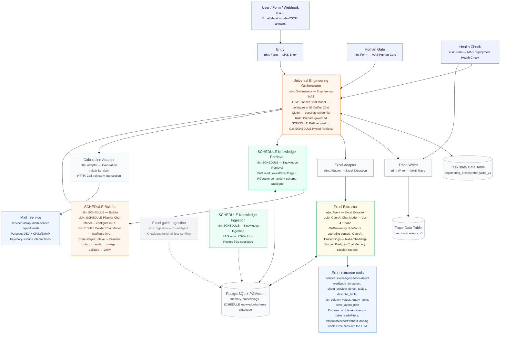

# MAS Architecture Overview: Hydrodynamic Orchestrator

This document outlines the architecture of the Multi-Agent System (MAS) designed to automate reservoir engineering workflows (specifically data extraction and tNavigator SCHEDULE generation).

The architecture follows a **Stateful Orchestrator-Workers** pattern with explicit validation and independent verification loops.

## High-Level System Architecture



## Тезисы для презентации: Почему базовые подходы к LLM не работают

Наивный подход "отправь промпт в ChatGPT" неприменим в гидродинамическом моделировании. Наша MAS-архитектура спроектирована специально для решения следующих enterprise-проблем:

### 1. Миф менеджеров: "Зачем сложности? Просто напиши промпт"
* **Миф:** Можно просто загрузить Excel в LLM и попросить её написать файл SCHEDULE.
* **Реальность (Галлюцинации):** LLM — это вероятностные генераторы текста, а не инженеры. Если заставить их считать математику, парсить сложную геометрию или генерировать ключевые слова гидродинамики без жестких ограничений, они начинают придумывать координаты, несуществующие скважины и выдавать невалидный синтаксис.
* **Решение MAS:** Строгое разделение ответственности (Contract-Driven Architecture). LLM-Оркестратор **никогда** не считает математику и не формирует итоговые файлы SCHEDULE. Он делегирует эти задачи изолированным детерминированным микросервисам (FastAPI для Excel и математики), общаясь с ними через строгие JSON-контракты. Независимый LLM-Верификатор проверяет результат перед выдачей готового файла SCHEDULE.

### 2. Миф IT-отдела: "У нас есть парсеры (Docling), мы всё переведем в Markdown"
* **Миф:** У нас уже есть инструменты, переводящие таблицы в текст/Markdown. Давайте скормим этот текст нейросети, и она сама во всем разберется.
* **Реальность (Context Collapse):** Реальный инженерный Excel-файл (например, график бурения) содержит 5000+ строк. Конвертация его в Markdown создает гигантскую "простыню" текста. Загрузка этого текста в LLM переполняет контекстное окно, приводит к критическим провалам памяти модели ("lost-in-the-middle") и сжигает колоссальный бюджет на токены.
* **Решение MAS:** Наш `Excel Extraction Agent` не читает весь файл глазами LLM. Он использует детерминированный Python-код (Pandas через FastAPI), чтобы умно запрашивать схему файла, фильтровать нужные строки и агрегировать данные на стороне сервера. Модель получает только *сухую выжимку* (например: "Скважина А пробурена 12.05"), экономя время, токены и исключая ошибки чтения.

### 3. Миф безопасников: "Нейросеть — это черный ящик"
* **Реальность:** Бизнес не может доверять системе, которая генерирует входные данные для гидродинамики "вслепую", без возможности аудита.
* **Решение MAS:** Прозрачность и Human-In-The-Loop (HITL). Оркестратор останавливает работу и запрашивает явное подтверждение человека перед любыми необратимыми или критическими действиями. Каждое решение LLM, её логика рассуждений и история вызовов тулов записываются модулем `Trace Event Writer` в базу данных. Это обеспечивает полный лог аудита: мы всегда знаем, *почему* ИИ сгенерировал конкретное ключевое слово или строку в файле SCHEDULE.

## Component Breakdown

### 1. Universal Engineering Orchestrator
The central nervous system of the MAS. It maintains state across asynchronous calls (HITL - Human in the loop) and dictates the workflow.
*   **Planner:** `Planner Chat Model — configure in UI`, an LLM responsible for analyzing current task state and choosing the next bounded capability.
*   **Independent Verifier:** `Verifier Chat Model — separate credential`, a separate LLM that evaluates specialist output against the original request and evidence gates.
*   **Router:** Deterministic Code/Switch path that invokes allowlisted `Execute Workflow` nodes. The deployment operator binds each call node to the exact UI workflow name listed in `docs/DEPLOY_N8N_UI.md`.
*   **State:** `engineering_orchestrator_tasks_v1` Data Table stores CAS task state, HITL gates, retries and versions.

### 2. Excel Subsystem (Data Extraction)
Designed to handle unstructured, "dirty" engineering data.
*   **Adapter:** `Adapter — Excel Extraction` (`excel-engineering-specialist-adapter.workflow.json`) translates the Orchestrator's standard contract into the Excel Agent packet.
*   **Excel Extraction Agent:** `Agent — Excel Extractor` (`excel-extraction-agent.workflow.json`) uses `OpenAI Chat Model — gpt-4.1-nano`, `Postgres Chat Memory — session scoped`, `PGVector operating context` and `OpenAI Embeddings — text-embedding-3-small`.
*   **FastAPI Backend:** `excel-agent-tools` runs outside n8n at `/api/v1`. It owns workbook sessions and deterministic tool calls: `workbook_introspect`, `sheet_preview`, `detect_tables`, `describe_table`, `list_column_values`, `query_table`, `save_agent_plan`, plus validation/export/state endpoints.
*   **Optional:** `Ingestion — Excel Agent Knowledge` seeds Excel operating-guide RAG and is normally run as Test workflow only. `Legacy — Excel Orchestrator` is not part of the runtime path and must not be activated for MVP.

### 3. SCHEDULE Subsystem (Code Generation)
A highly specialized RAG-driven code generation pipeline with three importable workflows.
*   **Knowledge Ingestion / Hybrid Retrieval:** expert keyword instructions and schema catalogue into PostgreSQL/PGVector, then RRF retrieval.
*   **Builder pipeline (`tnavigator-schedule-builder`):** single specialist that owns intake, baseline analyze/decode/query, planner, typed-IR render, merge, validate and independent verify as Code stages.
*   **Release:** accountable human gate lives in Universal Orchestrator (`Apply action and version guard`), not a separate SCHEDULE workflow.

### 4. Calculation Subsystem
*   **Adapter:** `Adapter — Calculation (Math Service)` (`calculation-specialist-adapter.workflow.json`) normalizes orchestrator requests and calls `Call trajectory intersection`.
*   **Math Service:** `fastapi-math-service` runs outside n8n at `/api/v1/math`. It parses DEV trajectories and CPS3/ZMAP surfaces and returns `intersection_md`, `intersection_x`, `intersection_y`, `intersection_z` for up to 256 trajectories per batch.

### 5. Infrastructure
*   **Trace Event Writer (`mas-trace-event-writer`):** Logs state transitions and LLM reasoning steps for debugging and audit trails.
*   **Data Tables:** `engineering_orchestrator_tasks_v1` and `mas_trace_events_v1` are created manually in n8n 2.30.8 and then selected in the corresponding Data Table nodes.
*   **PostgreSQL + PGVector:** backs SCHEDULE RAG, Excel memory/context and embeddings. Ingestion and retrieval embedding model/dimensions must match.

## Deployment Guide: Step-by-Step Setup

Follow this sequence to deploy the MAS architecture into your corporate n8n instance. 

### Step 1: Runtime workflows (Import First)
Import the 11 runtime workflows in the order defined by `n8n/import-manifest.json`:

1. `calculation-specialist-adapter.workflow.json` — `Adapter — Calculation (Math Service)`
2. `excel-extraction-agent.workflow.json` — `Agent — Excel Extractor`
3. `excel-engineering-specialist-adapter.workflow.json` — `Adapter — Excel Extraction`
4. `tnavigator-schedule-knowledge-ingestion.workflow.json` — `SCHEDULE — Knowledge Ingestion`
5. `tnavigator-schedule-hybrid-retrieval.workflow.json` — `SCHEDULE — Knowledge Retrieval`
6. `tnavigator-schedule-builder.workflow.json` — `SCHEDULE — Builder`
7. `mas-trace-event-writer.workflow.json` — `Writer — MAS Trace`
8. `universal-engineering-orchestrator.workflow.json` — `Orchestrator — Engineering MAS`
9. `mvp-entry-form.workflow.json` — `Form — MAS Entry`
10. `mas-human-gate-form.workflow.json` — `Form — MAS Human Gate`
11. `mas-deployment-health-check.workflow.json` — `Form — MAS Deployment Health Check`

Optional/non-runtime imports from the full clean set: `excel-extraction-form-adapter.workflow.json`, `excel-rag-ingestion.workflow.json`, `ai-components.workflow.json`, `engineering-specialist-template.workflow.json`, `excel-mas-orchestrator.workflow.json`. Do not activate `Legacy — Excel Orchestrator` for MVP.

**Corporate UI deploy from scratch:** [`docs/DEPLOY_N8N_UI.md`](../DEPLOY_N8N_UI.md) (import order, Data Table click-paths, Execute Workflow bindings, CSV templates under `n8n/data-tables/`).

*Note: After importing these, bind Execute Workflow and Data Table nodes using the tables in DEPLOY_N8N_UI.md — do not scroll the picker guessing names. Run Health Check before activating Entry/Human Gate.*

### Step 2: Bind Execute Workflow nodes (not one router node)
1. Import `universal-engineering-orchestrator.workflow.json` (and the rest per `docs/DEPLOY_N8N_UI.md`).
2. Bind **each** `Call …` Execute Workflow node individually — there is no single picker on `Route invocation action` (that node is Code routing only).
3. Use the exact owner → node → target table in [`docs/DEPLOY_N8N_UI.md`](../DEPLOY_N8N_UI.md) Step 4 (Orchestrator Call Excel / Retrieval / Builder / Calculation / Trace; Entry; Human Gate; Health Check).

### Step 3: Service URLs (UI-only — no Global Variables / `$env`)
Do **not** use n8n Variables / `$vars` / `$env`. Set URLs in visible workflow config nodes:
- **Excel Agent** → `Runtime configuration`: `excel_tools_url` = `http://<windows-ip>:8000/api/v1` + API key
- **Calculation Adapter** → `Math Service Configuration`: `math_service_url` = `http://<windows-ip>:8100/api/v1/math`

### Step 4: Infrastructure & Credentials
Within the n8n UI, ensure you have configured:
- **PostgreSQL / PGVector Credential:** For State/Memory tracking and Knowledge Retrieval.
- **LLM Credentials:** Set up your chosen models (e.g., GPT/Claude) for the Planner, Verifier, and Sub-agents.

### Step 5: Start the Microservices (Windows PC)
Open two separate terminals on the machine where the Python services reside and start both:

**Terminal 1 (Excel Parser):**
```bash
cd ~/omegalul/excel-agent-tools
# prefer start-windows.bat; or:
python -m uvicorn app.main:app --host 0.0.0.0 --port 8000 --reload
```

**Terminal 2 (Math Service):**
```bash
cd ~/omegalul/fastapi-math-service
python -m uvicorn app.main:app --host 0.0.0.0 --port 8100 --reload
```

### Step 6: Test the Entry Form
1. Go to your n8n Workflows.
2. Open `mvp-entry-form` and click **"Test Workflow"** (or use the production Webhook URL).
3. Fill out the "Task Description" and attach your files (`.xlsx`, `.dev`, `.cps3`, etc.).
4. Click Submit and watch the Orchestrator route your task!
