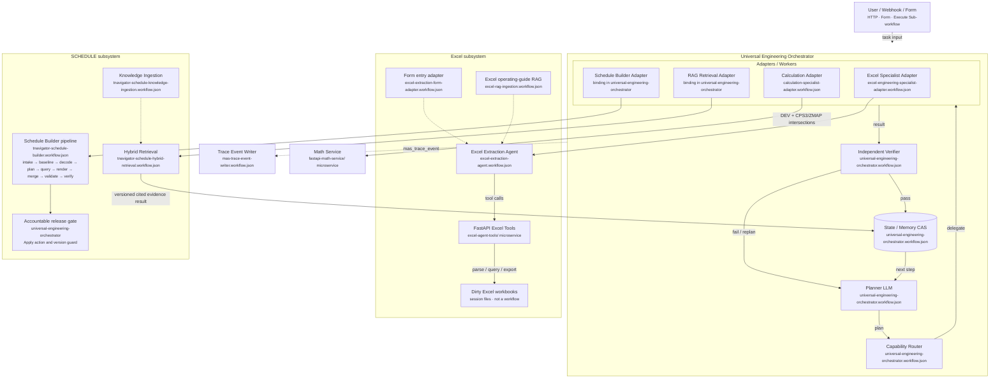

# Petroleum Engineering MAS: SCHEDULE-first research и roadmap

**Целевая платформа:** n8n **2.30.8**.
**Дата ревизии:** 2026-08-09 (implementation status синхронизирован после smoke).
**Текущий предметный scope:** создание, проверка и выпуск файлов секции `SCHEDULE` для tNavigator/ECLIPSE-совместимых моделей в двух равноправных режимах: `CREATE` с нуля и `REVISE` с безопасным изменением существующего Schedule.
**Вне текущего scope:** построение сеток, 3D grid, геологическое моделирование и генерация `GRID`/`PROPS`/`REGIONS`/`SOLUTION`. При необходимости существующий `.data/.inc` передаётся в n8n как обычный bounded UTF-8 text.
**Статус документа:** живой roadmap серьёзного внутреннего MVP с заделом на дальнейшее развитие. Реализованы Orchestrator, Excel specialist, SCHEDULE planner/lossless baseline/catalogue decoder/targeted query/typed renderer/semantic replay/atomic merge/validator/verifier/release и redacted trace. Knowledge Ingestion и Hybrid Retrieval используют expert-authored blocks, lexical + semantic + exact tags + RRF и full-parent hydration. В `REVISE` Builder строит hash-bound `PRE_CHANGE_BOUNDARY`, а mutation authority получает отдельный полный query slice с target/hash guards. Этот документ не является техническим справочником keyword layouts.

> **Актуальный MVP-профиль:** система остаётся серьёзной инженерной основой, но runtime-путь намеренно прост: expert-authored hybrid RAG, Excel evidence loop, lossless baseline, typed IR, deterministic renderer/validator, independent verifier и inline `.INC` result. Источник знаний — подготовленные гидродинамиком `keyword_instruction` и `worked_example`; `schedule_schema_catalogue/v1` — runtime JSON-справочник эксперта отдела. `.data/.inc` обрабатываются как bounded text внутри n8n.

### 0.1. Хирургический delta: что сохраняем и что меняем

| Уже созданный компонент | Решение |
|---|---|
| Universal Orchestrator, CAS/HITL/retry/trace | сохраняем без смены владельца состояния |
| Excel Extractor + adapter + FastAPI | сохраняем; Builder по-прежнему не вызывает Excel напрямую |
| Lossless baseline, decoder/query, CREATE/REVISE, typed IR, renderer/merge/validator | сохраняем; это основная ценность MVP |
| PostgreSQL + PGVector + lexical/tag/RRF retrieval | сохраняем и расширяем типами `keyword_instruction`/`worked_example` |
| `schedule_schema_catalogue/v1` | переиспользуем как expert-authored JSON grammar/semantics, без требования vendor licence |
| `.data/.inc` artifacts | принимаем и возвращаем как текст/binary n8n с лимитами; server filesystem не нужен |

## 1. Решение в одном абзаце

Первый нефтегазовый product slice MAS — не генератор полного `.DATA`, а управляемый **SCHEDULE Construction System**. В нём есть два прикладных специалиста: существующий **Excel Extractor** и конкретный **Schedule Builder**. Universal Orchestrator принимает задачу, инженерные исходные данные и, опционально, текст старого Schedule. Для `CREATE` система строит Schedule с нуля; для `REVISE` lossless baseline analyzer и change planner определяют минимальный доказанный change set и сохраняют всё не затронутое задачей. Специализированные workflow собирают versioned temporal IR, а deterministic renderer формирует SCHEDULE text. LLM помогает классифицировать вход, находить подтвержденные правила и предлагать typed changes, но не задаёт grammar, порядок полей или defaults. Выпуск выполняется после `schema validation -> temporal/state validation -> preservation/diff reconciliation -> independent review -> применимый human approval`. Excel Extractor остаётся upstream specialist для табличных исходных данных.

## 2. Технические источники и текущая MVP-authority

> Раздел ниже сохраняет результаты web-исследования только как справочный контекст. Runtime-authority текущего MVP — активная карточка знания и exact JSON schema, подготовленные и проверенные гидродинамиком отдела.

### 2.1. Что удалось найти в web

- Официальный [RFD Client Centre](https://support.rfdyn.com/) существует и возвращает login page/HTTP 401 без клиентского доступа. Это официальный защищенный канал документации и release notes.
- Публичная страница [tNavigator 26.2 release](https://rfdyn.com/tnavigator-26-2-accelerating-the-digital-energy-workflow-with-ai-petrophysics-and-advanced-simulation/) прямо направляет действующих клиентов в Client Centre за полным комплектом release notes. Следовательно, grammar нельзя привязывать просто к слову «tNavigator»: нужна конкретная версия документации.
- В [публично индексируемой научной публикации](https://www.researchgate.net/publication/374018238_Estimation_of_the_volume_of_trapped_gas_and_the_use_of_sidetracking_as_a_method_of_its_additional_recovery_using_hydrodynamic_modeling_in_the_tNavigator_software_product) встречается библиографическая ссылка `tNavigator 22.2: Technical manual. Moscow: Rock Flow Dynamics, 2022`. Это подтверждает существование versioned редакции и полезно для проверки экспертных карточек, но не является deployment dependency MVP.
- Публичный [RFD Resources Hub](https://rfdyn.com/resources-hub/) предоставляет продуктовые материалы, но не открытый Schedule keyword reference.

**Итог для текущего milestone:** профиль рендера фиксирован как tNavigator 22.2-compatible, но знания загружаются в `target_base=schedule_mvp` как `department_expert`. Expert block обязан быть versioned/content-addressed; случайный PDF-текст не становится grammar автоматически. Если позже появится другой runtime, вводится отдельный compatibility profile.

### 2.2. Практический источник истины MVP

Эксперт отдела готовит один versioned knowledge block на используемый keyword:

```text
vendor                 Rock Flow Dynamics
simulator              tNavigator
simulator_version      22.2 для первого production profile
document_title         название экспертной карточки или исходного PDF
document_revision      ревизия карточки
source                  department_expert / working_example / internal_pdf
source_hash             content hash подготовленного блока
access_scope            внутренняя разрешенная группа
approved_by             ответственный инженер-гидродинамик
```

Для deterministic render вместе с текстовой инструкцией загружается `schedule_schema_catalogue/v1`: поля, позиции, required/default/enum/type и семантические правила. Источник может быть подготовлен по рабочему PDF, личному опыту и проверенным примерам. Необработанный PDF не получает authority автоматически: в runtime попадает только вычитанная экспертная карточка.

### 2.3. Открытый cross-check, но не замена tNavigator manual

Открытый [OPM Flow Reference Manual 2025.10](https://opm-project.org/?page_id=955), [OPM keyword registry](https://github.com/OPM/opm-common/tree/master/opm/input/eclipse/share/keywords) и [Schedule integration fixtures](https://github.com/OPM/opm-common/tree/master/tests/parser/data/integration_tests/SCHEDULE) полезны для ECLIPSE-compatible grammar и regression oracle.

В OPM Schedule registry подтверждены `DATES`, `INCLUDE`, `WELSPECS`, `WCONPROD`, `WCONHIST`, `GCONPROD`, `GRUPTREE`, `BRANPROP`, `NODEPROP`, `WECON`, `WTEST`. В открытом registry не найдены `COMPDATMD`, `WELLTRACK`, `FRACTURE_SPECS`, `FRACTURE_STAGE`; для них используем техническое описание и параметры именно из tNavigator 22.2, а не из похожих ECLIPSE keywords. OPM support — только cross-check совместимого subset; итоговую authority задает профиль tNavigator 22.2.

## 3. Словарь SCHEDULE v1

Повтор `GRUPTREE` в исходном перечне нормализован: это одно обязательное семейство правил.

| Keyword | Роль в текущем scope | Основные проверки | Источник grammar |
|---|---|---|---|
| `DATES` | перевод simulation clock и граница time block | валидная дата, строгое возрастание, cutover/history/forecast range, отсутствие неоднозначной локали | tNavigator manual; OPM cross-check |
| `INCLUDE` | вставка управляемых SCHEDULE fragments | относительный canonical path, package root, существование, hash, depth/cycle/size limits, deterministic order | tNavigator manual; OPM cross-check |
| `GRUPTREE` | иерархия child-parent groups | единственный parent, существование, отсутствие cycles/orphans, разрешенный root, effective date | tNavigator manual; OPM cross-check |
| `WELSPECS` | объявление/изменение well specification и group membership | уникальное имя, группа существует, ссылки на импортированную модель, phase/ref-depth/heads/units, allowed redefinition | tNavigator manual; OPM cross-check |
| `WELLTRACK` | траектория скважины | record schema, MD/TVD/coordinates/order и linkage по tNavigator 22.2; monotonic measured depth и finite values | tNavigator 22.2 manual |
| `COMPDATMD` | completion/perforation definition по MD/trajectory | fields/defaults, интервалы, overlap, well/track dependency, grid intersection semantics по tNavigator 22.2 | tNavigator 22.2 manual |
| `WCONHIST` | observed historical production controls/data | well exists, history period only, mode/rates/pressures/units, missing-vs-zero, no forecast misuse | tNavigator manual; OPM cross-check |
| `WCONPROD` | forecast production target/constraint | well exists, forecast period, status/control mode, compatible active target, ORAT/WRAT/GRAT/LRAT/RESV/BHP/THP, VFP/ALQ refs | tNavigator manual; OPM cross-check |
| `GCONPROD` | group production targets/constraints | group exists, mode-target consistency, exceed procedures, guide rates, parent-response behavior, unit dimensions | tNavigator manual; OPM cross-check |
| `BRANPROP` | extended surface-network branches | feature enabled in base profile, endpoints exist, no forbidden network mode, graph integrity, VFP/ALQ references | tNavigator manual; OPM cross-check |
| `NODEPROP` | extended surface-network nodes | node uniqueness, required branch/network dependency, pressure units, choke/group references, network topology | tNavigator manual; OPM cross-check |
| `FRACTURE_SPECS` | fracture definition/configuration | fields, units, well/trajectory linkage, uniqueness и feature prerequisites по tNavigator 22.2 | tNavigator 22.2 manual |
| `FRACTURE_STAGE` | stage placement/activation/event | fields, stage ordering, time/well/fracture dependency и overlap по tNavigator 22.2 | tNavigator 22.2 manual |
| `WECON` | economic limits/actions for producers | well exists, ratio/rate dimensions, action semantics, follow-on reference, conflict/cycling with other controls | tNavigator manual; OPM cross-check |
| `WTEST` | well testing/reopening policy | well exists, positive interval, reason/action semantics, retry count/start time, interaction with WECON/status | tNavigator manual; OPM cross-check |

Таблица отражает **назначение validation domain**, а не пытается воспроизвести vendor record layout. Порядок полей, обязательность, defaults и допустимые enumerations извлекаются только из versioned schema catalogue, утвержденного по Technical Manual.

## 4. Два равноправных режима построения SCHEDULE

Система обязана поддерживать два first-class режима. Оба используют одну grammar 22.2, один temporal IR, одинаковые validators и release gates.

| Режим | Когда применяется | Основной инвариант |
|---|---|---|
| `CREATE` | Старого Schedule нет; нужно создать новый по базовой ГМ, задаче и исходным данным | Не генерировать обязательные сущности/поля без достаточных данных; полнота доказывается coverage matrix |
| `REVISE` | Приложен старый готовый Schedule, который нужно актуализировать | **Preserve by default:** менять только доказанную область задачи; остальное сохранить |

`build_mode` входит в request как `CREATE`, `REVISE` или `AUTO`. Для удобства `AUTO` детерминированно выбирает `REVISE`, если передан непустой `baseline_schedule_text`, иначе `CREATE`. Выбранный режим возвращается в intake response до планирования. `CREATE` не требует искусственного пустого baseline и идёт по собственной greenfield-ветке. Конфликт, например явный «создать заново» при приложенном baseline, требует подтверждения человека: наличие файла само по себе не даёт разрешения отбросить его содержимое.

### 4.1. Общие входы

MAS не переписывает геологическую сетку или исходный `.DATA`. На вход поступают:

- optional `baseline_schedule_text`; обязательный при `REVISE`;
- simulator profile `tNavigator 22.2` и подтвержденный `METRIC`;
- model start date, history end/cutover, forecast horizon;
- optional известные wells/groups/network/features из задачи, baseline или Excel;
- поставленная задача и acceptance criteria;
- Excel и другие приложенные source data с provenance;
- явные указания `must_change`, `must_add`, `must_remove`, `must_preserve`, если они известны.

Результат — standalone SCHEDULE text с именем `schedule.inc`, completeness/preservation report и diff. Приложенный baseline никогда не перезаписывается: изменённый текст возвращается как новый result.

### 4.2. `CREATE`: создание SCHEDULE с нуля

Отсутствие baseline — штатный production-вход, а не ошибка или урезанный fallback. Greenfield pipeline начинает с явно нового Schedule state, но это не дает модели разрешения «додумать» содержание:

1. разбирает задачу на history, forecast, well/trajectory/completion/fracture, group/network, economics/testing и time-grid subtasks;
2. извлекает данные из Excel/прочих artifacts и строит normalized source facts;
3. составляет **required-data matrix** по выбранным keywords и Technical Manual 22.2;
4. связывает каждое планируемое поле с `source_ref`, либо маркирует approved assumption/default;
5. запрашивает недостающие mandatory данные; optional keyword не добавляется «на всякий случай»;
6. строит зависимости `GRUPTREE -> WELSPECS -> WELLTRACK -> COMPDATMD -> controls/...` согласно profile;
7. формирует temporal IR, рендерит, валидирует, dry-runs и выпускает только через HITL.

Greenfield-builder обязан уметь создать как единый `schedule.inc`, так и управляемый include-package. Он определяет полный требуемый состав на основании задачи и доступных данных: календарь `DATES`, объявления и иерархию объектов, history/forecast controls, completions/trajectory/fractures, network, economics и testing. Он не копирует структуры из случайного примера и не требует старый Schedule как шаблон.

Для `CREATE` completeness report обязан ответить:

- какие requested capabilities реализованы и какими keywords;
- какие wells/groups/dates/source rows покрыты;
- какие данные отсутствовали и что поэтому не создано;
- где применены simulator defaults и кем они разрешены;
- какие assumptions остаются открытыми.

Минимальный комплект доказательств для успешно созданного с нуля пакета:

```text
requirements-matrix.json        # capability -> keyword -> обязательные source facts
source-facts.json               # нормализованные утвержденные исходные данные
schedule-ir.json                # полный типизированный temporal IR
source-map.json                 # каждое output field -> source/default/assumption
completeness-report.json        # покрытие задачи, сущностей, дат и обязательных полей
validation/findings.json
manifest.json                   # файлы, hashes, encoding, profile и INCLUDE graph
```

Если source data не хватает для обязательного record, результат — `needs_input`, а не частично правдоподобный файл.

### 4.3. `REVISE`: killer feature «старый SCHEDULE + новая задача»

В этом режиме пользователь прикладывает уже готовую предыдущую версию Schedule, формулирует новую задачу и добавляет столько новых данных, сколько имеется. Агент должен понять, **что именно следует изменить**, а все не затронутое задачей сохранить.

#### 4.3.1. Lossless baseline ingestion

Baseline сначала обрабатывает детерминированный parser, не LLM:

1. проверяет encoding, line endings и file hashes;
2. рекурсивно разрешает `INCLUDE` graph с защитой path/depth/cycle/size;
3. строит **lossless concrete syntax tree (CST)**: keywords, records, default markers, comments, whitespace, source file и byte/line ranges;
4. параллельно строит semantic temporal IR и state snapshots;
5. создает inventory: dates, keywords, entities, record identities, groups, wells, trajectories, completions, fractures, controls, network, economics/tests;
6. сохраняет неизвестные/неподдержанные конструкции как opaque CST nodes: их нельзя генерировать или редактировать автоматически, но они не должны пропасть.

Lossless CST необходим: обычный parse-and-render может незаметно изменить комментарии, defaults, форматирование или include layout даже там, где задача ничего не просила менять.

#### 4.3.2. Анализ задачи и новых данных

Planner получает не весь сырой файл в prompt, а компактный baseline inventory/state и evidence packets. Он:

1. декомпозирует задачу в проверяемые change intents;
2. определяет affected dates/entities/keywords/fields;
3. сопоставляет Excel и другие sources с baseline records;
4. строит `change_coverage_matrix`;
5. выявляет missing/conflicting data и открывает clarification;
6. предлагает минимальный change set, но не применяет его.

Новые данные являются **доказательством значения**, но не автоматическим разрешением переписать все совпавшие объекты. Изменение разрешено, только если одновременно есть:

- связь с утвержденным intent текущей задачи;
- однозначная identity entity/date/record;
- достаточный source fact либо явно approved assumption;
- разрешенная Technical Manual 22.2 schema;
- отсутствие нерешенного конфликта с baseline/другим источником.

#### 4.3.3. Change operations

Каждый baseline record/CST node получает ровно одну disposition:

| Операция | Семантика | Условие |
|---|---|---|
| `KEEP` | Сохранить исходные bytes и положение без изменений | Default для всего вне approved scope |
| `MODIFY` | Изменить только перечисленные поля/record с before/after | Есть approved intent, source и schema |
| `ADD` | Добавить новый record/time block/include | Следует из задачи и достаточно данных |
| `REMOVE` | Удалить record/entity/block | Только явное указание или отдельно одобренное концептуальное изменение |

Перемещение, split/merge или полная замена блока моделируются как явная комбинация операций и показываются человеку. `REMOVE` никогда не выводится из отсутствия строки в новом Excel. Отсутствующая новая величина в `REVISE` означает `KEEP` старого значения; если поле попало в scope изменения, но новое значение неизвестно, workflow возвращает `needs_input`.

#### 4.3.4. Preserve-by-default и no-data-loss invariant

Математический инвариант merge:

```text
OUTPUT = KEEP(BASELINE)
       + APPROVED_MODIFICATIONS
       + APPROVED_ADDITIONS
       - EXPLICITLY_APPROVED_REMOVALS
```

Перед release детерминированный reconciliation доказывает:

- каждый baseline CST node учтен ровно один раз;
- все `KEEP` fragments побайтно идентичны исходнику;
- изменены только paths из approved change set;
- ни один comment, unknown keyword, include или default marker не исчез молча;
- все output additions имеют provenance;
- каждый removal имеет actor, reason и impact review.

Нулевой change set должен выдавать byte-identical package с теми же hashes. Повтор одного request с теми же baseline/source/plan versions должен быть идемпотентным.

#### 4.3.5. Концептуальные изменения и удаления

Фразы «перестроить структуру групп», «отказаться от старых ограничений», «пересоздать прогноз после даты X» потенциально задают широкий destructive scope. Workflow обязан:

1. превратить их в точный candidate scope;
2. показать cascade impact на wells/groups/network/controls/future time blocks;
3. перечислить сохраняемые и удаляемые records;
4. запросить `needs_decision`/approval;
5. не применять cascade delete автоматически.

Если новое указание противоречит старому Schedule, явное утвержденное требование может supersede baseline. Если друг другу противоречат новые sources или задача неоднозначна, приоритета «последний файл победил» нет — требуется clarification.

#### 4.3.6. Артефакты ревизии

Помимо полного нового Schedule package результат включает:

```text
baseline-inventory.json
change-intents.json
change-coverage-matrix.json
change-set.json                # KEEP/MODIFY/ADD/REMOVE
source-map.json                # output field -> task/source/manual rule
semantic-diff.json             # date/entity/keyword/field before/after
textual-diff.patch
preservation-report.json       # byte-identical KEEP proof
impact-report.json
validation/findings.json
```

Human reviewer видит компактный semantic diff, но может открыть точный textual diff и исходные citations. Approval подписывает hashes baseline, change set и output; изменение change set делает старое approval недействительным.

### 4.4. Typed temporal IR вместо генерации текста

Каждое новое или изменяемое событие сначала становится нормализованным IR:

```json
{
  "event_id": "evt_...",
  "effective_at": "2030-01-01",
  "phase": "forecast",
  "keyword": "WCONPROD",
  "entity_type": "well",
  "entity_id": "WELL-01",
  "payload_schema": "tnav-22.2/WCONPROD/v1",
  "payload": {},
  "operation": "MODIFY",
  "baseline_record_id": "rec_...",
  "source_refs": ["artifact://approved-plan/..."],
  "assumptions": [],
  "approval_class": "high"
}
```

В `CREATE` все IR nodes являются `ADD`; в `REVISE` они связаны с baseline record либо явно добавлены. LLM может предложить draft, но schema/policy validator принимает его только после exact lookup `22.2 + keyword`. Renderer не исправляет вход эвристически.

### 4.5. История и прогноз — разные режимы данных

- `WCONHIST` допускается только в согласованном history interval.
- `WCONPROD`/`GCONPROD` для прогноза начинаются не раньше утвержденного cutover.
- Cutover является approved datum; его нельзя молча вывести из последней строки Excel.
- В `REVISE` at-cutover state восстанавливается из baseline и меняется только approved change set.
- В `CREATE` at-cutover state строится из полностью покрытых source facts.
- Ноль, missing и simulator default — разные состояния. Default применяется только по schema/policy.

### 4.6. Dependency graph и порядок событий

До render строится dependency graph:

1. `DATES` задает effective time block; даты монотонны.
2. Group существует до ссылки из `WELSPECS`/`GCONPROD`; `GRUPTREE` не содержит cycles.
3. Well существует до trajectory/completion/control/economic/test/fracture records.
4. Trajectory существует до MD-based completion/stage по tNavigator 22.2 profile.
5. Network feature разрешен base model; nodes/branches ссылаются только на известные endpoints.
6. Control mode согласован с target/constraint; mutually exclusive records разрешает policy.
7. `WECON` и `WTEST` анализируются совместно во избежание непреднамеренных shut/reopen loops.
8. В `REVISE` dependency impact вычисляется до удаления/замены parent record.

### 4.7. INCLUDE package

Рекомендуемый layout:

```text
schedule-package/
  manifest.json
  schedule.inc
  timeblocks/
    2030-01-01.inc
    2030-02-01.inc
  validation/
    findings.json
    source-map.json
    semantic-diff.json
    preservation-report.json
```

В `CREATE` renderer создает стабильный canonical layout. В `REVISE` исходный include layout сохраняется по умолчанию; новый canonical layout требует отдельного approved refactor, потому что реорганизация файлов сама является изменением. Запрещены absolute paths, `..`, symlink escape, duplicate/cyclic includes, URLs и незарегистрированные files. Manifest фиксирует hashes, encoding, line endings, profile и include graph.

### 4.8. Stateful semantics и conflict analysis

Validator replay-ит event stream и обнаруживает duplicate/redefinition, reference до создания, несовместимые statuses/controls, несколько modes без precedence, group/network cycles, invalid completion/stage intervals, history/forecast violations, units/range/non-finite errors и неожиданное wildcard expansion.

В `REVISE` он дополнительно проверяет unintended semantic drift: состояние объектов вне approved scope на каждой контрольной дате должно совпасть с baseline. Wildcards либо запрещаются для release v1, либо раскрываются детерминированно и сохраняются как resolved target list.

## 5. Target MAS architecture

Stateful **Orchestrator-Workers**: Universal Orchestrator планирует и владеет CAS/HITL; specialists вызываются только через adapter/packet-контракты. Excel-файл парсит FastAPI, не LLM. SCHEDULE идёт через hybrid RAG → Builder → baseline decode/replay (`REVISE`) → typed IR/render → merge → candidate validation → independent verify → inline release.

Под каждой нодой мелким шрифтом — файл workflow из `n8n/workflows/` (или сервис, если это не n8n).



Текстовый эквивалент того же control-plane (если preview без Mermaid):

```text
HTTP / Form / Execute Sub-workflow
                 |
Universal Petroleum Engineering Orchestrator
  |- durable task ledger + CAS + HITL + policy/budgets
  |- planner returns structured plan only
  |- deterministic capability router
  `- independent verifier + human release gate
                 |
       SCHEDULE Construction Pipeline
  |- Text task and optional baseline .data/.inc
  |- Excel Extraction Specialist (implemented)
  |- tNavigator Manual RAG Researcher
  |- Deterministic CREATE / REVISE Mode Router
  |    |- CREATE: Requirements Matrix -> Full Temporal IR Builder
  |    `- REVISE: Lossless Analyzer -> Catalogue Decoder -> Prefix Replay -> Planning Summary -> Change Planner -> Targeted Query -> Baseline Merger
  |- History Normalizer
  |- Forecast Controls Planner
  |- Well / Completion / Fracture Specialist
  |- Group / Surface Network Specialist
  |- Economic / Testing Specialist
  |- Dependency / Conflict Resolver
  |- Deterministic SCHEDULE Renderer
  |- Parser / Stateful Linter / Completeness or Preservation Evidence
  `- Independent Verifier -> inline schedule.inc
```

Для `CREATE` baseline analyzer/decoder/query/merger не вызываются: requirements planner строит required-data matrix, greenfield-builder создаёт полный approved IR, а renderer выпускает новый текст и completeness evidence. Для `REVISE` analyzer фиксирует lossless CST/include graph, catalogue decoder строит typed prefix/suffix IR, общий replay формирует `PRE_CHANGE_BOUNDARY`, planning query выдаёт только summary/samples, а после плана targeted query возвращает полный релевантный mutation-safe slice. Merger применяет только одобренные `KEEP/MODIFY/ADD/REMOVE`, причём `MODIFY/REMOVE` обязаны ссылаться на target/hash из этого slice. Общими для обеих веток остаются schema catalogue, normalized source facts, dependency rules, renderer, candidate validator, independent verifier и human release. Один LLM не должен одновременно планировать, генерировать, проверять и выпускать Schedule. Specialists не меняют authoritative task state и возвращают universal `specialist_result`; итоговый bounded `.INC` text возвращается пользователю внутри результата n8n.

### 5.1. Граница ответственности: Orchestrator → Excel Extractor → Schedule Builder

**Решение для MVP: Schedule Builder и Excel Extractor взаимодействуют только через Universal Orchestrator и типизированные adapter/packet-контракты. Прямой вызов Excel Extractor из Schedule Builder запрещён.**

Это не лишний уровень абстракции, а обязательная anti-corruption boundary:

| Вариант | Решение | Почему |
|---|---|---|
| `Schedule Builder -> Excel Extractor` напрямую | запрещён для MVP | Builder начинает знать FastAPI/session/tool-протокол, появляются два владельца состояния, обходятся CAS/HITL, усложняется retry и аудит, а бинарные файлы и continuation начинают жить в разных execution chains |
| `Orchestrator -> Excel adapter -> Excel Extractor` | **основной путь** | Orchestrator единственный владелец задачи, версии состояния, маршрутизации, budget, clarification и release policy; Excel остаётся заменяемым specialist |
| `Orchestrator -> Schedule Builder` | **основной путь** | Builder получает уже нормализованные facts/evidence и baseline inventory, а не пытается самостоятельно искать таблицы или вызывать Excel tools |

Excel Extractor отвечает только за детерминированное извлечение фактов из workbook: структуру листов/таблиц, строки, значения, единицы и признаки пропусков; он не принимает решений о том, какие SCHEDULE keywords менять. Schedule Builder отвечает за domain mapping, temporal IR, `CREATE`/`REVISE`, change set и генерацию Schedule; он не парсит Excel через FastAPI. Orchestrator соединяет результаты, контролирует итерации и решает, когда вызвать следующий specialist.

Допускается только обратное **логическое** сообщение `evidence_gap` от Builder в Orchestrator: например, Builder сообщает, что для `WCONPROD` не хватает `BHP` для конкретной скважины и даты. Orchestrator сохраняет состояние, формирует ограниченный `excel_query_request`, вызывает Excel adapter повторно и передаёт Builder новый versioned evidence packet. Builder никогда не вызывает Excel workflow самостоятельно и не получает внутренние workflow IDs или FastAPI URLs.

#### Почему это решение соответствует MAS best practices

Выбран не peer-to-peer swarm, а **manager/orchestrator + bounded specialists**:

- Anthropic рекомендует начинать с простых composable workflows и вводить agentic flexibility только там, где она дает измеримый выигрыш; SCHEDULE pipeline имеет известные safety gates и поэтому его control path должен оставаться детерминированным;
- Microsoft разделяет sequential orchestration, concurrent fan-out, handoff и manager patterns; здесь Excel facts являются входом Builder, поэтому основной путь — последовательный, а центральный manager нужен для общей task memory, policy и result aggregation;
- Google описывает sequential pipeline как наиболее прозрачный и отлаживаемый путь для зависимых преобразований, а parallel fan-out — только для независимых задач;
- n8n Execute Sub-workflow предоставляет явную workflow boundary, отдельную execution и статическую UI-привязку; это дает видимость handoff без передачи installation-specific workflow ID модели.

Следствия для реализации:

1. Planner выбирает только логическую capability, а детерминированный allowlist связывает её со статической Execute Sub-workflow node.
2. Excel и Builder не владеют общей conversation/task memory и не меняют CAS-state; они возвращают typed result.
3. Orchestrator хранит plan, immutable evidence snapshots, stage scores, открытые вопросы, retry budget и approval decisions.
4. Builder может сформулировать потребность в фактах, но не выбирает, какой workbook/tool/workflow запустить: это решение Orchestrator.
5. Независимые read-only проверки разрешено запускать параллельно, но любое изменение authoritative state проходит сериализованный CAS transition.

#### Оценка пригодности схемы для MVP

По результатам сверки с manager/orchestrator, sequential pipeline, bounded delegation, explicit HITL и evaluator/verifier patterns из источников раздела 13 схема подходит для первого производственного slice лучше, чем peer-to-peer swarm: у неё один владелец состояния и политики, воспроизводимый порядок зависимых инженерных этапов, заменяемые specialists и отдельная независимая проверка. Оценка не означает, что сам результат модели вероятностно «верен» — она описывает пригодность архитектурного решения:

| Критерий | Оценка для MVP | Почему / ограничение |
|---|---|---|
| Разделение ответственности | высокая | Excel извлекает доказуемые факты, Builder строит SCHEDULE IR, Orchestrator управляет решением и состоянием |
| Безопасность изменений | высокая при включённых gates | `preserve_unmentioned`, typed change set, fail-closed validator и обязательный accountable release; без catalogue 22.2 выпуск запрещён |
| Итерации и HITL | высокая | `evidence_gap`, CAS-версии и bounded retry позволяют продолжить ту же задачу без смешивания snapshots |
| Наблюдаемость | высокая для UI-only n8n | Executions UI + redacted trace показывают handoff/tool/evidence/gate; скрытый chain-of-thought не публикуется |
| Расширяемость | высокая | новый specialist подключается через versioned packet и allowlist, не меняя Excel/Builder контракты |
| Операционная сложность | средняя | несколько sub-workflows и ручные UI bindings неизбежны при n8n 2.30.8/UI-only; это компенсируется импортным manifest и smoke gate |
| Production readiness сейчас | условная | importable foundation, automatic baseline snapshot, artifact-publisher и simulator control-plane gates уже запускаются, но exact field/semantic catalogue, реальный artifact service/runner/check procedure, golden corpus и corporate UI acceptance остаются обязательными gates |

Итоговое решение: для MVP фиксируем **orchestrator-mediated sequential MAS**. Direct specialist-to-specialist calls, свободный выбор workflow моделью и автоматический выпуск при одном высоком score не входят в допустимую архитектуру. После накопления golden cases отдельные независимые read-only проверки можно распараллелить, не меняя владельца state и release policy.

Прямой вызов был бы оправдан только позднее для полностью автономного, низкорискового, атомарного tool, если он не имеет своей durable memory, не открывает HITL и не меняет task state. Excel Extractor этим условиям не соответствует: он имеет session/continuation, может запросить уточнение и обрабатывает пользовательский binary artifact. Поэтому для MVP исключений нет.

#### Итерационный evidence-gap loop

```text
Builder detects missing/conflicting fact
  -> schedule_builder_result.evidence_gap[]
  -> Orchestrator validates gap against approved keyword plan
  -> if answer is already in approved snapshot: reject duplicate request/replan
  -> if workbook may contain it: scoped excel_query_request/v1
  -> if user decision/input is required: durable HITL gate
  -> Excel Extractor returns source_facts_packet/v1
  -> Orchestrator validates correlation/version/hash and creates snapshot N+1
  -> Builder is called again with snapshot N+1 and prior builder findings
```

Loop limits задаются policy (`max_excel_iterations`, `max_builder_iterations`, time/token/tool budgets). Повтор одного и того же gap без нового evidence останавливается как `STALLED_EVIDENCE_LOOP`; stale snapshot, correlation или task version отклоняются. Это делает возврат к задаче воспроизводимым и не позволяет двум specialists бесконечно вызывать друг друга.

Непересекаемые архитектурные инварианты MVP:

- только Orchestrator создаёт новую версию authoritative task state и открывает/закрывает HITL gate;
- только Excel Extractor обращается к Excel FastAPI и владеет его opaque session/continuation;
- только Hybrid Retrieval получает governed knowledge evidence; Builder не выбирает RAG workflow и не выполняет произвольный retrieval;
- только Schedule Builder формирует typed domain IR/change proposal, но не утверждает release;
- только deterministic renderer/validator превращают утверждённый typed IR в authoritative text и проверяют его;
- только accountable Release gate присваивает результату статус `approved`.

Таким образом, «через Orchestrator» не означает передачу всех байтов в LLM prompt. Workbook binary остаётся на границе Excel subsystem, baseline text обрабатывается deterministic Code nodes, а модели получают только bounded typed packets и необходимые excerpts. В durable task state сохраняются версии, решения, compact results и audit metadata без лишних копий больших файлов.

#### Каноническая последовательность принятия решения о keywords

Чтобы ответ на вопрос «что добавить/изменить/создать/оставить» был воспроизводимым, полномочие распределяется между этапами, а не отдаётся одному агенту:

1. **Control-plane triage** извлекает из задачи явные intents и классифицирует artifacts, но не разрешает мутации.
2. **Baseline Analyzer** (`REVISE`) детерминированно строит inventory/CST и помечает всё исходное как candidate `KEEP`.
3. **SCHEDULE Planner** предлагает candidate keyword scope и required-data matrix: какая capability требует какого keyword, сущности, периода и фактов.
4. **Evidence Router** сопоставляет каждый mandatory fact с уже утверждённым source snapshot. Только для gaps, которые реально могут находиться в workbook, он вызывает Excel Extractor.
5. **Excel Extractor** возвращает факты, пропуски и conflicts с row-level provenance, но не выбирает keyword и не формирует `ADD/MODIFY/REMOVE`.
6. **Plan reconciler + authorized RAG** проверяют candidate scope по baseline, фактам и schema/citations 22.2. На этом шаге возникает approved change intent.
7. **Schedule Builder** превращает approved intents в typed IR/change set; Validator и Verifier независимо отклоняют недоказанные операции.

Матрица решения для каждого `keyword × entity × effective_at × field`:

| Режим/ситуация | Disposition |
|---|---|
| `CREATE`, capability явно нужна и все mandatory facts/schema подтверждены | `ADD` |
| `CREATE`, capability не запрошена или optional и не доказана | не создавать |
| `REVISE`, поле вне approved intent | `KEEP` |
| `REVISE`, поле в intent и новое значение доказано | `MODIFY` |
| `REVISE`, поле в intent, но значение отсутствует/конфликтует | `needs_input`, baseline остаётся `KEEP` |
| Любой режим, новый record следует из approved intent и полностью покрыт | `ADD` |
| Удаление явно утверждено actor/reason/gate и прошёл impact review | `REMOVE` |
| Строка отсутствует в новом Excel | никогда не `REMOVE`; в `REVISE` — `KEEP` |

Именно такой split делает Excel заменяемым data specialist, Builder — bounded domain specialist, а Orchestrator — единственным владельцем итераций и task state.

### 5.2. Базовый MVP flow от задачи до Schedule

```text
User (HTTP/Form/file upload)
  -> Universal Orchestrator: task + optional Excel + optional baseline .data/.inc text
  -> governed schedule_build_request/v1 gate: task/version/idempotency, METRIC, time boundaries, mode/scope, catalogue binding
  -> Control-plane triage: mode, preliminary scope, input classification
  -> deterministic stage-readiness gate (не LLM confidence)
       ├─ attention: один targeted re-check/research, trace warning
       └─ HITL: clarification/decision, durable pause and resume
  -> [REVISE only] Baseline Analyzer: lossless CST + INCLUDE inventory
  -> [REVISE only] approved-catalogue decode + prefix replay -> PRE_CHANGE_BOUNDARY
  -> [REVISE only] bounded planning summary (counts/fields/samples; no mutation authority)
  -> SCHEDULE Planner: candidate keywords/change intents, required evidence, acceptance criteria
  -> Evidence router
       |- if a required fact is absent and an attached workbook can contain it:
       |     Excel Adapter -> Excel Extractor -> normalized source facts + coverage/conflicts
       |- if approved non-Excel facts already cover the plan: preserve the evidence snapshot
       `- if no supplied source can answer a mandatory question: durable HITL clarification
  -> SCHEDULE plan reconciliation: final KEEP/MODIFY/ADD/REMOVE scope
  -> [REVISE only] targeted baseline query: complete relevant records + target/hash/provenance
  -> [if evidence_gap] Excel clarification/retry, then resume same task_id at next version
  -> tNavigator 22.2 Hybrid RAG: authorized keyword evidence + complete citations
  -> Schedule Builder: typed CREATE/REVISE IR and draft .INC text
  -> deterministic validator + state replay + diff/preservation checks
  -> independent verifier
  -> readiness/risk gate + HITL release
  -> approved inline schedule.inc + audit/trace
```

В MVP порядок вызовов последовательный, потому что каждый этап создаёт входные данные для следующего. Excel не является обязательным hop: для задачи без workbook или для `REVISE`, где уже представлены все нужные значения, Evidence router не вызывает Extractor. Если mandatory факт отсутствует и ни один приложенный источник не может его доказать, Orchestrator сразу открывает HITL, а не запускает «поиск наугад». Параллелить можно только независимые read-only операции; запись состояния, изменение Schedule и approval всегда проходят через один orchestrator task ledger. Это сочетает patterns `sequential pipeline`, `orchestrator-workers` и ограниченную `concurrent fan-out/fan-in`, не превращая систему в peer-to-peer swarm.

Критически важно: в первой реализации routing выполняется **после** первичного плана. Поэтому workbook не отправляется в Excel «целиком на всякий случай»: Planner/required-data matrix сначала ограничивает искомые таблицы, сущности, даты и поля. Если структура workbook неизвестна, разрешён ровно один дешёвый discovery pass (`workbook_introspect`/`detect_tables`), после которого Orchestrator либо формирует scoped query, либо конкретный HITL-вопрос. Это снижает стоимость и риск случайного извлечения нерелевантных данных.

План задачи — не один свободный текст, а stage DAG с явными зависимостями и состояниями:

```text
pending -> running -> succeeded
                   -> attention -> recheck -> succeeded
                   -> needs_input|needs_decision|needs_approval -> resumed
                   -> retryable_error -> bounded_retry|HITL
                   -> failed|cancelled
```

Каждый stage имеет `stage_id`, `depends_on[]`, `owner_specialist`, `input_snapshot_hash`, `expected_outputs[]`, `acceptance_criteria[]`, `score_components`, `gate_decision`, `attempt`, `started_at/finished_at` и `output_refs[]`. Orchestrator запускает stage только после успеха зависимостей и не принимает результат от старого snapshot. Так в UI видно не «магическое рассуждение одной модели», а фактическое продвижение по плану и причины каждого перехода.

Минимальный сценарий пользователя:

1. Пользователь вызывает Orchestrator, пишет инженерную задачу и прикладывает `.xlsx` с исходными данными; для `REVISE` дополнительно прикладывает старый `.data/.inc`.
2. Orchestrator классифицирует inputs и сохраняет `task_id`, `trace_id`, `expected_version` и `idempotency_key`. Неправильно классифицированный или неоднозначный baseline не используется молча — создаётся clarification.
3. Control-plane Planner подтверждает режим и формирует preliminary decomposition. В `REVISE` после этого детерминированный Baseline Analyzer строит inventory/CST/INCLUDE graph, catalogue decoder выбирает ровно один утверждённый schema variant на record и делит event stream относительно явного `change_effective_from`, а общий semantic runtime replay-ит prefix в `PRE_CHANGE_BOUNDARY`. Только затем SCHEDULE Planner определяет candidate keyword/change scope. Так old Schedule является декодированным evidence, а не непрочитанным вложением или внешне подготовленным snapshot.
4. SCHEDULE Planner формирует `schedule_plan`: candidate keywords/records, этапы, зависимости, нужные Excel facts и acceptance criteria. Он получает hash-bound semantic boundary и planning summary — counts, field names, date range и не более пяти samples на keyword, но не сырой baseline text и не полный массив. Это ещё не разрешение на изменение файла.
5. Evidence router вызывает Excel adapter только если required-data matrix указывает на конкретные недостающие поля и приложенный workbook является допустимым источником. В запрос Extractor попадают лишь `task_id`, `correlation_id`, artifact/continuation ref, target sheets/tables/columns, requested fields и лимиты. FastAPI session и tool calls остаются внутри Excel specialist. Если Excel не нужен, router записывает детерминированный `SKIPPED_NOT_REQUIRED` trace event; если доказать поле не из чего — создаёт HITL, а не пустой Excel-вызов.
6. Orchestrator принимает `source_facts`, provenance, row coverage, warnings и `needs_input`/`evidence_gap`; обновляет ledger и либо продолжает, либо задаёт пользователю конкретный вопрос с форматом ответа. Затем SCHEDULE Planner/детерминированный reconciler утверждает минимальный change scope.
7. Orchestrator выполняет обязательный Hybrid RAG retrieval только по утверждённому keyword/version/access scope. Для каждого затронутого keyword нужны authorized evidence и полная citation (`document_id`, revision, source hash, page/heading); `abstain`, неполное покрытие или неверная версия создают конкретный HITL gate, а не разрешают Builder угадывать синтаксис.
8. После плана детерминированный baseline query выбирает записи по approved keyword/entity/date/node/file/field scope. Builder получает approved plan, source facts, RAG catalogue 22.2 и только полный релевантный slice. `MODIFY/REMOVE` вне slice или с несовпадающим `expected_raw_hash` отклоняется до renderer/merge. Если совпадений больше лимита полного slice, workflow возвращает `BASELINE_QUERY_REFINEMENT_REQUIRED`, а не усечённый prompt. Builder возвращает typed IR/change set либо точный `needs_input`; свободный текст не является результатом.
9. Validator выполняется независимо от Builder, затем Orchestrator вызывает independent verifier и применяет release gate. До требуемого human approval статус остаётся `draft`/`validated`; пользователь получает новый текст `schedule.inc`, completeness/preservation report, semantic/textual diff и trace summary.

### 5.3. Что именно является Schedule Builder

`tnavigator-schedule-builder.workflow.json` — не общий шаблон и не второй orchestrator, а конкретный MVP specialist. Он должен иметь production sub-workflow entrypoint через `Execute Sub-workflow Trigger`; HTTP/Form entrypoints допустимы только для controlled smoke и ручной диагностики. Builder поддерживает оба режима:

- `CREATE`: строит полный typed temporal IR с нуля и canonical include-package, формирует `requirements_matrix`, `source_map` и `completeness_report`;
- `REVISE`: до вызова LLM детерминированно декодирует baseline approved catalogue, строит `PRE_CHANGE_BOUNDARY`, затем принимает decoded inventory/CST ref и approved change intents и выпускает только typed `KEEP/MODIFY/ADD/REMOVE` change set для deterministic merger;
- перед merge typed IR проходит отдельный catalogue-driven renderer: он проверяет `schedule_schema_catalogue/v1`, profile/hash/approval/citation, типы полей, порядок, enum/default policy и только затем формирует `rendered_text` для merge. После merge Validator replay-ит catalogue-declared entity/reference/dependency/hierarchy/period/state rules. Raw Schedule text и доменная семантика, предложенные LLM, не являются authoritative output.

Builder не владеет task ledger, не хранит пользовательскую conversation memory, не выбирает другие workflow, не вызывает FastAPI и не выдаёт `approved`. Его output contract включает `builder_run_id`, `trace_id`, `input_hashes`, `ir_ref`, `change_set_ref`/`package_ref`, `findings`, `evidence_refs`, `score` и `status`. Внутренний renderer не содержит vendor catalogue: каталог загружается через governed knowledge-ingestion flow и передаётся из Hybrid Retrieval как versioned immutable snapshot; отсутствие каталога означает `needs_input`/`abstain`.

### 5.4. Наблюдаемость: показываем ход работы, но не скрытый chain-of-thought

Требование «видеть рассуждения» реализуем как **аудируемый structured execution trace**, а не как публикацию приватного chain-of-thought модели. Пользователь и инженер видят, какие этапы выполнялись, какие агенты и инструменты вызывались, какие данные были получены, почему сработал gate и что требуется дальше. Сырые системные prompts, секреты и необработанные приватные рассуждения в trace не сохраняются.

Целевой контракт требует, чтобы каждый orchestrator/specialist stage писал событие `mas_trace_event/v1` в общий durable ledger (для UI-only MVP — отдельная Data Table; для production — PostgreSQL event table). Текущий foundation уже формирует bounded fan-in: Orchestrator собирает итоговое событие и доступные redacted summaries Planner/Excel/Builder/Verifier, передаёт не более 100 событий в Trace Writer и возвращает внутренний `trace_summary`. Полная доставка каждого низкоуровневого tool event и внешний PostgreSQL event store остаются production hardening:

```text
event_id, task_id, trace_id, parent_event_id, sequence
stage, actor_type, agent_id, event_type, status
started_at, finished_at, latency_ms
input_refs[], output_refs[], input_hashes[], output_hashes[]
tool_name, tool_call_id, redacted_args, result_summary
model, model_version, token_usage, retry_no
score {stage_score, components{}, raw_counts{}, provisional}
gate {attention_threshold, hitl_threshold, decision, reason_codes[]}
error_code, safe_message, created_at
```

Разрешённые `event_type`: `task_received`, `stage_started`, `model_call`, `tool_call`, `tool_result`, `handoff`, `score_computed`, `clarification_requested`, `validation_finding`, `gate_decision`, `stage_finished`, `retry`, `approval`, `release`. `redacted_args` содержит только безопасные параметры или их hash; binary и крупные результаты — immutable refs.

В n8n 2.30.8 оператор получает два уровня видимости:

1. штатный **Executions UI** показывает граф, входы/выходы нод, ошибки и дочерние Execute Sub-workflow executions;
2. явный trace ledger показывает сквозной `trace_id`, handoff между workflow, tool name/result summary, latency, retries, score и gate decision даже после завершения отдельных execution.

Для QA/демо у Excel tool-using AI Agent включается `returnIntermediateSteps=true`, поэтому в execution видны вызовы FastAPI tools и их результаты. SCHEDULE Planner/Builder также экспортированы с этим флагом для безопасного будущего подключения allowlisted tools; в текущем foundation их фактические действия — отдельные детерминированные Code/IF/Switch stages, видимые прямо на canvas и в execution. Это **операторская диагностика**, а не источник authoritative state: production trace хранит только redacted summaries/IDs/hashes. Для Planner/Verifier показываются их bounded structured outputs: decomposition, rationale, criteria, findings и gate reason codes — не скрытый внутренний монолог. Для production сохраняем structured summaries и метаданные, а не весь prompt/tool payload; retention и redaction обязательны. Нативный execution UI не является durable audit log: его retention/настройки могут удалить execution, поэтому критические события дублируются в ledger. Внешний LangSmith/OpenTelemetry допускается как дополнительный sink только после отдельной проверки credentials, data residency и совместимости с 2.30.8.

Каждый AI stage обязан вернуть отдельный показываемый `decision_record`, независимо от того, использовал ли он tools:

```text
decision_record/v1
  objective                         # что этап должен был решить
  considered_inputs[]               # только refs/hashes и безопасные summaries
  proposed_actions[]                # какие действия рассматривались
  selected_action + reason_codes[]  # что выбрано и по каким проверяемым причинам
  rejected_actions[] {action, reason_codes[]}
  assumptions[]
  evidence_refs[] + citations[]
  tool_call_ids[]
  unresolved_questions[]
  acceptance_check_results[]
```

Это обеспечивает наглядность **всех** агентов: у Planner видны декомпозиция и выбор keyword scope, у Excel Extractor — таблица/поля/tool calls и coverage, у Builder — proposed operations и provenance, у Verifier — findings и критерии verdict. В `tool_result` записываются не только имя и статус, но и безопасный result summary/row counts/hash; оператор может открыть соответствующую node execution. `decision_record` не должен содержать выдуманный post-hoc монолог: его утверждения обязаны ссылаться на observable input, citation, tool result или policy rule.


Для показательного MVP workflow canvas группируется sticky notes по стадиям (`Intake`, `Plan`, `Excel Evidence`, `Schedule Build`, `Validation`, `HITL`, `Release`), а дочерние executions именуются логическим `stage_id`. Итоговый response содержит `trace_summary`: пройденные этапы, specialist/tool calls, безопасные input/output summaries, scores, gates и links/IDs executions, если политика n8n позволяет их раскрывать оператору. **Запрещено** обещать или сохранять скрытый chain-of-thought: инженер получает decision rationale, citations, tool evidence и validation findings — то есть проверяемое объяснение, а не внутренний монолог модели.

### 5.5. Relevance/confidence scoring и два порога

Проценты — это **операционный score качества evidence и соответствия этапу, а не вероятность правильности и не самооценка LLM**. Score вычисляет детерминированный Code/validator node по наблюдаемым сигналам и калибрует на golden corpus. Каждый stage публикует отдельный score, а `overall_score` для задачи равен минимуму по применимым critical stages (weighted average используется только для аналитики и не может скрыть bottleneck). Этап, который по утверждённому plan не нужен (например, Excel для задачи без таблиц), получает состояние `not_applicable`, reason code и trace event, но **не** искусственные `0%` или `100%`; он исключается из агрегата только по versioned policy.

Идея score полезна как **triage/readiness gate**, если проценты объяснимы и калибруются; она вредна, если показывать пользователю выдуманную «уверенность агента». Поэтому модель не выставляет итоговый процент. Она может вернуть только проверяемые observations; Code/validator переводит их в компоненты по versioned rubric. Для каждой оценки сохраняются raw counts (`required=20`, `supported=17`, `conflicts=1`, `validator_errors=0`) и reason codes, чтобы инженер мог воспроизвести score без LLM.

`applicability`, `relevance` и `readiness` разделяются. Это принципиально: низкая применимость означает «этап не нужен этой задаче», а низкая readiness означает «нужный этап пока недостаточно обеспечен данными». Смешивание этих смыслов породило бы ложный HITL для необязательного Excel и, наоборот, позволило бы пропустить обязательную validation.

- `stage_applicability` — policy-derived `required|conditional|not_applicable`, вычисляется из режима, approved task intent, artifact manifest и dependency graph; рядом можно показывать диагностический `applicability_score`, но он не заменяет policy и не участвует в release score;
- `required` stage нельзя исключить из DAG из-за низкого model score; низкое evidence-покрытие такого stage приводит к attention/HITL;
- `conditional` stage включается только при выполнении явного versioned rule, например Excel extraction при наличии workbook и unresolved tabular fact;
- `not_applicable` stage получает reason code и trace event, исключается из агрегата и не получает фиктивные `0%`/`100%`.

Для уже включённого stage показываются отдельные проверяемые сигналы:

- `relevance_score` — соответствует ли найденная таблица/документ/факт конкретному вопросу и entity/date scope;
- `evidence_score` — полнота, authority, citation и отсутствие конфликтов;
- `validation_score` — доля пройденных deterministic checks с severity weighting;
- `stage_readiness_score` — policy aggregation предыдущих сигналов для решения `continue/attention/HITL`.

Низкая relevance одного документа не обязательно останавливает stage, если есть другое полное authoritative evidence. Но отсутствие релевантного evidence для mandatory output — hard blocker, даже если средний score высок. Score не может переопределять фиксированную инженерную политику: `unknown keyword grammar`, `missing mandatory fact`, conflict источников, непроверенная единица измерения, unsafe `INCLUDE`, destructive change без approval и ошибка deterministic validator остаются блокерами при любом проценте.

Базовая формула MVP (каждый компонент 0–100):

```text
stage_score = round(
    0.25 * scope_fit
  + 0.25 * evidence_completeness
  + 0.20 * source_authority_and_citation
  + 0.15 * entity_temporal_consistency
  + 0.15 * deterministic_validation_health
)
```

Stage catalog:

| Этап | Что оценивается | Основные evidence |
|---|---|---|
| `intake_mode` | понятна задача и выбран режим | artifact hashes, simulator/version, cutover, explicit CREATE/REVISE |
| `keyword_impact` | корректно определены `ADD/MODIFY/KEEP/REMOVE` | task intents, 22.2 schema citations, baseline inventory |
| `excel_evidence` | факты извлечены из правильных таблиц и покрывают нужные поля | table identity, verified columns, row coverage, units, missing/conflicts |
| `schedule_plan` | план реализуем и не содержит лишнего scope | dependency graph, required-data matrix, acceptance criteria |
| `builder_output` | IR/package соответствует плану и имеет provenance | schema lookup, source map, deterministic render |
| `validation` | пакет грамматически и темпорально корректен | L0–L4 findings, state replay, diff/preservation |
| `verification` | независимая проверка не нашла критических расхождений | verifier checklist, evidence citations, reproducibility |

Первые практические rubric для компонентов:

- `scope_fit = supported requested keyword/entity/date intents / all requested intents`;
- `evidence_completeness = supported mandatory facts / all mandatory facts` с отдельным счётчиком source-map coverage;
- `source_authority_and_citation = affected keywords с разрешённой version-exact citation / affected keywords`;
- `entity_temporal_consistency = passed identity/date/dependency checks / applicable checks`, а unresolved conflict делает component `0` и hard blocker;
- `deterministic_validation_health = passed weighted checks / applicable weighted checks`; любая blocking validation error переопределяет итоговый score.

Planner и Builder **не имеют поля для авторитетной модельной самооценки**. Их `decision_record` содержит observations, а Code node формирует компоненты, raw counts, `provisional=true`, reason codes и gate. Общая UI-индикация показывает минимум critical-stage scores; среднее рядом допустимо только как неуправляющая аналитика.

Начальные policy thresholds (калибруются на согласованном наборе golden cases):

```text
attention_threshold = 85
hitl_threshold      = 70
```

Эти два порога применяются к `stage_readiness_score` только для `required`/активированного `conditional` stage. Диагностический `applicability_score` ими не управляется: иначе нерелевантный задаче Excel-stage ошибочно требовал бы вмешательства человека вместо корректного `not_applicable`.

- `score >= 85` и нет hard blocker → этап может продолжиться;
- `70 <= score < 85` → жёлтый attention gate: trace warning, targeted re-check/RAG или повтор specialist; release не считается автоматически подтверждённым;
- `score < 70` → обязательный HITL gate: workflow ставится на durable pause и формирует понятный запрос пользователю;
- любой hard blocker (`missing_mandatory_fact`, `conflicting_sources`, `ambiguous_identity`, `unsupported_keyword/version`, `schema_error`, destructive/cascade change) немедленно переводит этап в `needs_input`/`needs_decision`/`needs_approval`, независимо от процента.


Attention gate не является разрешением продолжать бесконечно. Он выполняет не более одного policy-defined targeted action для каждого reason code: exact RAG lookup, alternate table check, deterministic normalization или independent verifier. Если score не вырос, evidence не изменился или повторился тот же reason code, stage эскалируется в HITL. Thresholds являются стартовыми гипотезами: до калибровки на golden corpus проценты показываются как `provisional`, а release всё равно требует инженерного approval.

Для `high`/`critical` инженерных задач human approval обязателен даже при score 100; score управляет глубиной перепроверки, но не отменяет ответственность. Пороговая политика хранится как versioned policy в task packet, а не в prompt, и изменение порогов требует новой версии policy и повторной верификации.

### 5.6. HITL-вопрос должен быть конкретным

Нельзя показывать человеку только «confidence 62%». При остановке Orchestrator возвращает:

```json
{
  "status": "needs_input",
  "stage": "excel_evidence",
  "score": 62,
  "threshold": 70,
  "reason_codes": ["MISSING_REQUIRED_FIELD", "AMBIGUOUS_TABLE"],
  "evidence_refs": ["artifact://input/wells.xlsx#sheet=Forecast"],
  "questions": [
    {
      "id": "q1",
      "text": "Для WCONPROD скважины WELL-01 на 2030-01-01 укажите BHP и единицы измерения.",
      "expected_format": "number + unit",
      "allowed_values": [],
      "required": true
    }
  ],
  "impact_if_unanswered": "Нельзя безопасно сформировать forecast control; значение baseline не изменяется.",
  "resume": {"task_id": "task_...", "expected_version": 4, "clarification_token": "opaque"}
}
```

Ответ человека сохраняется как отдельный immutable decision event, после чего Orchestrator инкрементирует version и запускает только необходимые этапы. Старый execution не продолжает работу с устаревшим состоянием; CAS отклоняет stale reply.

## 6. Контракты SCHEDULE

### 6.1. Build request

```text
schedule_build_request/v1
  schema_version = v1
  task_id, trace_id, expected_version, idempotency_key, policy_version
  base_model_manifest_ref + hash
  build_mode = CREATE|REVISE|AUTO
  baseline_schedule_package_ref + manifest_hash (required for REVISE)
  simulator_profile {vendor, family, version, dialect, unit_system}
  manual_document_id + revision + hash
  history_start/end, forecast_start/end
  requested_keyword_scope[]
  requested_change_scope {must_change[], must_add[], must_remove[], must_preserve[]} (REVISE)
  requested_capability_scope[] + required_outputs[] (CREATE)
  preservation_policy = preserve_unmentioned (REVISE)
  source_artifact_refs[]
  stage_gate_policy {attention_threshold, hitl_threshold, hard_blockers[]}
  assumptions[], acceptance_criteria[], requested_by
```

`AUTO` выбирает `REVISE`, если передан baseline package, и `CREATE` при его отсутствии. В `REVISE` baseline package/manifest hash обязательны; в `CREATE` отсутствие baseline является нормальным контрактом, но обязательны base model, profile, cutover/units, requested capabilities и достаточные source facts. Отсутствующие version/manual/cutover/units/base hash — `needs_input`, а не guessed default. `preserve_unmentioned` запрещает неявное удаление или переписывание полей за пределами approved change scope.

### 6.2. Build result

```text
schedule_build_result/v1
  schema_version = v1
  task_id, trace_id, final_task_version, policy_version
  status = needs_input|needs_decision|draft|validated|rejected|approved
  build_mode = CREATE|REVISE
  ir_ref + hash
  package_ref + manifest_hash
  baseline_manifest_ref + hash (REVISE only)
  source_map_ref, semantic_diff_ref, change_set_ref, preservation_report_ref, findings_ref
  simulator_profile + manual_version
  keyword_counts, time_range, entity_counts
  completeness_report_ref (CREATE)
  requirements_matrix_ref (CREATE)
  stage_scores[], overall_score, gate_decisions[]
  trace_summary_ref
  unresolved_assumptions[], warnings[], citations[]
  verifier_verdict, approval_record
```

Для `CREATE` `semantic_diff` относительно baseline неприменим, но обязательны `requirements_matrix`, `source_map` и `completeness_report`; для `REVISE` обязательны baseline hash и preservation/diff evidence. `draft`/`validated` не равны `approved`. Только отдельный Release workflow может выдать approved artifact.

### 6.3. Внутренние handoff-контракты Excel ↔ Orchestrator ↔ Builder

Вызовы specialists всегда выполняет Orchestrator. Пакеты immutable и versioned; получатель проверяет `schema_version`, `task_id`, `trace_id`, `expected_version`, hashes и `idempotency_key` до начала работы.

```text
excel_query_request/v1
  schema_version = v1
  task_id, trace_id, expected_version, correlation_id, idempotency_key
  source_artifact_refs[] + hashes
  continuation_ref (optional, opaque for Orchestrator)
  target_tables[], target_entities[], requested_fields[]
  filters {date_from/to, wells[], groups[], units}
  expected_schema, limits {max_rows, max_cells, max_iterations}

source_facts_packet/v1
  schema_version = v1
  task_id, trace_id, expected_version, correlation_id, idempotency_key
  source_snapshot_hash
  facts[] {fact_id, entity, effective_at, field, value, unit, source_ref}
  table_identity[], row_coverage, missing_fields[], conflicts[], warnings[]
  provenance[], continuation_ref, status = complete|partial|needs_input|failed

schedule_builder_request/v1
  schema_version = v1
  task_id, trace_id, expected_version, builder_run_id, idempotency_key
  build_mode, simulator_profile, manual/schema refs + hashes
  model_start_date, change_effective_from (required for REVISE)
  approved_schedule_plan_ref + hash
  approved_source_facts_ref + snapshot_hash
  baseline_manifest/CST refs + hashes (REVISE only)
  baseline_planning_summary_ref + query_hash (REVISE only)
  targeted_baseline_records_ref + query_hash + decoded_hash (REVISE only)
  generated_semantic_boundary_ref + boundary_hash (REVISE only)
  requested_change_scope, assumptions[], acceptance_criteria[]

schedule_builder_result/v1
  schema_version = v1
  task_id, trace_id, expected_version, builder_run_id, idempotency_key, input_hashes[]
  status = complete|partial|needs_input|needs_decision|failed
  ir_ref, package_ref, change_set_ref, requirements_matrix_ref
  evidence_gap[] {entity, effective_at, keyword, field, reason, expected_format}
  findings[], evidence_refs[], stage_score, output_hashes[]
```

`evidence_gap` — единственный способ Builder запросить дополнительные табличные факты. Он не содержит команды «вызвать workflow»: Orchestrator сопоставляет gap с approved plan, проверяет budget/loop limit, сохраняет новую task version и формирует следующий `excel_query_request`. Повторный ответ Excel создаёт новый `source_snapshot_hash`; Builder не может молча смешать факты разных snapshots. Свободный текст между агентами не является authoritative handoff.

### 6.4. `schedule_schema_catalogue/v1` и typed-IR renderer

Renderer не извлекает grammar из prompt или RAG prose. Передаётся отдельный утверждённый snapshot:

```text
schedule_schema_catalogue/v1
  catalogue_ref, catalogue_hash
  simulator_profile {vendor, simulator, version=22.2}
  source_hash, access_scope
  approved=true, approved_by, approval_gate_id
  non_record_keywords[] = [SCHEDULE] (optional explicit section-trivia policy)
  schemas[] {
    schema_id, schema_revision, keyword, variant
    citation {document_id, document_revision, source_hash, page|heading}
    parser {match{}, token_width, allow_trailing_omission, allow_unquoted_strings}
    fields[] {name, position, type, required, enum[], default_allowed,
              format, quote, parse_token_width}
    layout {newline, indent, delimiter, record_terminator, block_terminator}
    semantics {
      period = ANY|HISTORY|FORECAST
      clock {sets_from_field|effective_date_field|uses_current|uses_event_effective_at}
      definitions[] {entity_type, id_field, action=CREATE|UPSERT}
      references[] {entity_type, id_field, required}
      prerequisites[] {keyword, scope=GLOBAL|ENTITY, entity_field, prerequisite_entity_field}
      hierarchy_edges[] {graph, child_entity_type, parent_entity_type, child_field, parent_field}
      state_assignments[] {namespace, entity_type, entity_field, key_fields[], value_fields[]}
      lifecycle_effects[] {entity_type, id_field, action=RETIRE|DELETE|REACTIVATE}
      interval_rules[] {namespace, entity_type, entity_field, start_field, end_field,
                        scope=EFFECTIVE_DATE|GLOBAL, allow_touching}
      numeric_constraints[] {field, min, max, min_exclusive, max_exclusive, allow_default}
      wildcard_rules[] {field, entity_type}
    }
  }
```

`Schedule Builder` возвращает `ir_events[]`, где каждое событие содержит `event_id`, `operation`, `keyword`, `variant`, typed `fields`, `provenance`, а для `REVISE` — `target_node_id` и `expected_raw_hash`. Deterministic renderer:

1. проверяет profile, catalogue/source hashes, approval gate, полные citations и наличие explicit semantic declaration у каждого schema variant;
2. проверяет уникальность/порядок полей, типы, enum, даты, default marker policy и provenance;
3. формирует canonical record text только из schema layout;
4. возвращает `rendered_text`, `render_hash` и typed `ADD/MODIFY/KEEP/REMOVE` changes;
5. останавливается на `needs_input`, если catalogue/variant/field отсутствует или событие не имеет доказательства.

В репозитории хранятся только generic renderer/state replay и synthetic test fixtures; содержимое лицензированного Technical Manual 22.2 и production field/semantic catalogue не коммитятся. Knowledge Ingestion проверяет semantic field references вместе с layout и сохраняет approved catalogue отдельно от PGVector text chunks в PostgreSQL таблице `tnavigator_schedule_schema_catalogue_v1`; Hybrid Retrieval возвращает ровно один version/access-compatible catalogue с полными semantic declarations либо `abstain`. Это не разрешает смешивать разные revisions или «достраивать» поля/semantics моделью.

### 6.5. `schedule_semantic_snapshot/v1` и generic state replay

Validator получает те же typed `ir_events`, которые прошли renderer, и проверяет one-to-one event IDs с `rendered_records`. Предметные эффекты не захардкожены по именам `WELSPECS`/`GRUPTREE`/`WCONPROD`: generic runtime исполняет только `semantics` соответствующего approved schema variant.

```text
schedule_semantic_snapshot/v1
  snapshot_kind = BASE_MODEL|PRE_CHANGE_BOUNDARY|REPLAY_RESULT
  catalogue_hash, package_hash, snapshot_hash, replay_through
  change_effective_from (required for PRE_CHANGE_BOUNDARY)
  boundary_hash (SHA-256, required for PRE_CHANGE_BOUNDARY)
  entities[] {entity_type, entity_id, created_at, retired_at, source}
  hierarchy_edges[] {graph, child_key, parent_key}
  state_assignments[] {assignment_key, namespace, entity_type, entity_id,
                       effective_at, value_signature, source}
  keyword_occurrences[] {event_id, keyword, fields, effective_at}
```

Реализованный replay:

1. проверяет clock/effective date и строгое продвижение date events;
2. создает/upsert-ит catalogue-described entities и проверяет references на effective date;
3. проверяет global/entity-scoped keyword prerequisites только по предыдущим occurrences;
4. строит именованные hierarchy graphs, запрещает второй parent и cycles;
5. применяет `HISTORY`/`FORECAST` к versioned `history_end`/`forecast_start` policy;
6. формирует deterministic assignment key и блокирует duplicate/conflicting state на одной дате;
7. исполняет catalogue-declared retire/reactivate, numeric bounds и interval overlap rules;
8. требует предварительного deterministic expansion для wildcard — wildcard pattern в authoritative IR блокируется;
9. возвращает новый content-addressed snapshot либо fail-closed findings/score.

Для `CREATE` replay начинается с пустого состояния либо optional `BASE_MODEL` snapshot реестра сущностей. Для `REVISE` реализованы две фазы на одном semantic runtime:

1. `BASELINE_PREFIX`: Code-узлы `Analyze lossless baseline inventory` / `Decode typed baseline records` внутри `tnavigator-schedule-builder.workflow.json` раскрывают уже проверенный INCLUDE graph в execution order, токенизируют quoted/default/repeat/date records, выбирают ровно один schema variant и делят typed events по явной границе (`effective_at < change_effective_from` входит в prefix; событие на границе — в suffix). Replay доверяет только decoder events с node/raw/record hashes и provenance, не требует renderer output и создаёт `PRE_CHANGE_BOUNDARY`.
2. `CANDIDATE`: Builder/renderer events replay-ятся от этого snapshot; one-to-one matching с `rendered_records` остаётся обязательным. Candidate event раньше `change_effective_from`, stale catalogue/package, missing boundary или future-state snapshot блокируются.

`boundary_hash` связывает `prefix_hash`, hash исходного `BASE_MODEL` snapshot, `catalogue_hash`, baseline `package_hash`, `model_start_date` и запрошенный `change_effective_from`; `replay_through` хранит фактическую дату последнего prefix state, а не подменяет сам cutover. Candidate Validator получает только сгенерированный snapshot из текущего Builder execution: произвольный `semantic_baseline_snapshot` во входном request не используется. Равенство boundary относится к suffix, поэтому изменения ровно на cutover не теряются и не попадают в «состояние из будущего».

Decoder fail closed при ambiguous/no matching schema variant, missing semantics, malformed/default-disallowed record, unknown keyword, unsafe/cyclic/repeated INCLUDE и hash mismatch. `INCLUDE` рассматривается как управляющая конструкция graph traversal, а `SCHEDULE` может быть пропущен только как явно разрешённый `non_record_keyword`; произвольный unknown keyword так замаскировать нельзя. Production-каталог при этом по-прежнему должен быть подготовлен ответственным инженером по licensed Manual 22.2: decoder не содержит и не угадывает vendor layouts.

Текущие ограничения foundation: mutation target — целый CST keyword block, даже если он содержит несколько records; repeated inclusion одного физического файла запрещён безопасной политикой v1. Wildcard policy v1 требует, чтобы upstream deterministic step раскрыл pattern в отдельные explicit events; сам Validator не расширяет wildcard эвристически. Exact lifecycle/control/interval semantics для каждого keyword остаются содержимым утверждаемого каталога 22.2, а не встроенным знанием runtime.

Текущий generic replay не объявляется полной tNavigator semantic model: механизмы lifecycle/numeric/interval/wildcard уже существуют, а simulator-specific control precedence можно выразить общим `state_assignments.namespace/key_fields`; однако exact 22.2 declarations, unit dimensions, completion/fracture policy и golden cases должны быть утверждены инженером, а не выводиться LLM.

### 6.6. `baseline_inventory_query_result/v1`

Большой decoded baseline остаётся в детерминированной ветке n8n и не копируется целиком в Planner/Builder prompt. Один vendor-neutral query runtime используется дважды:

1. `PLANNING + summary_only`: counts по keyword/variant, field inventory, effective range и максимум пять samples на keyword. Samples помогают понять форму baseline, но не являются mutation authority.
2. `BUILD + require_complete`: фильтры approved plan (`keywords`, `entity_values`, `effective_from/to`, `source_node_ids`, `file_refs`, explicit `field_filters`) возвращают полный релевантный slice до 2000 records.

Каждая возвращаемая запись несёт `target_node_id`, `expected_raw_hash`, `record_hash`, `execution_sequence`, schema revision и provenance. Builder validation разрешает `MODIFY/REMOVE` только для target/hash из slice. Query связан с `decoded_hash`, catalogue и baseline package; stale hash отклоняется. Если полный BUILD-slice превышает лимит, status становится `needs_input` с `BASELINE_QUERY_REFINEMENT_REQUIRED`, `total_matches` и лимитом — records не обрезаются и модель не продолжает на неполном контексте. Диагностический consumer может использовать cursor pagination, но Builder — только complete slice.

## 7. Deterministic validation stack

| Level | Проверка | Реализация |
|---|---|---|
| L0 Package | encoding, line endings, hashes, include graph, limits | deterministic code/service |
| L1 Grammar | known keyword, section, record count, types, enums, required/defaulted fields, slash termination, renderer/schema consistency | versioned approved machine-readable tNavigator schema catalogue + deterministic renderer |
| L2 References | wells/groups/trajectory/completions/fractures/nodes/branches/VFP references | generic catalogue-driven entity/reference/prerequisite replay реализован; exact 22.2 declarations pending |
| L3 Time/state | chronological replay, cutover, hierarchy cycles/parent conflicts, duplicate/conflicting assignments, lifecycle, numeric bounds, intervals, wildcard policy | generic state machine, automatic pre-change snapshot и extended rule mechanisms реализованы; exact 22.2 declarations/control policy pending |
| L4 Engineering | units, signs, bounds, control/economic/test conflicts, provenance | deterministic rules + independent engineer verifier |
| L5 Simulator | documented data-check/dry-run for tNavigator 22.2 profile (или approved compatibility profile) | sandboxed async adapter; command approved by IT/manual |
| L6 Preservation/release | baseline reconciliation, semantic/textual diff, accountable approval | deterministic merge report + HITL Release workflow |

Для первого профиля допустимые grammar/parameters и data-check procedure фиксируются по Technical Manual 22.2. Если runtime отличается от 22.2, конкретный `check-only`/dry-run command и delta keywords должны быть подтверждены compatibility matrix и IT. OPM parser может быть дополнительным compatibility oracle для общего subset, но не валидатором tNavigator-only keywords.

Каждый finding содержит `code`, `severity`, `keyword`, `entity`, `effective_at`, `file`, `line/record`, `message`, `source_rule_id`, `manual_citation` и безопасное suggested action. Ошибки grammar/reference/time блокируют release; warnings требуют явного disposition.

## 8. RAG для tNavigator SCHEDULE

### 8.0. Практический MVP-профиль: expert-authored knowledge base

Для MVP нормативным источником является не «лицензированный каталог», а версия знаний, которую подготовил и опубликовал гидродинамик отдела. Сохраняем один существующий hybrid RAG stack и одну таблицу `tnavigator_schedule_knowledge_v1`; отдельную конкурирующую RAG-систему не создаём.

Два обязательных `knowledge_type`:

1. `keyword_instruction` — полная рабочая инструкция по keyword: назначение, scope, record layout, fields/types/defaults, units, зависимости, history/forecast semantics, validation rules, anti-patterns и примеры;
2. `worked_example` — типовая решённая задача с фрагментом `.DATA/.INC`, например «лимит по воде», с problem/intent, применёнными keywords, входными facts, ожидаемым результатом и пояснением эксперта.

Опциональные типы: `policy_note`, `troubleshooting`, `pattern`. Для всех используются одинаковые filters и provenance. Минимальный knowledge block:

```json
{
  "contract": "schedule_knowledge_block",
  "contract_version": "1.0",
  "target_base": "schedule_mvp",
  "knowledge_type": "keyword_instruction",
  "knowledge_id": "wconprod-forecast-control-v1",
  "revision": "1",
  "title": "WCONPROD — управление добывающей скважиной",
  "keywords": ["WCONPROD"],
  "topics": ["Контроль по скважинам", "Прогноз", "лимит по воде"],
  "task_patterns": ["задать ограничение по воде", "изменить BHP"],
  "simulator_family": ["E100", "E300", "tNavigator"],
  "status": "active",
  "author": "ФИО гидродинамика",
  "text": "Полная самодостаточная инструкция...",
  "examples": [
    {"title": "Water-rate limit", "task": "...", "schedule_text": "WCONPROD ... /", "explanation": "..."}
  ],
  "schema_catalogue": null
}
```

Для точного deterministic render тот же block может нести `schema_catalogue` существующего контракта. Это **наш JSON-справочник**, подготовленный экспертом из PDF, личных примеров и рабочего опыта. RAG prose помогает выбрать и понять правило; renderer по-прежнему не угадывает порядок полей и использует структурированную schema-часть, если keyword будет генерироваться автоматически.

#### Типовой Knowledge Ingestion workflow

Точечно расширяем существующий `tnavigator-schedule-knowledge-ingestion.workflow.json`, не создавая новый стек:

```text
Form / Execute Sub-workflow
  -> Parse one schedule_knowledge_block/v1 (batch extension remains optional)
  -> Validate target_base against static UI allowlist
  -> Normalize knowledge_type / keywords / topics / task_patterns / revision
  -> Build one self-contained document per instruction/example
  -> Recursive splitter (instruction and example boundaries are never mixed)
  -> Embeddings
  -> PGVector insert into selected allowlisted table
  -> PostgreSQL indexes + dedupe by knowledge_id/revision/content_hash
  -> optional upsert of expert schema_catalogue
  -> ingest summary
```

`target_base` выбирается пользователем как **логический namespace**, а не превращается в произвольное имя SQL-таблицы. Это позволяет переиспользовать существующие PGVector/PostgreSQL nodes без динамического SQL и новых credentials. В Code хранится небольшой UI-editable allowlist, например:

```text
schedule_mvp
schedule_vendor_22_2
```

Оба namespace хранятся в существующей `tnavigator_schedule_knowledge_v1` и всегда участвуют в metadata filter; один namespace никогда не смешивается с другим. Для первого MVP используется `schedule_mvp`. Credentials и embedding выбираются в UI. Form заполняет один block за запуск; Execute Sub-workflow принимает тот же объект. Binary PDF напрямую не индексируем: эксперт заранее готовит самодостаточный block и контролирует качество.

Чтобы Builder всегда получал **полную инструкцию**, а не один случайный chunk, ingestion дополнительно upsert-ит исходный block целиком в маленькую PostgreSQL-таблицу `tnavigator_schedule_knowledge_documents_v1`:

```text
PRIMARY KEY (target_base, knowledge_id, revision)
knowledge_type, status, keywords[], topics[], task_patterns[]
title, body_json, searchable_text, content_hash, updated_at
```

PGVector table остаётся chunk index. Lexical/semantic/tag branches ранжируют chunks, RRF агрегирует score на уровне `knowledge_id + revision`, после чего один PostgreSQL node **гидратирует top parent blocks целиком** из documents table. Только active revision возвращается Builder. Это минимальное дополнение к существующему workflow, но оно гарантирует полноту instruction и сохраняет качественный chunk retrieval.

#### Hybrid retrieval для Builder

Baseline Analyzer/Planner сначала извлекает inventory и candidate scope. Orchestrator формирует запрос из:

- exact keywords (`WCONPROD`, `WECON`);
- объектов и временного scope;
- русских/английских topics (`Контроль по скважинам`, `Прогноз`);
- task pattern (`лимит по воде`);
- `knowledge_types=[keyword_instruction, worked_example]`.

Один существующий Retrieval выполняет три обязательные ветки:

1. PostgreSQL full-text `simple` — лексический поиск, сохраняющий keywords и русские/английские термины;
2. PGVector — семантический поиск по формулировке задачи;
3. exact tag lookup по `keywords/topics/task_patterns/knowledge_type`;
4. deterministic RRF объединяет результаты и дедуплицирует их по parent knowledge block;
5. parent hydration возвращает полный `keyword_instruction`/`worked_example`, сохраняя matched chunk IDs/scores для объяснимости.

Для каждого затронутого keyword Builder получает минимум одну полную `keyword_instruction`; релевантные `worked_example` добавляются как few-shot evidence. Если instruction отсутствует, Orchestrator открывает понятный `needs_input`: «Добавьте или дополните карточку WCONPROD в Knowledge Ingestion». Пример никогда не заменяет инструкцию и не является разрешением слепо копировать имена скважин, даты или числа.

#### Хирургический implementation delta по файлам

| Файл | Точное изменение |
|---|---|
| `schedule_rag_workflows.py` | **реализовано:** expert block metadata, logical `target_base`, parent upsert/hydration; существующие lexical/PGVector/tag/RRF nodes сохранены |
| `tnavigator-schedule-knowledge-ingestion.workflow.json` | **реализовано:** Form-поля block; второго ingestion workflow нет |
| `tnavigator-schedule-hybrid-retrieval.workflow.json` | **реализовано:** `target_base`, `knowledge_types`, aggregate-by-parent и hydration |
| `generate_universal_engineering_workflows.py` | **реализовано:** query из keyword scope/topics/task patterns; instruction coverage обязательна, examples optional |
| `schedule_schema_runtime.py` | **реализовано:** expert author/provenance при сохранении exact content-addressed schema contract |
| `schedule-rag-runtime-smoke.js` | **реализовано:** instruction/example, namespace isolation, inactive block и full-parent hydration cases |
| README/import manifest | **синхронизировано:** актуальные workflow IDs/UI credentials и пять MVP bindings |

Новые agent/workflow boundaries, новый векторный движок или прямой Builder→RAG вызов **не вводятся**.

#### Простой operational check вместо corporate gold evaluation

После пополнения базы инженер запускает 3–5 реальных запросов через Retrieval Form/Execute input и визуально проверяет top results/citations. Минимальный gate: exact keyword найден, instruction возвращён полностью, пример соответствует задаче, inactive revision не попала в результат, а отсутствующий keyword приводит к `abstain`.

### 8.1. Knowledge tiers

Приоритет задаётся policy:

1. active `keyword_instruction`, подготовленная и подтверждённая экспертом отдела;
2. exact `schedule_schema_catalogue/v1` того же keyword/revision;
3. проверенные `worked_example` из реальных задач;
4. приложенный baseline и явные решения текущей задачи;
5. PDF/manual/OPM/web — материал для подготовки и cross-check карточки, но не прямой runtime authority.

Retrieved content остается untrusted data и не может менять system policy. Противоречие tier 1–3 открывает human decision; модель не выбирает удобный источник.

### 8.2. UI-only manual ingestion

Реализованный `tnavigator-schedule-knowledge-ingestion.workflow.json` имеет n8n-user-auth Form и Execute Sub-workflow entrypoints. Для рабочей среды основной путь:

1. скачать лицензированный Technical Manual 22.2 из RFD Client Centre и локально подготовить утверждённый текстовый фрагмент с сохранёнными heading/page;
2. через Form вставить фрагмент и заполнить document ID/revision, `sha256`, access scope, approver, page/heading и approval flag;
3. fail-closed gate проверяет `Rock Flow Dynamics/tNavigator/22.2/vendor_manual`, hash, citation location и accountable approval;
4. Default Data Loader + Recursive Splitter `1200/180` создают chunks, одна UI-настраиваемая embedding node пишет их в `tnavigator_schedule_knowledge_v1`;
5. При наличии `schema_catalogue_json` тот же approved packet проходит отдельный contract/approval gate и upsert-ится как JSON snapshot в `tnavigator_schedule_schema_catalogue_v1`; renderer не читает prose вместо этого snapshot;
6. PostgreSQL node создаёт metadata/lexical indexes и удаляет повторные chunks по `ingest_key + md5(text)`;
7. инженер запускает retrieval coverage/evaluation; previous revision не становится authoritative без нового approved metadata.

Текущий UI-only workflow принимает нормализованный текст, а не PDF binary: извлечение таблиц из PDF зависит от корпоративного набора нод и должно выполняться отдельно с проверкой структуры. Это осознанный fail-closed boundary, а не потеря данных внутри RAG.

Содержимое лицензированного manual не встраивается в workflow JSON и не экспортируется вместе со схемой. Если PDF extraction не сохраняет таблицы/порядок полей, ingestion fail closed и требует ручной нормализации, а не отправляет поврежденную схему в RAG.

### 8.3. Metadata

```text
vendor, simulator, simulator_version, document_revision, source_hash
section=SCHEDULE, keyword, record_variant, field_position, field_name
units/dimensions, required/default, enum, prerequisites, conflicts
source_page/heading, authority_level, access_scope, approved_status
valid_from/to, ingested_at, embedding_model/dimensions
```

### 8.4. Hybrid retrieval

Исполняемый `tnavigator-schedule-hybrid-retrieval.workflow.json`:

1. обязательные filters: approved, access scope, `simulator=tNavigator`, `simulator_version=22.2`, `section=SCHEDULE`, `knowledge_status=current`; для другого runtime — отдельный approved compatibility profile;
2. exact keyword/field lookup первым каналом;
3. PostgreSQL full-text lexical candidates;
4. PGVector semantic candidates;
5. deterministic Reciprocal Rank Fusion (`k=60`) для трёх rankings с exact-hit boost;
6. повторная проверка metadata каждого кандидата после fan-in;
7. response с page/heading/revision/source-hash citations и keyword coverage;
8. `abstain`, если нет authorized evidence, citation location/revision неполны, exact keyword coverage отсутствует или не найден ровно один compatible approved schema catalogue.

Orchestrator статически вызывает Retrieval перед каждым SCHEDULE Builder invocation, оборачивает результат в `schedule_rag_evidence/v1` и передаёт его в Builder packet. Builder дополнительно проверяет непустые citations. Retrieval `abstain` или отсутствие `access_scope` открывает конкретный HITL gate; модель не может обойти этот маршрут.

RAG дает evidence; renderer использует machine-readable schema catalogue. Free text из RAG не интерпретируется напрямую как record layout.

### 8.5. Практическая проверка RAG

Отдельный evaluation workflow для MVP не нужен. После загрузки карточки эксперт вручную выполняет несколько понятных retrieval checks через существующий Hybrid Retrieval:

- exact keyword, например `WCONPROD`;
- русское описание задачи, например «задать лимит по воде»;
- topic/tag, например «Контроль по скважинам» и «Прогноз»;
- запрос на отсутствующий keyword, который должен завершиться `abstain`;
- inactive или чужой `target_base`, который не должен попасть в ответ.

Эти проверки входят в repository/runtime smoke и в UI checklist. Сложная статистическая оценка retrieval может быть добавлена позднее отдельным проектом, но не является частью текущей схемы.

## 9. Реализованные n8n workflows и следующие extensions

### Runtime slice v1 — importable foundation

1. `tnavigator-schedule-knowledge-ingestion.workflow.json` — Form/sub-workflow загрузка expert-authored `keyword_instruction` и `worked_example` в PostgreSQL/PGVector.
2. `tnavigator-schedule-hybrid-retrieval.workflow.json` — PostgreSQL exact/lexical, PGVector semantic, tags, deterministic RRF, access/current-revision filters и full-parent hydration.
3. `tnavigator-schedule-builder.workflow.json` — единственный SCHEDULE specialist: intake → lossless baseline → catalogue decode → planning/targeted query → planner → typed IR → render → merge → validate → independent verifier; `evidence_gap`, no direct Excel call, inline `.INC` draft.
4. `mas-trace-event-writer.workflow.json` — redacted `mas_trace_event/v1` и sanitized tool metadata в выбранную через UI Data Table.
5. Existing Excel Agent/adapter — upstream table normalization; вызываются только Orchestrator.
6. Universal Orchestrator — durable CAS state, Excel→RAG→Builder handoff, RAG abstention/HITL, evidence-gap retry, independent verification и accountable release gate (`Apply action and version guard`).

Отдельные diagnostic workflow для intake/baseline/planner/renderer/merge/validator/verifier/release удалены из поставки: их алгоритмы остались Code-нодами Builder либо release-политикой Orchestrator.

MVP готов к repository smoke, но итоговая приёмка всё равно требует target n8n `2.30.8` UI, реальных credentials/Data Tables/network и экспертных карточек для keywords конкретного рабочего сценария.

### Reusable templates

- RAG researcher;
- temporal artifact builder;
- deterministic validator adapter;
- independent verifier;
- HITL decision/release;
- generic bounded specialist.

Entrypoints соответствуют роли workflow: user-facing Orchestrator/ingestion получают HTTP, Form и Execute Sub-workflow; внутренние production specialists — только Execute Sub-workflow Trigger, а контролируемые HTTP/Form-входы допускаются лишь для диагностики и smoke. Все delivery workflow используют versioned packet/result, `active:false`, UI credentials/bindings only, без `$env`/Global Variables/server filesystem. Baseline и generated `.INC` передаются как bounded text внутри n8n; полный текст не помещается в LLM prompt без необходимости.

## 10. Implementation roadmap

### Phase 0 — scope, expert catalogue и contracts

**Работы:** зафиксировать профиль `tNavigator 22.2`, `METRIC`, cutover и keyword subset; подготовить первые expert-authored instructions/schema JSON; утвердить contracts для `CREATE`/`REVISE`, `preserve_unmentioned`, source/event/findings и approval roles.
**DoD:** no keyword schema inferred from LLM; обе mode-схемы и preservation policy имеют good/bad JSON fixtures; baseline text обязателен для `REVISE`; unsupported profile fail closed.

### Phase 1 — SCHEDULE knowledge foundation

**Работы:** PostgreSQL schema; UI-only ingestion экспертных инструкций и примеров; keyword-aware chunking; exact/lexical/vector/tag retrieval; `schedule_schema_catalogue/v1`; baseline text/CST inventory contract.
**Статус repository-side:** ingestion и hybrid retrieval реализованы и импортируемы. **Нужно в рабочем UI:** выбрать embedding/PostgreSQL credentials, загрузить карточки используемых keywords и выполнить operational retrieval checks.
**DoD:** exact `target_base/access/current-revision` filtering; keyword coverage; one compatible catalogue per access scope; no access/status leakage; duplicate ingestion idempotent; baseline upload preserves encoding/include graph and produces stable inventory.

### Phase 2 — temporal IR, renderer и linter

**Работы:** events/state snapshots; dependency rules; lossless CST; catalogue-driven deterministic CREATE renderer; REVISE change planner and KEEP/MODIFY/ADD/REMOVE merger; include manifest; grammar/reference/time validators; semantic/textual diff. Начать с `DATES`, `INCLUDE`, `GRUPTREE`, `WELSPECS`, `WCONHIST`, `WCONPROD`, `GCONPROD`, затем network/economic/test, затем tNavigator-only MD/fracture keywords.
**DoD:** CREATE golden valid/invalid cases; renderer fixtures with type/enum/default/citation gates; REVISE fixture with one-field modification; byte-stable render; zero-change byte-identical output; untouched baseline bytes/comments/unknown keywords/includes retained; missing Excel fields default to KEEP or `needs_input`; explicit REMOVE requires approval; state replay; conflict/wildcard/include security tests; OPM-compatible subset cross-check; no LLM needed for rendering/validation.

### Phase 3 — MAS specialists и HITL release

**Работы:** mode router; конкретный Schedule Builder для CREATE/REVISE; baseline analyzer/change planner/merger; common researcher/validators/verifier/release workflows; scoped Excel input adapter; typed `evidence_gap` clarification loop; `mas_trace_event/v1`; детерминированный stage scoring и два policy thresholds; accountable approval; bounded retry/replan; cost/tool budgets. Excel и Builder соединяются только через Orchestrator, который сохраняет CAS state между итерациями.
**DoD:** end-to-end CREATE и REVISE artifacts остаются draft до всех gates; Schedule Builder не содержит Excel workflow ID/FastAPI URL и не вызывает Extractor напрямую; iterative Excel evidence gap возобновляет ту же задачу без потери state и без смешивания snapshots; stale approval/reply отклоняется CAS; unknown/deconfigured route не исполняется; каждый stage имеет explainable score/components/reason codes и trace; attention/re-check и HITL thresholds отрабатывают детерминированно; для `CREATE` полны requirements matrix, source map и completeness report; для `REVISE` полны change set, preservation report и semantic/textual diff; conceptual removals/cascade changes always reach HITL.

### Phase 4 — расчётные сервисы и будущая автоматическая проверка расчётом

Текущий репозиторий уже содержит `Calculation Adapter` и `fastapi-math-service` для детерминированного расчёта пересечений DEV-траекторий с CPS3/ZMAP-поверхностью. Отложены именно simulator-backed verification, optimization и любые более широкие расчётные workflow, которые должны становиться release dependency для `.INC`.

### Phase 5 — production hardening

**Работы:** RBAC/SSO/API gateway, backup/restore, retention, monitoring/SLO, audit export, prompt/tool/manual/schema version observability, red-team/load/DR runbooks.
**DoD:** audit reconstructs every output record; recovery and access-leak tests; domain owner signs release checklist.

### Deferred, не часть текущего SCHEDULE slice

- grid/3D model generation;
- general full-DATA builder;
- PVT/SCAL/rock/property agents;
- simulator-backed verification beyond the current DEV + CPS3/ZMAP intersection utility;
- full simulation optimization/autonomous history matching;
- автоматический запуск расчёта;
- security/load/backup/DR acceptance.

Архитектурные extension points сохраняются, но эти функции не должны размывать первый production milestone.

### Актуальный MVP DoD

1. Через UI импортируются существующие workflow n8n 2.30.8, настраиваются Data Tables, credentials и обязательные MVP bindings.
2. Эксперт через Knowledge Ingestion добавляет/обновляет `keyword_instruction` и `worked_example` в выбранную allowlisted RAG base.
3. Hybrid Retrieval доказуемо использует lexical + semantic + exact tags + RRF и возвращает инструкции по candidate keywords baseline/задачи.
4. Orchestrator принимает `.data/.inc` как bounded text/binary, Excel — через существующий adapter; Builder не вызывает источники напрямую.
5. `CREATE` возвращает новый текст SCHEDULE `.INC`; `REVISE` возвращает изменённый `.INC` и preservation/diff, сохраняя невовлечённые baseline blocks.
6. Parser/renderer/validator и independent verifier не имеют blocking findings; при missing instruction/fact система задаёт конкретный HITL-вопрос.
7. Результат скачивается/копируется из n8n как обычный `.inc` text.

## 11. Smoke gate после каждого workflow change

Автоматически:

1. parse всех workflow JSON; schema, unique node names, connections/no orphans;
2. allowlisted registry IDs и exact `typeVersion` из официального `n8nio/n8n:2.30.8`;
3. compile всех Code nodes;
4. contracts/security tests; отсутствие `$env`, Global Variables и секретов;
5. все delivery workflows `active:false`;
6. чистый CLI import всех delivery JSON в новую пустую DB официального n8n 2.30.8;
7. governed input regression: deterministic `schedule_build_request/v1`, exact task/version/idempotency/policy, `METRIC`, time boundaries, CREATE/REVISE scopes, expert catalogue binding, fixed thresholds and explicit HITL questions;
8. SCHEDULE fixtures: CREATE without baseline; REVISE with one approved field change; zero-change byte-identical replay; untouched comments/defaults/unknown keywords/includes retained; missing Excel field => KEEP/`needs_input`; explicit REMOVE => HITL; valid/invalid history/forecast cutover, include traversal/cycle, conflict/state replay;
9. catalogue renderer regression: `schedule_schema_catalogue/v1`, type/enum/date/default/provenance checks, unsupported variant, stale target hash and CREATE-only ADD policy;
10. baseline decode/two-phase replay regression: INCLUDE execution order, quotes/escaped quotes, defaults/repeats, multi-token dates, exact/ambiguous variants, malformed/unknown records, CRLF/LF stability, boundary equality in suffix, stable boundary hash and provenance guards;
11. targeted baseline query regression: planning summary, keyword/entity/date/node/file/field filters, complete-slice refusal, cursor diagnostics, stale decoded hash и mutation identity propagation;
12. semantic candidate replay regression: entity existence/effective dates, prerequisites, hierarchy, cutover, duplicate/conflicting assignments, lifecycle retire/reactivate, numeric bounds, interval overlap, wildcard refusal, candidate-before-boundary и stale snapshot guards;
13. orchestration regression: Excel facts → Builder; Builder `evidence_gap` → scoped Excel request → resume; Builder success → independent verifier; valid inline `.INC` → release; missing/oversized/invalid inline text → block; no direct specialist-to-specialist calls; stale snapshot/version and exhausted loop budget fail closed;
14. scoring/gates: `>=85`, `70–84`, `<70`, every hard blocker and high/critical mandatory approval;
15. trace regression: every model/tool/handoff/gate has one correlated event; secrets/binary/raw prompts absent; execution and ledger reconstruct the same stage order;
16. RAG exact/lexical/semantic/tag/RRF, access/current revision, full-parent hydration, keyword instruction coverage and `abstain` regression;
17. Excel regression; `pytest`; `git diff --check`.

В чистом target UI:

1. открыть `n8n/import-manifest.json` и импортировать перечисленные runtime workflows в указанном порядке;
2. выбрать credentials, Data Table и static workflow bindings;
3. загрузить экспертную `keyword_instruction` и optional schema JSON через ingestion Form;
4. выполнить exact keyword, русский task-pattern, topic/tag и negative `abstain` retrieval checks;
5. убедиться, что runtime nodes не красные;
6. прогнать HTTP, Form и Execute Sub-workflow entrypoints;
7. проверить clarification, stale version, unauthorized access, retry/reject/approve и видимый trace model/tool/sub-workflow calls;
8. выполнить два независимых сценария: создать Schedule с нуля и пересобрать старый `.data/.inc` с одним approved change; проверить inline result, completeness, state replay, diff и preservation;
9. отдельно вызвать нехватку обязательного Excel-поля: увидеть `evidence_gap`, конкретный HITL-вопрос, сохранение state, повторное извлечение и resume Builder;
10. только после этого активировать user-facing workflows.

CLI import не проверяет корпоративную сеть, credentials, PostgreSQL rights и реальный UI round-trip — UI/infrastructure smoke обязателен отдельно.

**Последний полный repository gate на официальном n8n 2.30.8:** 121 runtime-сценарий; pytest (`excel-agent-tools/tests`); generator emits only 4 SCHEDULE/trace JSON; native HITL forms + Deployment Health Check; UI runbook `docs/DEPLOY_N8N_UI.md`; clean import/export 16/16, активных после импорта — 0. Целевой UI всё равно требует ручного round-trip с реальными credentials, Data Tables и сетью.

## 12. Ревизия текущего репозитория

| Компонент | Сейчас | Решение для SCHEDULE slice |
|---|---|---|
| Universal Engineering Orchestrator | state/CAS/HITL/router/verifier, static Excel→RAG→Builder→Verifier и bounded redacted trace fan-in реализованы | target UI binding/Data Table/credential smoke |
| Excel Agent + adapter | реализованы | использовать для history/forecast input tables |
| Excel FastAPI tools | реализованы отдельно | не смешивать с Schedule grammar/validation |
| Engineering specialist template | базовый | создать SCHEDULE-specific templates из раздела 9 |
| Excel RAG | локальный operating guide | не считать tNavigator knowledge base |
| SCHEDULE hybrid RAG | executable ingestion + PostgreSQL/PGVector/tag/RRF retrieval; mandatory pre-Builder route | в UI выбрать credentials и загрузить expert-authored instructions/examples/schema JSON |
| Конкретный Schedule Builder agent | importable foundation с automatic pre-change snapshot, targeted mutation authority и inline `.INC` result реализован | заполнить expert catalogue для keywords рабочего сценария и провести UI end-to-end smoke |
| SCHEDULE parser/decoder/query/renderer/merge/validator | block-preserving baseline/merge, catalogue decoder, targeted query, two-phase replay и generic lifecycle/numeric/interval/wildcard mechanisms реализованы | уточнять expert schema/policy по мере добавления keywords |
| Calculation Adapter + Math Service | реализованы: `calculation-specialist-adapter.workflow.json` вызывает `fastapi-math-service` для DEV + CPS3/ZMAP intersections | использовать как отдельную deterministic capability; simulator-backed verification остаётся вне текущего SCHEDULE slice |
| Full DATA/grid generation | отсутствует | явно вне scope |
| `excel-mas-orchestrator` | legacy | не импортировать в greenfield |

### 12.1. Requirement-by-requirement completion audit

| Обязательное требование текущего SCHEDULE slice | Repository evidence | Что ещё блокирует production acceptance |
|---|---|---|
| Один Orchestrator, Excel и Builder без прямых вызовов | статические allowlisted routes, universal adapter, `evidence_gap` resume и contract regression | target UI binding/network round-trip |
| `CREATE` с нуля | отдельная greenfield-ветка, required-data/source/completeness contracts, catalogue renderer и semantic replay | экспертные инструкции/schema JSON и рабочие CREATE cases |
| Preserve-by-default `REVISE` | lossless CST/INCLUDE, approved decoder, `PRE_CHANGE_BOUNDARY`, targeted mutation authority, atomic merge/diff; `REMOVE` только через approval | representative baseline files и engineer sign-off |
| Выбор `KEEP/MODIFY/ADD/REMOVE` и итеративный Excel evidence loop | Planner/reconciler boundary, scoped Excel packet, CAS task version, loop/stale-snapshot guards | corporate workbooks and accountable HITL acceptance |
| Наглядность работы агентов без hidden chain-of-thought | n8n execution graph, structured `decision_record`, redacted tool/stage events и trace Data Table | production trace sink, retention/RBAC/data-residency policy |
| Explainable readiness `>=85`, `70–84`, `<70` + hard blockers | deterministic score components/raw counts/reason codes, attention retry и HITL regression | проверить пороги на рабочих сценариях отдела |
| Hybrid RAG: exact/lexical/vector/tags/RRF | executable PostgreSQL/PGVector retrieval, access/current filters, full-parent hydration и abstention | corporate embeddings/PGVector credentials и expert-authored content |
| Практический RAG gate | exact/task-pattern/tag/negative retrieval smoke через фактический Hybrid Retrieval | target UI проверка на знаниях отдела |
| n8n 2.30.8 UI-only portability | no `$env`/Globals/shell/server files; manifest и пять UI bindings | clean corporate UI import, credentials/Data Tables and network acceptance |
| Windows Excel service | dotenv-aware FastAPI package, CMD `.bat` setup/start/check and Docker alternative | corporate Windows firewall/service account/availability acceptance |

**Аудит-вывод:** текущая repository-side архитектура соответствует практичному MVP. Рабочая готовность подтверждается только после импорта в целевой UI, настройки credentials/Data Tables и двух end-to-end сценариев `CREATE`/`REVISE` на экспертных карточках отдела.

## 13. Источники и примененные выводы

Доступ к первичным web-источникам по MAS/n8n повторно проверен 2026-08-09; implementation status обновлён в ту же дату. Online-документация может описывать более новую версию, поэтому runtime grammar всегда version-pinned, а node registry/typeVersion фиксируются smoke-прогоном официального image `n8nio/n8n:2.30.8`.

### SCHEDULE/tNavigator

- [RFD Client Centre](https://support.rfdyn.com/) — официальный защищенный канал; без client credentials доступна только login page. Именно отсюда должен быть получен лицензированный versioned Technical Manual.
- [RFD tNavigator 26.2 release](https://rfdyn.com/tnavigator-26-2-accelerating-the-digital-energy-workflow-with-ai-petrophysics-and-advanced-simulation/) — публично подтверждает versioned releases и направление клиента в Client Centre за полными release notes.
- [RFD Resources Hub](https://rfdyn.com/resources-hub/) — официальный публичный product resource, но не Schedule keyword reference.
- [Публикация, цитирующая tNavigator 22.2 Technical Manual](https://www.researchgate.net/publication/374018238_Estimation_of_the_volume_of_trapped_gas_and_the_use_of_sidetracking_as_a_method_of_its_additional_recovery_using_hydrodynamic_modeling_in_the_tNavigator_software_product) — вторичное подтверждение названия/versioned manual; не используется как источник keyword grammar.
- [OPM Flow Manual](https://opm-project.org/?page_id=955) — открытый reference, Chapter 12 Schedule и keyword definitions; используется как cross-check, не как tNavigator authority.
- [OPM Schedule keyword JSON](https://github.com/OPM/opm-common/tree/master/opm/input/eclipse/share/keywords/000_Eclipse100) — машинно-читаемые sections/items/defaults/dimensions/prerequisites для compatible subset.
- [OPM Schedule fixtures](https://github.com/OPM/opm-common/tree/master/tests/parser/data/integration_tests/SCHEDULE) — открытые regression examples для совместимого subset.
- [OPM reference-manual sources](https://github.com/OPM/opm-reference-manual/tree/main/parts/chapters/subsections/12.3) — отдельные Schedule keyword chapters и versioned source history.

### MAS, RAG и governance

- [Anthropic — Building effective agents](https://www.anthropic.com/engineering/building-effective-agents) — simple composable workflows, routing, orchestrator-workers и evaluator-optimizer только где они нужны.
- [Microsoft — AI agent orchestration patterns](https://learn.microsoft.com/en-us/azure/architecture/ai-ml/guide/ai-agent-design-patterns) — sequential, concurrent, handoff, group-chat и manager patterns; для зависимого SCHEDULE pipeline выбран manager/orchestrator с ограниченным concurrent fan-out.
- [Google Developers — Multi-agent patterns](https://developers.googleblog.com/en/developers-guide-to-multi-agent-patterns-in-adk/) — sequential pipeline для зависимых stages, coordinator/dispatcher, parallel fan-out/gather только для независимой работы и explicit HITL pattern.
- [LangGraph — Persistence](https://docs.langchain.com/oss/python/langgraph/persistence) и [Human-in-the-loop](https://docs.langchain.com/oss/python/langchain/human-in-the-loop) — durable resume/state и policy approval patterns.
- [n8n — Execute Sub-workflow](https://docs.n8n.io/integrations/builtin/core-nodes/n8n-nodes-base.executeworkflow/) — явные sub-workflow inputs и installation-specific UI binding.
- [n8n — AI Agent](https://docs.n8n.io/integrations/builtin/cluster-nodes/root-nodes/n8n-nodes-langchain.agent/), [Tools Agent options](https://docs.n8n.io/integrations/builtin/cluster-nodes/root-nodes/n8n-nodes-langchain.agent/tools-agent/) и [Understand agents](https://docs.n8n.io/advanced-ai/examples/understand-agents/) — штатные agent/tool composition; `Return Intermediate Steps` включает шаги в output для операторской диагностики, но не заменяет redacted durable audit ledger. Фактические node IDs/typeVersion фиксируются по image 2.30.8.
- [n8n — Executions](https://docs.n8n.io/workflows/executions/), [single-workflow executions](https://docs.n8n.io/workflows/executions/single-workflow-executions/) и [Debug and re-run](https://docs.n8n.io/workflows/executions/debug/) — UI-наблюдаемость graph/input/output/error и controlled replay.
- [n8n — Execution data](https://docs.n8n.io/hosting/scaling/execution-data/) — execution retention/pruning подтверждает необходимость отдельного durable audit ledger для критических MAS events.
- [Microsoft — Hybrid search](https://learn.microsoft.com/en-us/azure/search/hybrid-search-overview) — parallel lexical/vector retrieval и RRF.
- [PostgreSQL Text Search](https://www.postgresql.org/docs/current/textsearch.html) и [pgvector](https://github.com/pgvector/pgvector) — lexical/semantic storage and retrieval foundation.
- [NIST AI RMF](https://www.nist.gov/itl/ai-risk-management-framework) и [OWASP Agentic threats](https://genai.owasp.org/resource/agentic-ai-threats-and-mitigations/) — govern/measure/manage, prompt injection, tool misuse и excessive agency controls.

## 14. Решения до начала Phase 1

1. Зафиксировать `tNavigator 22.2` как первый production profile и описать compatibility policy для runtime, который отличается от 22.2.
2. Разрешение владельца лицензии на внутреннюю индексацию manual в PostgreSQL/PGVector и список access roles.
3. Представительские approved base models и Schedule golden cases без конфиденциальных данных.
4. Точный history/forecast cutover policy и обязательные units/sign/precision conventions.
5. Подтвердить извлечение и инженерное утверждение machine-readable `schedule_schema_catalogue/v1` с field layouts **и explicit semantic declarations** для всех 15 unique keywords, особенно `COMPDATMD`, `WELLTRACK`, `FRACTURE_SPECS`, `FRACTURE_STAGE` и их prerequisites по manual; загрузить его отдельным approved snapshot, а не в prompt.
6. Допустимы ли wildcard records или v1 всегда раскрывает explicit entity list.
7. Artifact storage/retention и правила relative INCLUDE layout в целевой инфраструктуре.
8. Какой IT endpoint, Header Auth credential, logical `check_profile_id`, artifact-store interface и approved tNavigator 22.2 check procedure будут назначены уже реализованному adapter.
9. Инженеры-владельцы schemas/golden cases и лица с release authority.
10. Утвердить `attention=85`/`HITL=70`, hard-blocker catalogue, golden corpus и процедуру калибровки score; проценты не трактуются как вероятность корректности.
11. Выбрать production trace store, redaction/access/retention policy и определить, какие intermediate steps разрешено показывать пользователю, оператору и аудитору.
